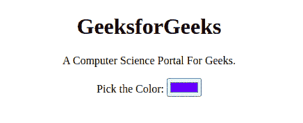

# 如何根据点击时拾色器值的值更改元素颜色？

> 原文:[https://www . geeksforgeeks . org/如何基于颜色选择器的值更改元素颜色-点击值/](https://www.geeksforgeeks.org/how-to-change-an-element-color-based-on-value-of-the-color-picker-value-on-click/)

HTML 标签 **<输入 type ="color" >** 提供了一个用户界面元素，允许用户借助视觉拾色器界面或通过在文本字段中输入十六进制格式的颜色值来指定颜色。只允许简单的颜色(没有 alpha 通道)，尽管 CSS 颜色有更多的格式，例如颜色名称、函数符号和带有 alpha 通道的十六进制格式。

**示例:**

## 超文本标记语言

```html
<!DOCTYPE html>
<html>
    <body>

<p>GeeksforGeeks</p>

        <label for="colors">Color:</label>
        <input type="color" value="#ff0000" id="colors" />

<p>A Computer Science Portal For Geeks.</p>

        <script>
            var colors;
            var defaultColor = "#0000ff";
            window.addEventListener("load", startup, false);
            function startup() {
                colors = document.querySelector("#colors");
                colors.value = defaultColor;
                colors.addEventListener("input", updateFirst, false);
                colors.addEventListener("change", updateAll, false);
                colors.select();
            }
            function updateFirst(event)
            {
                var p = document.querySelector("p");
                if (p) 
                {
                    p.style.color = event.target.value;
                }
            }
            function updateAll(event) {
                document.querySelectorAll("p").forEach(function (p) 
                {
                    p.style.color = event.target.value;
                });
            }
        </script>
    </body>
</html>
```

**输出:**

