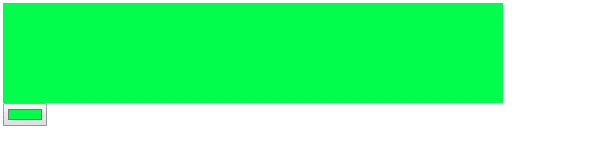

# 如何使用 onclick 根据拾色器值的值更改元素颜色？

> 原文:[https://www . geeksforgeeks . org/如何基于颜色选择器的值更改元素颜色-使用-onclick/](https://www.geeksforgeeks.org/how-to-change-an-element-color-based-on-value-of-the-color-picker-value-using-onclick/)

我们可以通过**输入 type="color"** 来定义拾色器。它提供了一个用户界面元素，允许用户通过使用可视的颜色选择器界面或通过将颜色以`#rrggbb`十六进制格式输入文本字段来指定颜色。只允许没有 alpha 通道的颜色。尽管 CSS 颜色有更多的格式，例如颜色名称、函数符号和带有 alpha 通道的十六进制格式。

**进场:**

*   要根据拾色器的值更改元素的颜色，我们必须使用元素的 onclick()事件，并根据拾色器元素中的选定值更改其 CSS 颜色属性。
*   该值显示为颜色选择器的值属性。使用 javascript，我们将更改元素的颜色作为颜色选择器中的选定值。

**语法:**

*   **HTML:**

    ```
     < div id="elementId" onclick="fn_name()"></div>
          < input name="ColorPickerId" type="color" id="ColorPickerName" />
    ```

*   **JavaScript:**

    ```
    document.getElementById("elementID").style.Color = 
          document.getElementById("ColorPickerId").value;
    ```

**例 1:**

```
<html>

<head>
    <style>
        #Myelement {
            background-color: black;
            width: 500px;
            height: 100px;
        }
    </style>
</head>

<body>
    <div id="Myelement" 
         onclick="changeColor()">
  </div>
    <input name="MyColorPicker"
           type="color"
           id="MyColorPicker" />
    <script>
        function changeColor() {
            document.getElementById(
              "Myelement").style.backgroundColor =
                document.getElementById(
              "MyColorPicker").value;
        }
    </script>
</body>

</html>
```

**输出:**
**前:**

**后勾选颜色:**

**后点击 div:**


**例 2:**

```
<html>

<head>
</head>

<body>
    <h1 id="Myelement" 
       onclick="changeColor()">
        GeeksforGeeks
    </h1>
    <input name="MyColorPicker" 
           type="color"
           id="ColorPicker1" />
    <script>
        function changeColor() {
            document.getElementById("Myelement").style.color =
                document.getElementById("ColorPicker1").value;
        }
    </script>
</body>

</html>
```

**输出:**
**前:**

**后勾选颜色:**

**后点击 div:**
