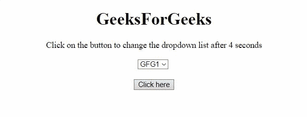
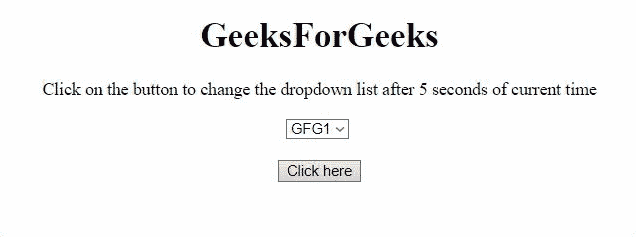

# 当时间改变时，如何改变下拉菜单？

> 原文:[https://www . geesforgeks . org/如何更改-下拉菜单-更改时间/](https://www.geeksforgeeks.org/how-to-change-dropdown-menu-when-time-is-changed/)

任务是在时间改变时改变下拉菜单。下面讨论两种方法。

**方法 1:** 使用 **setTimeOut()** 方法，一段时间后执行换菜单的代码。

**示例:**该示例实现了上述方法。

```htmlhtml
<!DOCTYPE HTML>
<html>

<head>
    <title>
        How to change dropdown 
        menu when time is changed?
    </title>

    <script src=
"https://ajax.googleapis.com/ajax/libs/jquery/3.4.1/jquery.min.js">
    </script>
</head>

<body style="text-align:center;">
    <h1>
        GeeksForGeeks
    </h1>

    <p id="GFG_UP"></p>

    <select id="select">
        <option value="1">GFG1</option>
        <option value="2">GFG2</option>
        <option value="3">GFG3</option>
        <option value="4">GFG4</option>
        <option value="5">GFG5</option>
    </select>
    <br><br>

    <button>
        Click here
    </button>

    <p id="GFG_DOWN" style="font-size: 23px; 
        font-weight: bold; color: green; ">
    </p>
    <script>
        var elUp = document.getElementById("GFG_UP");
        var elDown = document.getElementById("GFG_DOWN");
        elUp.innerHTML = "Click on the button "
            + "to change the dropdown list "
            + "after 4 seconds";
        $('button').click(function () {
            setTimeout(
                function () {
                    $("#select option[value=1]")
                                .text('GFG_N');
                    elDown.innerHTML 
                        = "Drop-down menu changed";
                }, 4000);
        })        
    </script>
</body>

</html>
```

**输出:**


**方法 2:** 使用 **Date()** 方法获取当前的 *DateTime* 对象，然后每当菜单将被更改时使用 **setSeconds()** 和 **getSeconds()** 方法声明另一个 DateTime 对象。

**示例:**该示例实现了上述方法。

```htmlhtml
<!DOCTYPE HTML>
<html>

<head>
    <title>
        How to change dropdown 
        menu when time is changed?
    </title>

    <script src=
"https://ajax.googleapis.com/ajax/libs/jquery/3.4.1/jquery.min.js">
    </script>
</head>

<body style="text-align:center;">
    <h1>
        GeeksForGeeks
    </h1>
    <p id="GFG_UP">
    </p>
    <select id="select">
        <option value="1">GFG1</option>
        <option value="2">GFG2</option>
        <option value="3">GFG3</option>
        <option value="4">GFG4</option>
        <option value="5">GFG5</option>
    </select>
    <br>
    <br>
    <button>
        Click here
    </button>
    <p id="GFG_DOWN" style="font-size: 23px; 
        font-weight: bold; color: green; ">
    </p>
    <script>
        var elUp = document.getElementById("GFG_UP");
        var elDown = document.getElementById("GFG_DOWN");
        elUp.innerHTML = "Click on the button to "
                + "change the dropdown list after "
                + "5 seconds of current time";
        $('button').click(function () {
            var d1 = new Date();
            var d2 = new Date();
            d2.setSeconds(d1.getSeconds() + 5);
            setTimeout(
                function () {
                    $("#select option[value=1]")
                                    .text('GFG_N');
                    elDown.innerHTML 
                        = "Drop-down menu changed";
                }, d2 - d1);
        })        
    </script>
</body>

</html>
```

**输出:**
