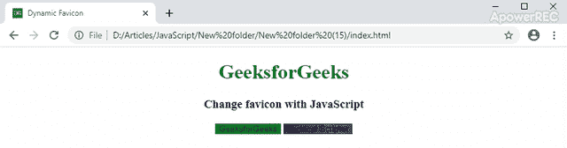

# 如何动态改变 favicon？

> 原文:[https://www . geesforgeks . org/how-change-fav icon-dynamic/](https://www.geeksforgeeks.org/how-to-change-favicon-dynamically/)

你可能会注意到，许多社交网络和现代网络应用程序都有动态收藏夹图标。动态收藏夹图标可能有不同的用途，例如，社交网络使用它来显示通知或消息。有些网站也有基于百分比的 favicon 来跟踪成功的级别，如果你完成了一个级别，favicon 就会被成功图标所取代。改变图标是为了吸引人们的注意力。您可以在 web 应用程序不同页面的不同图标之间旋转。

为了动态改变 favicons，我们将创建两个 javascript 函数，分别改变 favicons GeeksforGeeks 和 Technical Scripter。我们将分配一个常量变量，并用 **[getElementById()函数](https://www.geeksforgeeks.org/html-dom-getelementbyid-method/)** 通过图标标识来获取它们。之后，我们将创建 2 个函数，并为其分配两个按钮。通过悬停这些按钮，图标将会改变。

下面的例子说明了这种方法:
**例子:**首先，我们将创建一个带有两个按钮的 HTML 页面。这些按钮将有助于使用鼠标悬停来更改图标。

```htmlhtml
<!DOCTYPE html>
<html>

<head>
    <title>Dynamic Favicon</title>

    <!-- Default favicon image -->
    <link id="favicon" rel="icon"
          href="image_name.png"
          type="image/png" 
          sizes="16x16">

    <!--To style the Buttons-->
    <style>
        .btn1 {
            background-image: url('img2.png');
            border: none;

        }
        .btn2 {
            background-image: url('img.png');
            border: none;
        }

        .container {
            text-align: center;
        }

        h1 {
            color:green;
        }
    </style>
</head>

<body>
    <div class="container">
    <h1>GeeksforGeeks</h1>
    <h3>Change favicon with JavaScript</h3>

    <!--Creating buttons to change favicons on 
        the hover of the mouse on the button-->
    <button class="btn1" type="button" onmouseover="toRed()">
      GeeksforGeeks
    </button>
    <button class="btn2" type="button" onmouseover="toBlue()">
      Tecnical Scripter
    </button>

    <script>

        // Assign a constant variable and get them by the favicon Id
        const favicon = document.getElementById("favicon");

        // Creating a function for the button GeeksforGeeks
        function toRed() {
            favicon.setAttribute("href", "img2.png"); 
        }
        // Creating a function for the button Techiniacl Script
        function toBlue() {
            favicon.setAttribute("href", "img.png");
        }
    </script>
    </div>
</body>

</html>
```

**输出:**
