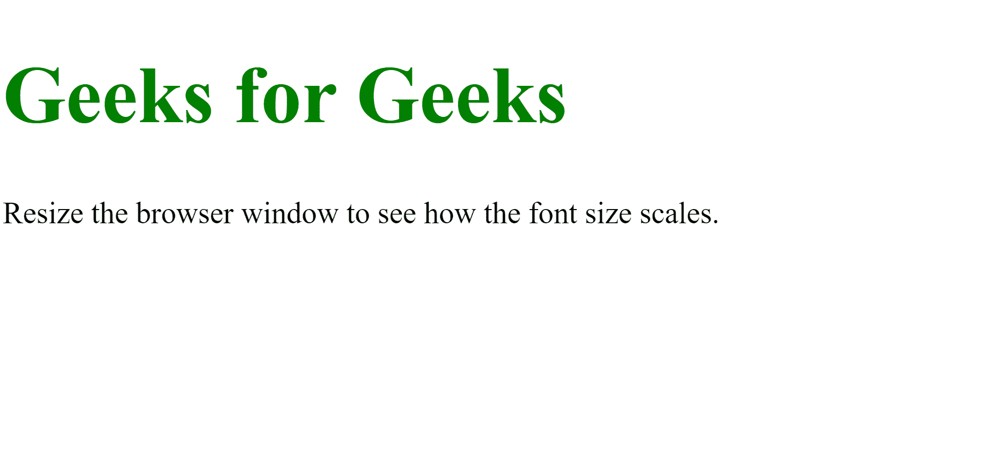
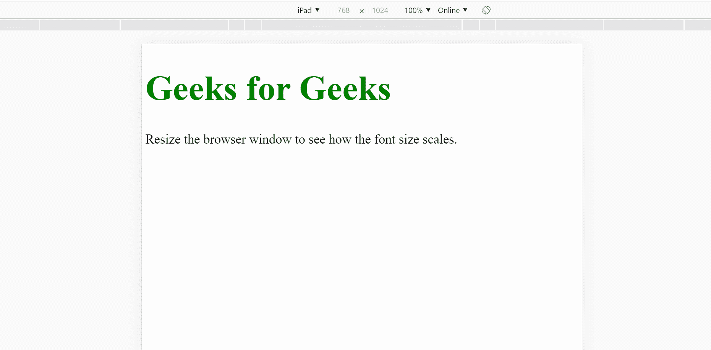
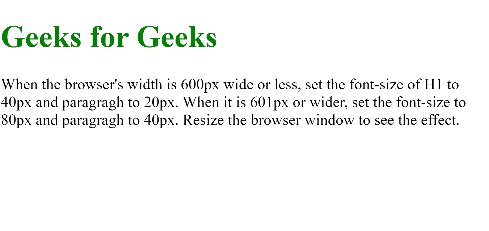
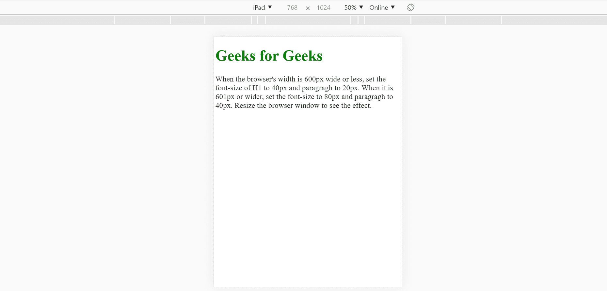
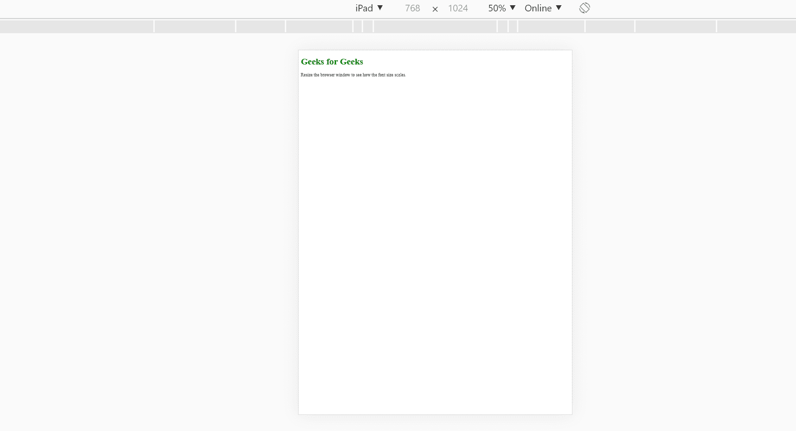

# 如何根据容器宽度改变字体大小？

> 原文:[https://www . geesforgeks . org/如何根据容器宽度更改字体大小/](https://www.geeksforgeeks.org/how-to-change-font-size-depending-on-width-of-container/)

有多种方法可以将一些文本放入容器中，并有一定的大小来填充该容器。
有使用 CSS、jQuery 等不同的方法，下面解释一下。

**使用 CSS 属性(视口宽度):**这个`vw`是一个 CSS 属性，用于在 HTML 文件中创建响应性的排版。视口是浏览器窗口大小。“文本大小”可以用“大众”单位设置，你可以找到一个精确的数字，文本非常适合容器，并且不会随着你调整浏览器窗口的大小而断裂。

1vw =视口宽度的 1%。如果视窗宽 100 厘米，1vw 为 10 厘米。

**示例:**

```html
<!DOCTYPE html>
<html lang="en" dir="ltr">

<head>
    <meta charset="utf-8">
    <title>
        How to change font size 
        depending on the width 
        of container?
    </title>

    <style>
        h1 {
            font-size: 8vw;
            color: green;
            font-weight: bold;
        }

        p {
            font-size: 3vw;
        }
    </style>
</head>

<body>
    <h1>Geeks for Geeks</h1>

    <p>
        Resize the browser window 
        to see how the font size 
        changes.
    </p>
</body>

</html>
```

**输出:**

*   **在桌面:**
    
*   **在 iPad 上:**
    

**使用 CSS 属性(媒体查询):**您也可以使用媒体查询来更改特定屏幕尺寸上元素的字体大小。`@media`规则，可以为不同的媒体类型定义不同的风格规则。

**示例:**

```html
<!DOCTYPE html>
<html lang="en" dir="ltr">

<head>
    <meta charset="utf-8">
    <title>
        How to change font size 
        depending on width of 
        container?
    </title>

    <style>
        h1 {
            color: green;
        }

        @media screen and (min-width: 601px) {
            h1 {
                font-size: 80px;
            }

            p {
                font-size: 40px;
            }
        }

        @media screen and (max-width: 600px) {
            h1 {
                font-size: 40px;
            }

            p {
                font-size: 20px;
            }
        }
    </style>
</head>

<body>
    <h1>Geeks for Geeks</h1>

    <p>
        Set the <em>font-size</em> of "h1" 
        to "40px" and <em>paragraph</em> to
        "20px", when the window's width is
        "600px" wide or less and when it 
        is "601px" or wider, set the 
        <em>font-size</em> to "80px" and
        <em>paragraph</em> to "40px". 
        Resize the browser window to 
        see the effect.
    </p>
</body>

</html>
```

**输出:**

*   **在桌面:**
    
*   **在 iPad 上:**
    

**使用 FitText jQuery 插件:**有一个 jQuery 插件，可以让*字号*在响应布局上灵活，即`FitText`。例如，可以使用插件根据容器的宽度来调整文本的大小。

**示例:**

```html
<!DOCTYPE html>
<html lang="en" dir="ltr">

<head>
    <meta charset="utf-8">
    <title>H
        ow to change font size 
        depending on width of c
        ontainer?
    </title>

    <style>
        h1 {
            color: green;
        }
    </style>
</head>

<body>
    <h1>Geeks for Geeks</h1>

    <p>
        Resize the browser window 
        to see how the font size 
        scales.
    </p>

    <script type="text/javascript" src=
"https://s3-us-west-2.amazonaws.com/s.cdpn.io/3/textFit.js">
    </script>

    <script type="text/javascript">
        textFit(document.querySelector("h1"));
    </script>
</body>

</html>
```

**输出:**

*   **在桌面:**
    
*   **在 iPad 上:**
    

jQuery 是一个开源的 JavaScript 库，它简化了 HTML/CSS 文档之间的交互，它以其“少写多做”的理念而闻名。
跟随本 [jQuery 教程](https://www.geeksforgeeks.org/jquery-tutorials/)和 [jQuery 示例](https://www.geeksforgeeks.org/jquery-examples/)可以从头开始学习 jQuery。