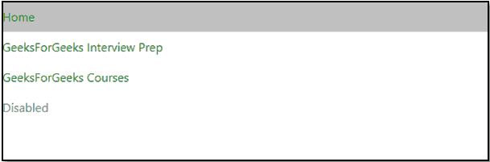
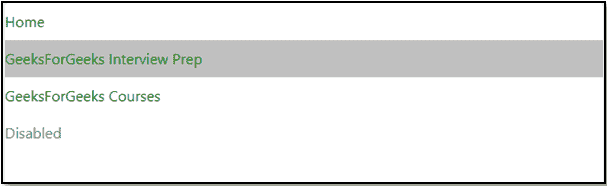

# 如何改变活动导航项目的背景颜色？

> 原文:[https://www . geesforgeks . org/如何更改活动导航项目的背景颜色/](https://www.geeksforgeeks.org/how-to-change-the-background-color-of-the-active-nav-item/)

给定一个包含项目列表的 HTML 文档，任务是在项目活动时更改项目列表的背景颜色。通过改变[背景色](https://www.geeksforgeeks.org/css-background-color-property/) CSS 属性可以改变项目列表的状态。

**语法:**

```html
background-color: color | transparent; 
```

**属性值:**

*   **颜色:**指定元素的背景颜色。
*   **透明:**指定背景色要透明。

因此，可以通过更改背景色 CSS 属性，以下列方式更改活动导航项目的背景色。

**语法:**

```html
.navbar-nav > .active > a { 
    background-color: color ; 
}
```

**示例:**

## 超文本标记语言

```html
<!DOCTYPE html>
<html lang="en">

<head>
    <meta charset="utf-8">

    <title>
        How to change the background 
        color of the active nav-item?
    </title>
</head>

<body>
    <link rel="stylesheet" href=
"https://cdnjs.cloudflare.com/ajax/libs/twitter-bootstrap/4.0.0-alpha.6/css/bootstrap.css"/>
    <script src=
"https://ajax.googleapis.com/ajax/libs/jquery/2.1.1/jquery.min.js">
    </script>
    <script src=
"https://npmcdn.com/tether@1.2.4/dist/js/tether.min.js">
    </script>
    <script src=
"https://cdnjs.cloudflare.com/ajax/libs/twitter-bootstrap/4.0.0-alpha.6/js/bootstrap.min.js">
    </script>

    <style>
        .nav-link {
            color: green;
        }

        .nav-item>a:hover {
            color: green;
        }

        /*code to change background color*/
        .navbar-nav>.active>a {
            background-color: #C0C0C0;
            color: green;
        }
    </style>
    <ul class="navbar-nav">
        <li class="nav-item active">
            <a class="nav-link" href="#">
                Home 
                <span class="sr-only">
                    (current)
                </span>
            </a>
        </li>
        <li class="nav-item">
            <a class="nav-link" href="#">
                GeeksForGeeks Interview Prep
            </a>
        </li>
        <li class="nav-item">
            <a class="nav-link" href="#">
                GeeksForGeeks Courses
            </a>
        </li>
        <li class="nav-item">
            <a class="nav-link disabled"
                href="#">Disabled</a>
        </li>
    </ul>

    <script>
        $(document).ready(function () {

            $('ul.navbar-nav > li')
                    .click(function (e) {
                $('ul.navbar-nav > li')
                    .removeClass('active');
                $(this).addClass('active');
            });
        });
    </script>
</body>

</html>
```

**输出:**

 

HTML 是网页的基础，通过构建网站和网络应用程序用于网页开发。您可以通过以下 [HTML 教程](https://www.geeksforgeeks.org/html-tutorials/)和 [HTML 示例](https://www.geeksforgeeks.org/html-examples/)从头开始学习 HTML。

CSS 是网页的基础，通过设计网站和网络应用程序用于网页开发。你可以通过以下 [CSS 教程](https://www.geeksforgeeks.org/css-tutorials/)和 [CSS 示例](https://www.geeksforgeeks.org/css-examples/)从头开始学习 CSS。

jQuery 是一个开源的 JavaScript 库，它简化了 HTML/CSS 文档之间的交互，它以其“少写多做”的理念而闻名。
跟随本 [jQuery 教程](https://www.geeksforgeeks.org/jquery-tutorials/)和 [jQuery 示例](https://www.geeksforgeeks.org/jquery-examples/)可以从头开始学习 jQuery。