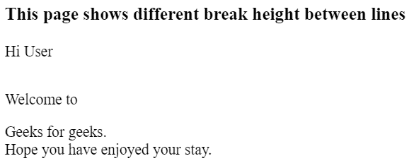
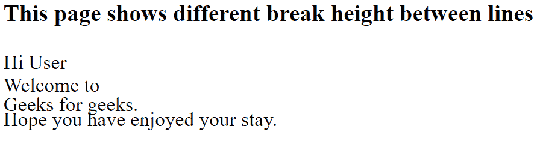
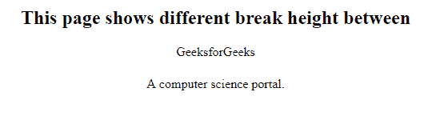

# 如何更改 br 标签的高度？

> 原文:[https://www . geesforgeks . org/如何更改 br-tag 的高度/](https://www.geeksforgeeks.org/how-to-change-the-height-of-br-tag/)

你不能改变 **< br >标签**的高度，因为它不是一个 HTML 元素，它只是一个强制换行符的指令。
br 不占用页面任何空间。

有一种方法可以增加行与行之间的换行符，就是放置多个 br 标签。

另一种方法是使用分类的 span 标记并将样式应用于它们，以获得所需的输出

**方法-1:** 使用应用了不同样式的各种跨度类，您可以为这些类更改**“边距-底部”**的值，以更改换行符的高度。

*   **Example-1:**

    ```html
    <!DOCTYPE html >
    <html>

    <head>
        <title>
          Customized break example
      </title>

        <style type="text/css">
            .br {
                display: block;
                margin-bottom: 0em;
            }

            .brmedium {
                display: block;
                margin-bottom: 1em;
            }

            .brlarge {
                display: block;
                margin-bottom: 2em;
            }
        </style>
    </head>

    <body>

        <h3>This page shows different 
          break height between lines</h3>
        <p> Hi User
          <span class="brlarge"></span>
          Welcome to
          <span class="brmedium"></span> 
          Geeks for geeks.
          <span class="br"></span> 
          Hope you have enjoyed your stay.
        </p>

    </body>

    </html>
    ```

    **输出:**
    

    *   **Example-2:** You can also decrease break height less than normal height by using negative bottom-margin for the span classes.

    ```html
    <!DOCTYPE html >
    <html>

    <head>
        <title>
          Customized break example
      </title>

        <style type="text/css">
            .br {
                display: block;
                margin-bottom: 0em;
            }

            .brsmall {
                display: block;
                margin-bottom: -.2em;
            }

            .brxsmall {
                display: block;
                margin-bottom: -.4em;
            }
        </style>
    </head>

    <body>

        <h2>This page shows different 
          break height between</h2>

        <p>Hi User
          <span class="br"></span> 
          Welcome to
          <span class="brsmall"></span>
          Geeks for geeks.
          <span class="brxsmall"></span>
          Hope you have enjoyed your stay.
        </p>

    </body>

    </html>
    ```

    **输出:**
    

    **方法-2:** 在 **< br >** 标签中使用内联 css 改变 br 标签的高度。

    *   **Example-3:**

    ```html
    <!DOCTYPE html >
    <html>

    <head>
        <title>
            Customized break example
        </title>
    </head>

    <body>
        <center>
            <h2>This page shows 
            different break 
            height between
        </h2>

            <p>GeeksforGeeks<br style=
            "line-height:40px"> A
              computer science portal.</p>
        </center>
    </body>

    </html>
    ```

    **输出:**
    