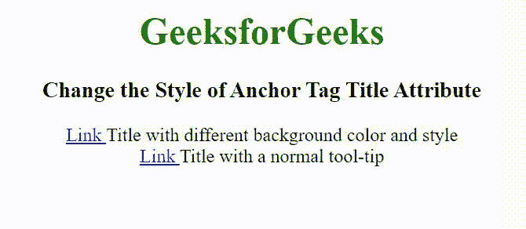

# 如何更改T3】

> 原文:[https://www . geesforgeks . org/如何更改标签标题属性的样式/](https://www.geeksforgeeks.org/how-to-change-the-style-of-a-tag-title-attribute/)

选项是根据需要使用 CSS 属性制作一个假的工具提示。为此，必须使用数据标题属性。[数据-*属性](https://www.geeksforgeeks.org/html-data-attributes/)方法用于存储页面或应用程序私有的自定义数据。CSS 可以使用各种方式来访问它们。

**示例 1:** 此示例使工具提示变大，并具有不同的背景颜色。

```htmlhtml
<!DOCTYPE html> 
<html> 

<head> 
    <title> 
        How to Change the Style of
        Anchor Tag Title Attribute?
    </title> 

    <style> 
        [data-title]:hover:after {
            visibility: visible;
        }

        [data-title]:after {
            content: attr(data-title);
            background-color: #4b9c2c;    
            color: #ffffff;
            font-size: 150%;
            position: absolute;
            padding: 4px 8px 4px 8px;
            visibility: hidden;
        }
    </style> 
</head> 

<body style="text-align:center;"> 
    <h1 style="color:green">
        GeeksforGeeks
    </h1>

    <h3>
        Change the Style of Anchor
        Tag Title Attribute
    </h3>

    <a href="geeksforgeeks.org" 
            data-title="GFG">
        Link 
    </a> Title with different
        background color and style
    <br>

    <a href="geeksforgeeks.org" title="GFG">
        Link
    </a> Title with a normal tool-tip
</body> 

</html>
```

**输出:**


**示例 2:** 以下示例使用一些更好的 CSS 属性，使工具提示的样式比上一个更好。

```htmlhtml
<!DOCTYPE html> 
<html> 

<head> 
    <title> 
        How to Change the Style of
        Anchor Tag Title Attribute?
    </title> 

    <style> 
        [data-title]:hover:after {
            opacity: 1;
            transition: all 0.2s ease 0.6s;
            visibility: visible;
        }
        [data-title]:after {
            content: attr(data-title);
            position: absolute;
            padding: 4px 8px 4px 8px;
            color: #222;
            border-radius: 5px;  
            box-shadow: 0px 0px 15px #222;  
            background-image: -webkit-linear-gradient(
                                top, #f8f8f8, #cccccc); 

            background-image: -moz-linear-gradient(
                                top, #f8f8f8, #cccccc);  

            background-image: -ms-linear-gradient(
                                top, #f8f8f8, #cccccc); 

            background-image: -o-linear-gradient(
                                top, #f8f8f8, #cccccc);

            visibility: hidden;
        }
    </style> 
</head> 

<body style="text-align:center;"> 
    <h1 style="color:green">
        GeeksforGeeks
    </h1>

    <h3>
        Change the Style of Anchor
        Tag Title Attribute
    </h3>

    <a href="geeksforgeeks.org" 
            data-title="GFG">
        Link 
    </a> with styled tooltip
    <br>

    <a href="geeksforgeeks.org" title="GFG">
        Link
    </a> with normal tooltip
</body> 

</html>
```

**输出:**
