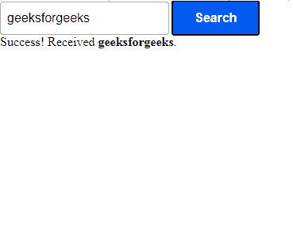

# 如何检查谷歌 AMP 中是否收到搜索输入？

> 原文:[https://www . geeksforgeeks . org/如何检查搜索输入是否被谷歌接收-amp/](https://www.geeksforgeeks.org/how-to-check-if-search-input-is-received-in-google-amp/)


我们可以在 amp-autocomplete 的帮助下检查在 AMP 中是否接收到搜索，AMP-autocomplete 可用于在 src 和查询属性的帮助下检查指定的查询参数

例如，如果一个`src="https://www.iamageek.org/"`和`query="q"`，那么一个输入极客的用户将从`https://iamageek.com?q=geek`获得获取 JSON 的结果

当查询属性与 src 属性配对时，用户输入被传递到静态生成的端点。

**需要脚本:**

导入**放大器自动完成**组件。

```htmlhtml
<script async custom-element="amp-autocomplete" 
              src=
"https://cdn.ampproject.org/v0/amp-autocomplete-0.1.js">
</script>
```

导入 **amp-form** 组件。

```htmlhtml
<script async custom-element="amp-form" 
         src=
"https://cdn.ampproject.org/v0/amp-form-0.1.js">
</script>
```

**指定查询参数:**

输入通过输入标签给出，并在提交时使用模板标签进行查询

```htmlhtml
<form class="sample-form"
  method="post"
  action-xhr="https://amp.dev/documentation/examples/api/echo"
  target="_top">
  <amp-autocomplete filter="none"
    min-characters="1"
    src="https://amp.dev/samples_templates/products_autosuggest"
    query="q">
    <input type="search"
      name="queryInput">
  </amp-autocomplete>
  <input type="submit"
    value="Search">
  <div submit-success>
    <template type="amp-mustache">
      Success! Received <strong>{{queryInput}}</strong>.
    </template>
  </div>
</form>
```

**示例:**

```htmlhtml
<!DOCTYPE html>
<html ⚡>
    <head>
        <meta charset="utf-8" />
        <link rel="canonical" 
              href=
"https://amp.dev/documentation/examples/components/amp-autocomplete/index.html" />
        <meta name="viewport" 
              content="width=device-width, 
                       minimum-scale=1, 
                       initial-scale=1" />
        <script async custom-element="amp-autocomplete" 
                src=
"https://cdn.ampproject.org/v0/amp-autocomplete-0.1.js">
      </script>
        <script async custom-element="amp-form" 
                src=
"https://cdn.ampproject.org/v0/amp-form-0.1.js">
      </script>
        <title>geeksforgeeks | amp-autocomplete</title>
        <style amp-custom>
            :root {
                --space-1: 0.5rem;
                --space-3: 1.5rem;
                --space-4: 2rem;
                --color-text-light: #fff;
                --color-primary: #005af0;
                --box-shadow-1: 0 1px 1px 0 rgba(0, 0, 0, 0.14), 
                  0 1px 1px -1px rgba(0, 0, 0, 0.14), 
                  0 1px 5px 0 rgba(0, 0, 0, 0.12);
            }

            .sample-form input[type="submit"] {
                -webkit-appearance: none;
                border: none;
                background-color: var(--color-primary);
                color: var(--color-text-light);
                margin: var(--space-2);
                font-family: "Poppins", sans-serif;
                font-weight: 700;
                line-height: 1.2em;
                font-size: 1em;
                padding: 0.75em 1.75em;
                text-decoration: none;
                text-align: center;
                border-radius: 3px;
                border: none;
                box-shadow: var(--box-shadow-1);
            }
            .sample-form {
                padding: var(--space-2);
            }
        </style>
        <style amp-boilerplate>
            body {
                -webkit-animation: 
                  -amp-start 8s steps(1, end) 0s 1 normal both;
                -moz-animation: 
                  -amp-start 8s steps(1, end) 0s 1 normal both;
                -ms-animation: 
                  -amp-start 8s steps(1, end) 0s 1 normal both;
                animation: 
                  -amp-start 8s steps(1, end) 0s 1 normal both;
            }
            @-webkit-keyframes -amp-start {
                from {
                    visibility: hidden;
                }
                to {
                    visibility: visible;
                }
            }
            @-moz-keyframes -amp-start {
                from {
                    visibility: hidden;
                }
                to {
                    visibility: visible;
                }
            }
            @-ms-keyframes -amp-start {
                from {
                    visibility: hidden;
                }
                to {
                    visibility: visible;
                }
            }
            @-o-keyframes -amp-start {
                from {
                    visibility: hidden;
                }
                to {
                    visibility: visible;
                }
            }
            @keyframes -amp-start {
                from {
                    visibility: hidden;
                }
                to {
                    visibility: visible;
                }
            }
        </style>
        <noscript>
            <style amp-boilerplate>
                body {
                    -webkit-animation: none;
                    -moz-animation: none;
                    -ms-animation: none;
                    animation: none;
                }
            </style>
        </noscript>
        <script async src=
 "https://cdn.ampproject.org/v0.js">
      </script>
        <script async custom-template="amp-mustache"
                src=
      "https://cdn.ampproject.org/v0/amp-mustache-0.2.js">
      </script>
    </head>
    <body>
        <form class="sample-form" 
              method="post" 
              action-xhr=
              "https://amp.dev/documentation/examples/api/echo" 
              target="_top">
            <amp-autocomplete filter="none" 
                              min-characters="1"
                              src=
       "https://amp.dev/samples_templates/products_autosuggest"
                              query="q">
                <input type="search" 
                       name="queryInput" />
            </amp-autocomplete>
            <input type="submit"
                   value="Search" />
            <div submit-success>
                <template type="amp-mustache">
                  Success! Received
                  <strong>{{queryInput}}</strong>.
              </template>
            </div>
        </form>
    </body>
</html>
```

**输出:** 