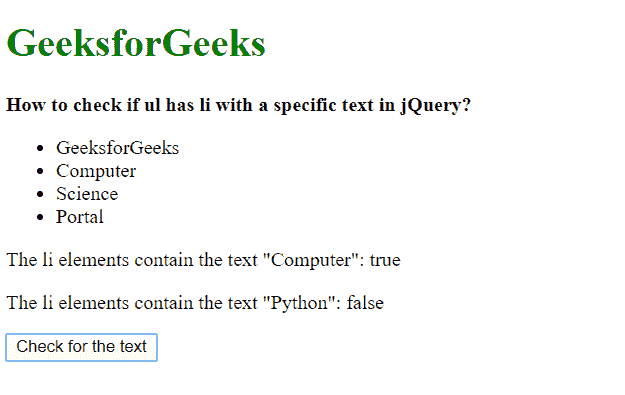
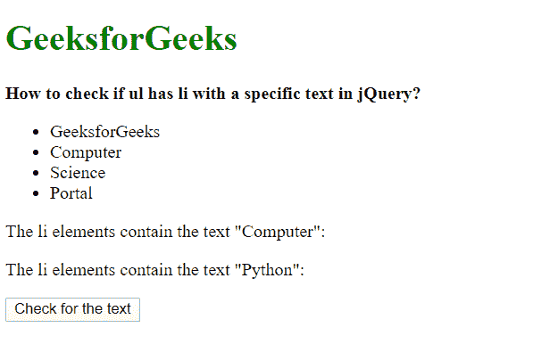

# 如何检查 ul 给定文本是否有 li？

> 原文:[https://www . geeksforgeeks . org/如何用给定文本检查是否有 Li/](https://www.geeksforgeeks.org/how-to-check-if-ul-has-li-with-the-given-text/)

**方法 1:使用列表中的方法检查 innerText 属性**

首先使用 jQuery 选择器选择无序列表的每个列表元素。在这个列表上使用**每个()**方法来遍历它。这个方法有一个回调函数，返回当前索引和迭代的元素。

检查返回元素内的文本的 **innerText** 属性，看它是否匹配所需的文本。成功的匹配意味着所选无序列表中的文本具有所需的文本。

**语法:**

```html
let found = false;

$("#list li").each((id, elem) => {
  if (elem.innerText == requiredText) {
    found = true;
  }
});

return found;
```

**示例:**

```html
<!DOCTYPE html>
<html>

<head>
    <title>
        Check if ul has li with a specific text in jQuery.
    </title>
</head>

<body>
    <h1 style="color: green">
    GeeksforGeeks
  </h1>
    <b>
    How to check if ul has li with
    a specific text in jQuery?
  </b>
    <ul id="list">
        <li>GeeksforGeeks</li>
        <li>Computer</li>
        <li>Science</li>
        <li>Portal</li>
    </ul>
    <p>
        The li elements contain the text "Computer":
      <span class="output">
    </span>
    </p>
    <p>
        The li elements contain the text "Python":
      <span class="output2">
    </span>
    </p>
    <button onclick="runChecks()">
        Check for the text
    </button>
    <script src="https://code.jquery.com/jquery-3.4.1.min.js">
    </script>
    <script>
        function checkforText(requiredText) {
            let found = false;

            $("#list li").each((id, elem) => {
                if (elem.innerText == requiredText) {
                    found = true;
                }
            });

            return found;
        }

        function runChecks() {
            ans1 = checkforText('Computer');
            document.querySelector(".output").textContent = ans1;

            ans2 = checkforText('Python');
            document.querySelector(".output2").textContent = ans2;
        }
    </script>
</body>

</html>
```

**输出:**

*   **点击按钮前:**
    
*   **点击按钮后:**
    

**方法 2:使用 contains()选择器**
**contains()**选择器用于选择文本与给定文本匹配的元素。该文本可以出现在元素的任何后代或元素本身中。它接受一个参数，即要匹配的区分大小写的文本。

contains()选择器与用于选择列表元素的选择器一起使用。如果没有选择任何元素，也就是说，如果给定的文本不存在，则返回的元素数将为 0。可以使用 length 属性检查返回的元素数量，并用于验证列表是否包含指定的文本。

**语法:**

```html
let found = false;

selector = `#list :contains('${requiredText}')`
selectedList = $(selector);

if (selectedList.length) {
  found = true;
}
return found;
```

**示例:**

```html
<!DOCTYPE html>
<html>

<head>
    <title>
        Check if ul has li with a specific text in jQuery.
    </title>
</head>

<body>
    <h1 style="color: green">
    GeeksforGeeks
  </h1>
    <b>
    How to check if ul has li with
    a specific text in jQuery?
  </b>
    <ul id="list">
        <li>GeeksforGeeks</li>
        <li>Computer</li>
        <li>Science</li>
        <li>Portal</li>
    </ul>
    <p>
        The li elements contain the text "Computer":
      <span class="output">
    </span>
    </p>
    <p>
        The li elements contain the text "Python":
      <span class="output2">
    </span>
    </p>
    <button onclick="runChecks()">
        Check for the text
    </button>
    <script src="https://code.jquery.com/jquery-3.4.1.min.js">
    </script>
    <script>
        function checkforText(requiredText) {
            let found = false;

            selector
                = `#list :contains('${requiredText}')`
            selectedList = $(selector);

            if (selectedList.length) {
                found = true;
            }
            return found;
        }

        function runChecks() {
            ans1 = checkforText('Computer');
            document.querySelector(".output").textContent = ans1;

            ans2 = checkforText('Python');
            document.querySelector(".output2").textContent = ans2;
        }
    </script>
</body>

</html>
```

**输出:**

*   **点击按钮前:**
    
*   **点击按钮后:**
    