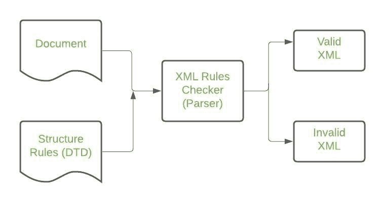

# 如何检查一个 XML 文档的结构？

> 原文:[https://www . geesforgeks . org/如何检查 xml 文档的结构/](https://www.geeksforgeeks.org/how-to-check-the-structure-of-an-xml-document/)

**简介:** XML 文档是组件和相关标记的组织良好的集合。一个 XML 文档可以包含广泛的信息。例如，具有数字或数学等式等的数据库。

**示例:**一个简单的文档可以创建为–

```
<?xml version = "1.0"?>
<Student-info>
   <name>Tanya Bajaj</name>
   <Organization>GeeksForGeeks</Organization>
   <contactNumber>(+91)-9966778909</contactNumber>
</Student-info>
```

XML 文档有两个部分:

*   **文档序言:**包含 XML &文档类型声明(以上 XML 文档前 2 行)。
*   **文档元素:**XML 的构建组件是文档元素。这些部分将文档分成多个层次的部分，每个部分都有自己的实用程序。

**是否可以对** **XML 文档的结构进行某种检查？**
XML 中包含了一个工具，用于创建规范文档构造方式的规则。这些在行话中被称为文档类型定义。您可以设置一个 DTD，以多种方式自动检查 XML 文档。这里有几个这样的例子:

*   一个光学名称、一个给定的名字和一个姓氏组成了一个人的名字。
*   在电视节目表上可以找到一个或多个频道。每个频道都有一个或多个时隙。每个时间段都有一个节目标题和可选描述。

这些效果可以通过识别您希望在文档中使用的元素类型并指示它们在文档类型中出现的结构顺序来实现。一个名为 XML Parser 的实用程序能够测试文档是否符合规定的规则。



用 XML 解析器检查 XML 文档的结构

XML 解析器是一个软件库或软件包，为客户端应用程序提供处理 XML 文档的接口。换句话说，XML 解析器是一个读取 XML 并允许程序使用它的程序。XML 解析器检查文档并确保其格式正确。大多数现代浏览器都包含 XML 解析器。

**如果我们不希望我们的结构被检查怎么办？**
没问题；有了 XML，不对照 DTD 来检查文档结构是完全可以接受的。如果元素正确地嵌套在一起，提供了一个树状结构，那么这个文档就被认为是一个格式良好的 XML 文档。
因为可以使用简单的 XML 工具进行处理，所以格式良好的 XML 文档特别适合互联网使用。这些工具小巧轻便，足以用于各种应用，包括浏览器小程序、信用卡刷卡器和实验室设备。