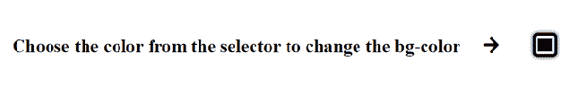
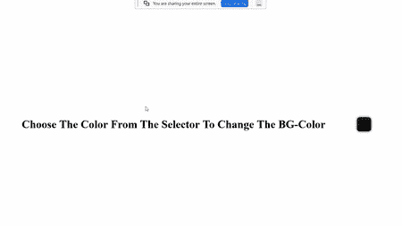

# 如何通过拾色器选择背景色？

> 原文:[https://www . geesforgeks . org/如何通过颜色选择器选择背景颜色/](https://www.geeksforgeeks.org/how-to-choose-background-color-through-color-picker/)

在这个项目中，我们将在颜色选择器的帮助下更改背景颜色。

**项目一瞥:**


**进场:**

*   创建一个 HTML 文件，我们将在其中添加文本和颜色选择器，这有助于改变我们网页的背景颜色。
*   创建一个 CSS 样式给网页元素一些动画效果。
*   创建一个 JavaScript 文件来添加可以检测鼠标移动的事件监听器。

**示例:**

**HTML:**

*   首先，创建一个 HTML 文件(index.html)。
*   然后我们将提供所有动画效果的 CSS 文件链接到我们的 HTML 页面。这也放在标签之间。
*   我们从谷歌字体添加了一个链接，在我们的项目中使用不同类型的字体系列。
*   然后我们必须添加一个输入标签，这样我们就可以使用颜色选择器了！
*   在正文标签的最后，我们还要加上 2 个

## index.html

```htmlhtml
<!DOCTYPE html>
<html lang="en">
<head>   
    <link rel="stylesheet" href="style.css">
    <script src="index.js"></script>
    <script src=
"https://kit.fontawesome.com/704ff50790.js" 
            crossorigin="anonymous">
    </script>
</head>
<body>
    <h1 class="head">
      Choose the color from the selector
      to change the bg-color 
      <i class="fas fa-arrow-right">
      </i>
    </h1>
    <input type="color" id="clr">
</body>
</html>
```

**CSS:** 以下是 HTML 代码中上面使用的“style.css”文件的代码。CSS 被用来给我们的 HTML 页面提供不同类型的动画和效果，这样它看起来对所有用户都是交互式的。

*   恢复所有浏览器效果。
*   使用类和 id 给 HTML 元素赋予效果。
*   使用*:悬停*使用悬停效果。
*   使用**@关键帧**在我们的网页上使用动画。

## style.css

```htmlhtml
/* restoring all the default 
   properties of the browser */
*{
    margin: 0;
    padding: 0;
    box-sizing: border-box;
}

/* all similar effects of the web page 
   so we applied them to the body */
body{
    height: 100vh;
    display: flex;
    justify-content: center;
    align-items: center;
}

/* css effects for the color picker */
input{
    margin: 2em;
    width: 3em;
    height: 3em;
    border: .4em solid black;
    border-radius: 20%;
    outline: none;
    cursor: pointer;
    box-shadow: 0 0 .5em #111;
}

/* for the icon that we have added */
.fas{
    margin: 1em;
}

/* hover effects on color picker */
input:hover{
    animation: round 2s infinite;
}

/* animation for our color picker */
@keyframes round{
    0%{
        transform: rotate(0deg);
    }
    10%{
        transform: rotate(60deg);
    }
    20%{
        transform: rotate(120deg);
    }
    40%{
        transform: rotate(180deg);
    }
    60%{
        transform: rotate(240deg);
    }
    80%{
        transform: rotate(300deg);
    }
    100%{
        transform: rotate(360deg);
    }
}
```

**JavaScript:** 在这里，我们编写了检测鼠标移动的代码，用于改变背景颜色。

> 返回与指定 CSS 选择器匹配的第一个元素:
> document . queryselector(' CSS _ selector ')=>
> 
> 返回与指定的 HTML ID:
> document . getelementbyid(' HTML _ ID ')=>匹配的所有元素

## index.js

```htmlhtml
// Selection of id's and classes from html document
const bgclr = document.getElementById("clr");
const headingg = document.querySelector(".head");

// Here we are adding event listener which 
// is used to detect the mouse movement
bgclr.addEventListener("input", () => {
  // This updates the background color which is 
  // picked by the user from the picker
  document.body.style.backgroundColor = bgclr.value;

  // This is the conditional statement that is used
  // to change the text color from BLACK to WHITE
  // when the background color changes to dark!
  if (
    bgclr.value.includes("00") ||
    bgclr.value.includes("0a") ||
    bgclr.value.includes("0b") ||
    bgclr.value.includes("0c") ||
    bgclr.value.includes("0d") ||
    bgclr.value.includes("0e") ||
    bgclr.value.includes("0f")
  ) {
    headingg.style.color = "#fff";
  } else {
    headingg.style.color = "#000";
  }
});
```

**输出:**

