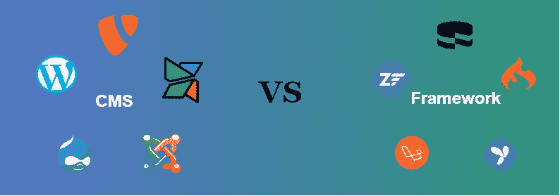

# 如何根据需要在 CMS 或 Framework 之间进行选择？

> 原文:[https://www . geesforgeks . org/如何根据需要在 cms 或框架之间进行选择/](https://www.geeksforgeeks.org/how-to-choose-between-cms-or-framework-according-to-the-need/)

在内容管理系统和框架之间进行选择是你网站的技术问题。这完全取决于你的需求、你的用户和你的长期愿景。**灵活性**、**扩展性**、**寿命**、**可维护性**、**安全性**都是可以帮助你做出选择的标准。从一开始就做出正确的选择很重要。根据你的进化维护(TMA)，你将有一个难以维护的网站。更糟糕的是，你冒着没有回报的风险，不得不从头开始。

**CMS:** CMS 代表内容管理系统。它是一个使用数据库的内容管理器。基于不同的技术有很多种。它们都是以相同的方式组织的，并且集成了共同的功能。

例如，您可以管理您的用户及其访问权限，或者管理内容及其显示方式。具体来说，内容管理系统允许你创建内容网站、博客，甚至在线商店。尽管如此，在 PHP 世界中，也有我们熟知的 Drupal、CMS，但是实现和维护起来更复杂。

**优势:**

*   WordPress 首先是一个社区。自 2003 年推出以来，这个内容管理系统受益于世界上强大的开发者社区。它有助于丰富、改进或创建模块(包)，并快速纠正缺陷。它非常方便，因为你可以很容易地找到你需要的东西。这也解释了数以千计的现有模块。
*   它还有各种各样的主题和模块。WP 上的模板和模块有多种选择。当我们“量身定制”时，我们发展我们的主题。至于模块，我们安装标准模块来管理基本问题。否则，我们开发自己的模块，因为通常一个模块永远不会 100%满足客户的需求。
*   模块化工具，易于携带和开发。WordPress 的特点是它的灵活性和通用性。它设置起来很快，它允许开发人员专注于开发具有高附加值的特定模块。它适用于许多网络项目。
*   对用户来说很容易处理。其编辑器**所见即所得** ***(所见即所得)*** 对于用户来说非常直观，接近一个 Word。站长不需要知道代码。
*   它是可扩展和模块化的。您可以根据需要向其中添加模块。也很容易维护。
*   如果你创建了高质量的内容，并且记得填写 Html 标签来支持搜索引擎，那么这个平台也是很好的参考。

**缺点:**

*   最受欢迎的内容管理系统，像 WordPress，是开源的。任何人都可以访问来源，包括黑客！这些是追逐安全漏洞。由您决定是否对您的平台进行定期更新。
*   他们为客户提供维护合同(TMA–tier ce 维护申请)。后者总是包括定期更新模块，以确保其网站的安全。
*   我们也可以谈论专有的内容管理系统，但我们不使用，因为我们希望确保我们创建的网站的可扩展性。不算网站不属于你，只算它的内容！如果你想退出，你必须重做你的网站。
*   最后，CMS 无法响应所有特定的请求。如果网站非常具体，并且其功能明显偏离内容管理系统规范，那么从框架类型的解决方案开始最符合您的利益。

**框架:**框架为设计者和开发人员提供了一组库，允许他通过定义一个保护其开发的框架来构建一个定制的应用程序。这些库解决了从头开始开发应用程序时可能遇到的所有问题。它们特别用于安全问题、访问文件、管理 HTTP 交换、创建表单、生成 Html 页面。它就像是开发人员的工具包。有非常强大的面向 web 应用的框架。它们允许你几乎像使用内容管理系统一样快速地建立一个网站(标准功能)。

PHP 中框架的一些例子:**交响乐**、**拉威尔**、**蛋糕 PHP** 、 **Zend** 等。

**优势:**

*   使用 PHP 框架开发的网站更安全。因为他们使用自定义代码，所以更难猜测他们的安全性。大多数框架还内置了加密和防范常见漏洞的功能。
*   极大的灵活性，满足多种需求。
*   在 Symfony 不可否认的优势中，我们注意到它的灵活性和可扩展性。它结合了公认的和经过验证的设计模式(组织开发的模式)

**缺点:**

*   你需要更多的技术技能来开始一个框架，因为你必须编程。为了让它进化，你还需要调用一个开发者。
*   框架没有默认的用户界面，这使得用户操作起来有点困难。要开发用户界面，你必须了解技术方面的东西，比如引导、安全系统等。

**如何选择哪个更好:**

*   要做出选择，我们的方法如下。如果你的网站是面向内容的(文章、新闻等)。)，我们强烈建议使用 CMS。事实上，如果你把所有的精力都放在内容、它的呈现、它的写作上，内容管理系统是必不可少的。然后，根据你的需求和预算，你会选择一个量身定制的网站或“现成的”网站。
*   另一方面，如果网站集成了非常具体的业务规则，例如与公司信息系统的接口、业务流程的集成、复杂表单的输入(Itavi 项目)，那么框架就是指示的一切。例如，如果你想建立一个网站，为你所有的客户提供服务，并且可以访问一个帐户(就像许多软件程序一样)，那么你将使用一个框架。

还有 CMFs 和 Framework 的混合)，比如 Drupal 8。在这里，您可以使用内容管理系统和框架来管理更具体的服务。但这并不明显，也不总是很好地整合。

此外，关于 Drupal 8，这需要双重技能:Drupal 和 Symfony 为其提供能量。这是有代价的。
一般来说，项目比较尖锐:非此即彼。如果你必须同时使用两者，你可以分别安装一个和另一个。然后，我们通过单点登录(SSO)在两个环境之间创建一个桥梁。如果我们用一个比喻来比较框架和内容管理系统，那就像盖房子一样。你有工具(基本要素，也就是一个框架)，有了工具，你就可以从 A 到 Z，以完全个性化的方式建造你的房子。而有了 CMS，房子就已经盖好了，你只需要通过安装家具(你的内容)和粉刷(模板)来装饰！