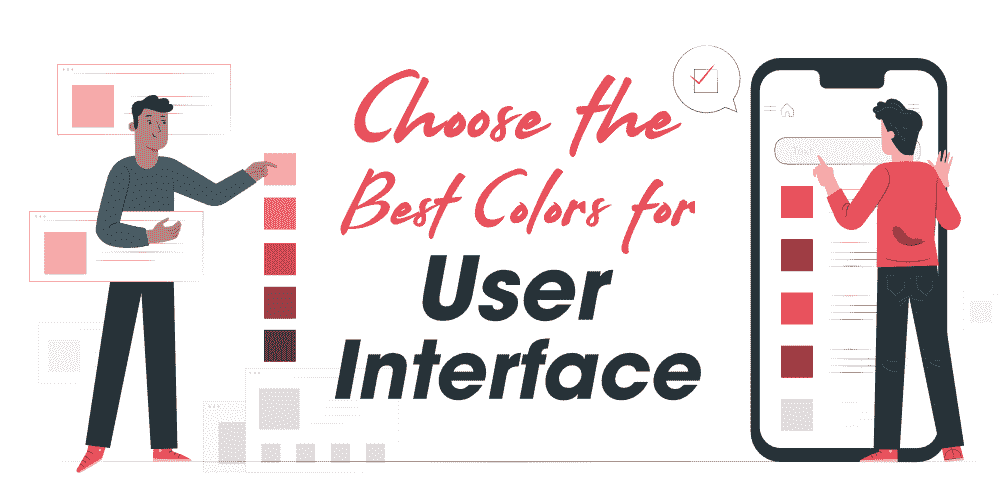
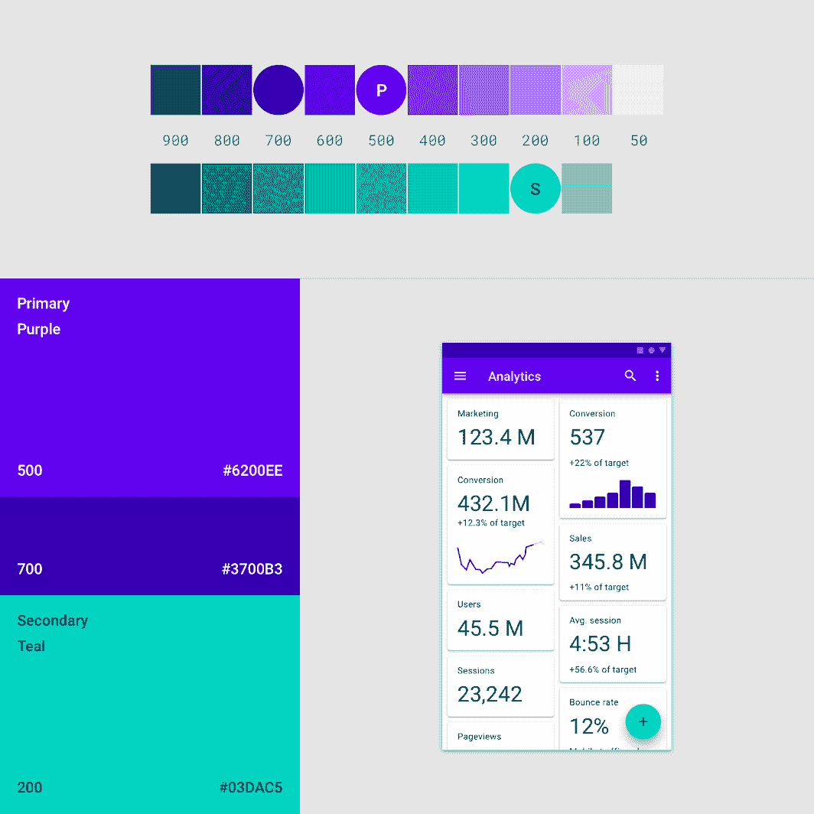
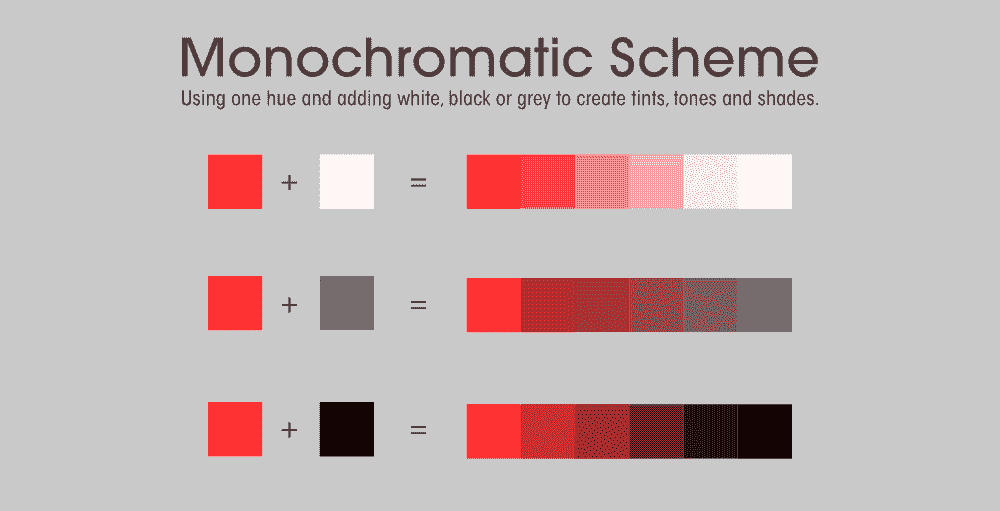

# 如何为用户界面选择最佳颜色？

> 原文:[https://www . geesforgeks . org/如何为用户界面选择最佳颜色/](https://www.geeksforgeeks.org/how-to-choose-the-best-colors-for-the-user-interface/)

**可口可乐、麦当劳、戴尔、咖啡日咖啡馆、Paytm、星巴克…..**当你想到这些著名的服务或品牌时，你会想到什么……也许是你最喜欢的美味食物、小玩意、饮料，或者是这些品牌的标志性标志和颜色，它们曾经用这些标志和颜色让他们的产品和服务更具吸引力。现在阅读下面一些有趣的事实…

***你知道吗，85%的购物者把颜色作为他们购买特定产品的主要原因。***
***你知道使用颜色时品牌认可度提升 80%吗？这意味着品牌认可度与消费者信心直接相关。***

颜色在品牌识别和获得顾客对特定服务或产品的关注方面确实起着重要的作用。顾客通过思考用来代表服务和产品的颜色，立即对任何服务或产品做出判断。它与人类的情感直接相关，可以对用户产生积极或消极的影响。根据萨延德拉·辛格(Satyendra Singh)***的《管理决策》一书，“人们在最初与网站或产品互动的 90 秒内就做出了决定。大约 62-90%的评估仅基于颜色。”**T3】*

现在你可能已经明白，颜色在建立信任、让消费者感到舒适以及创造品牌认可度方面发挥着巨大的作用。你为标题文本选择的颜色，到你为背景选择的颜色，每种颜色都为你的网站和你的品牌宣传设定了基调。挑选合适的配色方案并将其混合在一起并不是一件容易的事情，尤其是对于那些对自己的色彩协调能力不自信以及对平面设计不深入的人来说。现在的问题是……***如何为 UI 设计选择合适的颜色？*** 让我们讨论一些步骤、技巧和技巧，为您的网站选择合适的配色方案……

### 1.选择您的主要(主要)和次要颜色

原色或主色是用户界面的基本颜色。一般设计师从网站的 logo 中选择原色。主色代表了你网站的品牌，当用户访问你的网站或想到你的服务和产品时，它会带来某种情绪。当你想到可口可乐时，红色会浮现在你的脑海中，并引发情绪反应，如兴奋、大胆、爱和对可乐的热情。根据经验，专家建议您在用户界面中使用的原色不应超过三种。

除了原色之外，设计师在网站上使用的是副色。使用辅助颜色是可选的，但它会使您的用户界面更有吸引力，并提供了区分您的产品的机会。

**如何选择合适的主色？**

你是想吸引更年轻、更有活力的顾客还是 5-15 岁年龄段的孩子？你是想卖一些美容抗衰老的产品还是你的服务跟游戏和科技有关？你需要问自己，你的品牌代表什么，你和你的品牌有什么情感或感觉？每种颜色都与不同的情感和感受相关联，不同的颜色吸引不同类型的客户。考虑某些因素，如年龄、性别和目标受众。牢记色彩在 UI 设计中的心理作用，并据此选择色彩。以下是颜色的一些简短含义…

*   **红色:**爱、自信、激情、力量和愤怒。它经常被用来制造人们购买的紧迫感。例如:可口可乐，佐马托，塔吉特，网飞。
*   **橙色:**友善、热情、创意、独特的秋天。它通常是一种温暖而充满活力的颜色，促使人们采取行动:购买并订阅。当你试图为你的顾客营造一个温暖而诱人的氛围时，使用这种颜色。例子:亚马逊，无薪，粉碎汽水。
*   **黄色:**警告、年轻、快乐、乐观、愉快、阳光、喜悦、温暖或财富，在金色的阴影中。例如:麦当劳、赫兹、国家地理、尼康
*   **绿色:**自然、运气、财富、健康、清洁、成长、和谐、耐力、更新。例如:纯果乐、动物星球、有机印度、全食。
*   **蓝色:**悲伤、冷静、可靠、信任、团体、沟通、忠诚、内心安全感。经常用于 IT 服务、企业和银行，以建立对品牌的安全感和信任感。例如:戴尔、脸书、领英、推特、美国运通、口语-B
*   **紫色:**王权、创造力、财富、成功、智慧、神秘和魔法、灵性。多用于美容抗衰产品。例如:吉百利、卡塔尔航空、泰国航空、皇家皇冠航空。
*   **粉色:**女人味，浪漫，甜美，天真，敏感。通常用于向妇女或年轻女孩提供服务。例子:粉色维多利亚秘密，芭比，Lyft。
*   **黑色:**优雅、力量、奢华、力量、神秘。例如:巴黎欧莱雅、安德玛、海峡。
*   **灰色:**保守、简约、中性、现代、冷静、逻辑、未来、奢华。常用于技术、工业、精密、能力和精密。例子:苹果、奔驰、博世。

以上颜色的含义有助于为你的网站选择主色。简而言之，你需要注意某些因素，如年龄、性别(男性或女性)，以及你想通过网站反映的情绪。

### 2.强调色

强调色通常用于突出显示用户界面元素，如进度条、按钮、引号、字幕、链接、标题、滑块、开关和一些重要信息。
选择一种强调色不是一件容易的事情，它应该与网站上使用的其他颜色很好地融合在一起。你应该对色彩理论有很好的理解。强调色通常有更多的饱和度和亮度，这有助于用户互动。下面是一个材质用户界面的例子，其中强调色用于浮动操作按钮。

图片来源——谷歌分析

使用一些配色工具，如 [Adobe Color CC 工具](https://color.adobe.com/)，可以轻松找到强调色。

### 3.背景色或中性色

中性颜色或背景颜色通常用于网站的文本或背景。当用户看到网站的背景颜色时，他/她应该感到舒适。想象你进入一个房间，你注意到墙壁的颜色。墙壁的颜色不应该是压倒性的，它应该足够舒缓，让你可以在房间里呆上几个小时，给你放松的感觉。选择这种颜色也是一个棘手的游戏，因为如果你选择了错误的颜色，那么它会产生相反的影响，房间也可能会给人无聊或沉闷的感觉。

背景颜色的选择取决于你希望访问者关注的内容或网站的目的。例如，电子商务公司通常使用白色或灰色背景，带有醒目的主色调和强调色。*为什么？*因为他们的主要重点是推广创意或产品而不是网站的设计。浅色或中性的背景颜色有助于使内容更加可见和易读。时尚、设计、餐厅、美容和创意行业使用的背景颜色没有规则。您可以使用黑色菜单栏，也可以使用彩虹的颜色来创建一个鼓舞人心的背景图像。你在这里是自由的，你可以选择任何颜色，但在选择颜色时，请确保文本或内容不会很难阅读。

### 4.语义颜色

语义颜色通常用于传递信息，如警告、危险、成功和错误。这些颜色通常是用户界面设计者在网站中使用的保留颜色。红色表示错误，绿色表示成功，黄色表示警告，蓝色表示信息性消息。

### 技巧

最后，我们想给你一些建议，帮助你为你的网站选择正确的配色方案…

**1。60–30–10 法则:**这个法则来自于室内设计，在室内设计中，颜色应该组合在一起，因为 60%是主色调，30%是副色，10%是强调色。

**2。考虑颜色是如何协同工作的:**你需要理解令人惊讶地融合在一起的颜色组合。为了创造一个令人愉快和和谐的颜色组合，你可以使用传统的配色方案模式，如类比，单色和互补。使用这些配色方案的规则建立在**色圆**或**色轮**的基础上，这是创建颜色组合的有用工具。

*   **单色配色方案**使用单一色调的变化(色调)，它由不同的色调、色调和色调组成。

*   **互补方案**通过将色轮相对两侧的颜色结合在一起而创建。这些方案仅使用两种颜色，但您可以使用不同的色调、色调和色调来扩展它。
*   **通过使用色轮上彼此相邻的三种不同颜色来创建类似的配色方案**。
*   **三色**可以通过将等边三角形重叠到彩色圆上来获得
*   **分裂补色**可以通过将主色匹配到与其补色相邻的两种颜色上来获得。
*   **正方形颜色**可以通过将一个正方形重叠到彩色圆上来获得。
*   **从自然中汲取灵感:**人与自然联系在一起，总会感到舒服。人们喜欢欣赏日落、黎明、秋天、森林或山脉。最好的颜色组合来自大自然。如果你注意你的环境和周围，你可以找到适合你网站的颜色组合和设计方案。
*   **不要忘记文化差异:**每种文化都有自己的传统和信仰，所以在你选择任何颜色组合之前，确保它们会被按照你的意思解释。一种颜色在不同的国家可能有不同的含义，所以在为你的网站选择颜色时要记住文化差异。