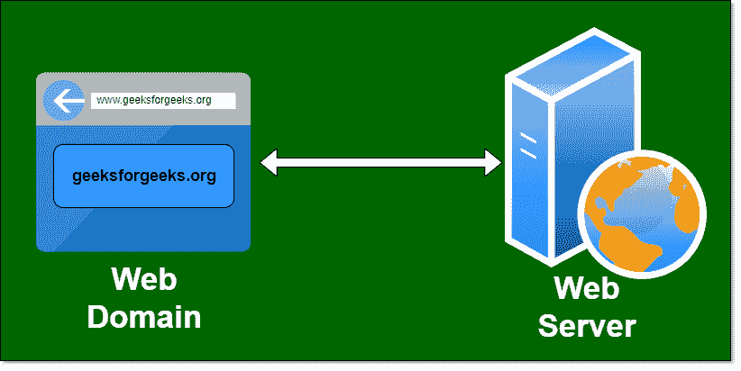

# 如何选择 Web 托管服务器和 Web 域？

> 原文:[https://www . geesforgeks . org/如何选择-网络托管-服务器和网络-域/](https://www.geeksforgeeks.org/how-to-choose-web-hosting-server-and-web-domain/)

**“今天不是‘获取流量’——而是‘获取有针对性的相关流量’。””–亚当·奥黛特**

当我们想在线托管业务时，脑海中浮现的是购买哪个域名？哪个领域好？它有什么特点？什么是托管？有什么用？以及其他各种东西。所以，这里是所有这些问题的答案。

域名或域名是在网站的网址中用来识别任何特定网页的名称。例如:**www.geeksforgeeks.org**。Web 服务器是一个程序，它处理用户的网络请求，并为他们提供创建网页的文件。这种交换使用超文本传输协议进行。在这个虚拟世界中，我们的网站数据存储在托管服务器中。托管服务器就像一台包含内存、处理器、硬盘、操作系统等可以远程访问的计算机。

**决定购买哪个域名的因素:**

*   **选择简单域名:**选择一个容易拼写、发音、容易记忆的短域名。请始终选择与您的工作相关的域名，如果域名已经被其他用户使用，请使用同义词注册域名。
*   **避免连字符和数字:**从域名中忽略连字符和数字是一个很好的做法。
*   **选择最佳域扩展:**域扩展事关营销和客户目的。强烈建议使用”。com”域扩展因为大部分用户熟悉。com 扩展。你也可以用”。net，。org 等。
*   **客户支持:**有好的客户支持的公司工作起来会更安心。

**转让价格:**如果由于任何原因您不喜欢该域名公司，例如客户支持不佳，并且如果您希望更换您的公司，那么为此支付的额外金额就是转让价格。

**网站如何与域名和托管一起工作？**
当我们在浏览器的搜索框中键入网址时，浏览器向其主机提供商发送请求，主机向浏览器发送响应页面，浏览器下载网站，然后网站可以进一步使用。所以，这两件事就是服务器上传和浏览器下载。

**网络托管服务器类型:**

*   **专用服务器:**专用服务器是指您租用并使用完整的服务器系统。专用服务器成本很高，速度也很快。它非常安全，因为它被一家公司使用。
*   **虚拟专用服务器(VPS):** VPS 将一台物理服务器共享到多台服务器中，共享服务器就像一台独立的服务器。
*   **共享服务器:**网站托管在与其他网站共享的服务器上。共享托管的主要优势是价格便宜。与其他主机相比，共享主机的成本非常便宜。共享托管的主要缺点是速度慢。共享托管中网站速度很慢。
*   **基于云的网络托管:**这是一种托管技术，可以让数百台单独的服务器协同工作，使其看起来像一台大型(巨型)服务器。基于云的网络托管的主要优势是它的大小可以根据服务器需求进行修改。

**决定选择哪个主机的因素:**

*   **网速:**是网速的别称。因此，如果互联网速度高，那么上传和下载的速度也高。
*   **数据上限:**这是服务器提供的数据的传输限制。超过限额后，将支付费用。
*   **操作系统:**必须检查网站中是否有某些特定的软件只在选定的操作系统中可用，然后选择该操作系统。例如:如果你想在 WordPress 中设计一个网站，那么 LINUX 操作系统很好，而且是免费的。
*   **RAM &处理能力:**一个网站对 RAM 和处理能力的要求，可以借助服务器来完成。一台共享服务器一次可以处理大约 1000 个用户，在此之上，将需要一台 VPS 服务器，经过一些限制后，专用服务器将可以工作。
*   **输入输出操作:**在 RAM 中，有一个输入输出操作，所以必须检查一次服务器可以处理多少个输入输出操作。服务器能够处理的操作越多越好。
*   **市场区域:**如果网站最有可能在印度使用，则优先购买印度的托管。