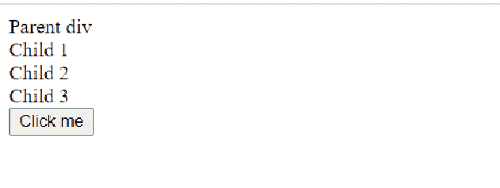
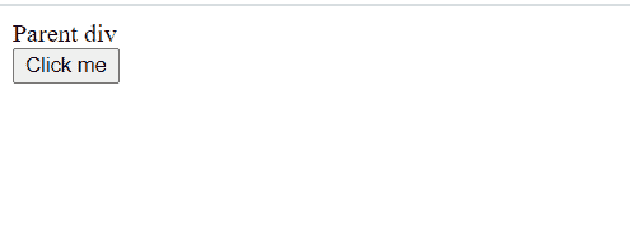

# 如何清除父 div 中所有 div 的内容？

> 原文:[https://www . geesforgeks . org/how-to-clear-all-div-content-in-a-parent-div/](https://www.geeksforgeeks.org/how-to-clear-all-divs-content-inside-a-parent-div/)

给定一个包含 div 元素的 HTML 文档，任务是使用 jQuery 移除现有的 HTML 元素。为了移除元素及其内容，jQuery 提供了两种方法:

*   **移除():**移除所选元素及其子元素。
*   **empty():** 它从所选元素中移除子元素。

**示例:**

```htmlhtml
<div id="Parent">
   <div id="child1">child 1</div>
   <div id="child2">child 2</div>
   <div id="child3">child 3</div>
</div>
```

**语法:**以下函数清除父“div”

```htmlhtml
$('#parent').empty();
```

下面的函数清除所有子“div”，但保留父“div”不变。

```htmlhtml
$('#parent div').empty()
```

**示例:**

## 超文本标记语言

```htmlhtml
<!DOCTYPE html>
<html lang="en">

<head>
    <meta charset="UTF-8">
    <meta name="viewport" content=
        "width=device-width, initial-scale=1.0">

    <script src=
"https://ajax.googleapis.com/ajax/libs/jquery/3.5.1/jquery.min.js">
    </script>
</head>

<body>
    <div id="parent">
        Parent div
        <div id="child1">Child 1</div>
        <div id="child2">Child 2</div>
        <div id="child3">Child 3</div>
    </div>

    <button onclick=myFunc()>Click me</button>

    <Script>
        function myFunc() {
            $('#parent div').empty()
        }
    </Script>
</body>

</html>
```

**输出:**

*   **点击按钮前:**
    
*   **点击按钮后:**
    