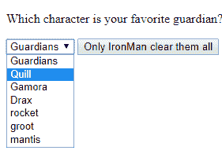
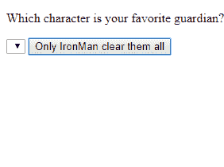
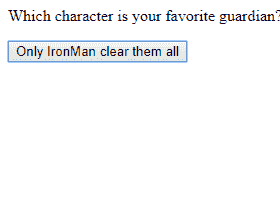

# 如何清除下拉框中的所有选项？

> 原文:[https://www . geesforgeks . org/如何清除下拉框中的所有选项/](https://www.geeksforgeeks.org/how-to-clear-all-options-in-a-dropdown-box/)

清除整个下拉列表非常容易，我们所要做的就是创建一个按钮，它调用一个执行删除的函数。
我们来看看删除部分的语法:

```html
document.getElementById("idofdropdownlist").innerHTML = "";
```

这里，它获取给定标识中存在的所有元素，然后通过将所有对象赋为空来清除，如果没有赋为空，对象仍然存在。
**进场 1:** 查看代码:

```html
<!DOCTYPE html>
<html>

<body>

    <p>Which character is your favorite guardian?</p>

        <select id="guardian">
            <!--dropdown list with id=guardian-->
            <option>Guardians</option>
            <option>Quill</option>
            <option>Gamora</option>
            <option>Drax</option>
            <option>rocket</option>
            <option>groot</option>
            <option>mantis</option>
        </select>

        <input type="button" onclick="myFunction()"
               value="Only IronMan clear them all" />
        <!––Button which avokes myFuction()-->

        <script>
            function myFunction() {
                //clears all the guardians with the specified id
                document.getElementById("guardian").innerHTML =
                    null;
            }
        </script>
</body>

</html>
```

**输出:**



**方法 2:**
这个过程不仅删除了选项，还删除了下拉框。
**查看代码:**

```html
<html>

<body>

    <p>Which character is your favorite guardian?</p>

    <select id="guardian">
        <!--dropdown list with id=guardian-->
        <option>Guardians</option>
        <option>Quill</option>
        <option>Gamora</option>
        <option>Drax</option>
        <option>rocket</option>
        <option>groot</option>
        <option>mantis</option>
    </select>

    <input type="button" 
           onclick="myFunction()" 
           value="Only IronMan clear them all">
    <!––Button which avokes myFuction()-->

    <script>
        function myFunction() {
            //process the options in a loop and removes them
            document.querySelectorAll(
              '#guardian').forEach(guardian => guardian.remove())
                //here, guardian inside the for is a variable not id.
        }
    </script>
</body>

</html>
```

**输出:**
[](https://contribute.geeksforgeeks.org/how-to-clear-all-options-in-a-dropdown-box/screenshot-1054/)
[](https://contribute.geeksforgeeks.org/how-to-clear-all-options-in-a-dropdown-box/screenshot-1163/)

**这些方法适用于所有浏览器。**