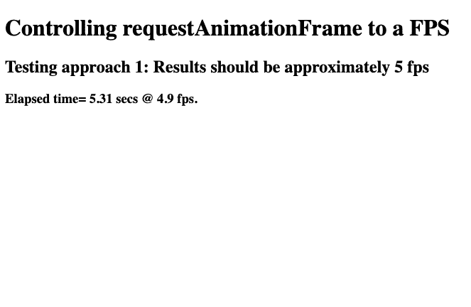
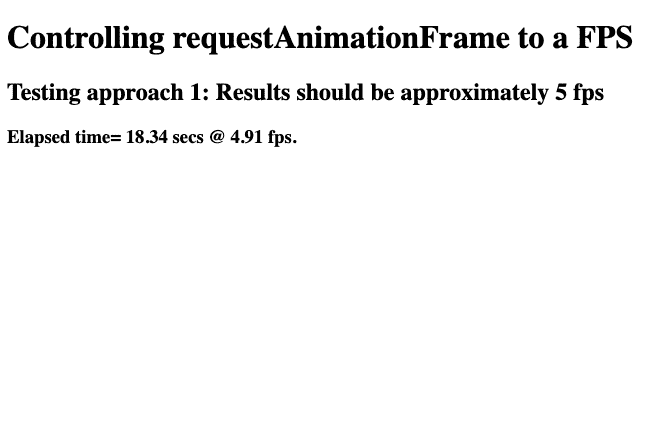
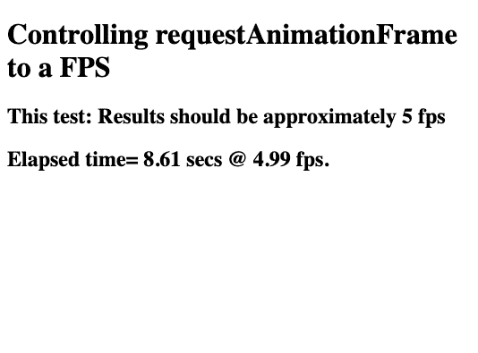
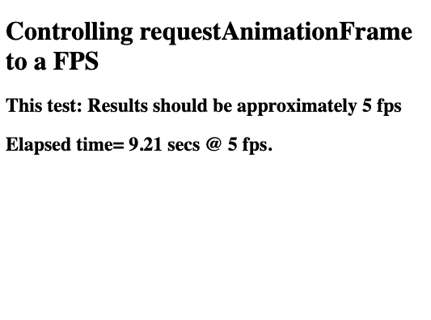

# 如何用 requestAnimationFrame 控制 fps？

> 原文:[https://www . geesforgeks . org/how-to-control-fps-with-requestanimationframe/](https://www.geeksforgeeks.org/how-to-control-fps-with-requestanimationframe/)

**简介:**
控制每秒帧数限制很重要，尤其是在开发动画对象不应超过特定每秒帧数限制的游戏时。`requestAnimationFrame()`用于简单地重新绘制屏幕——它不是定时器或循环功能。

> requestAnimationFrame(回调):
> 用于使用指定的回调函数更新或重画屏幕。

每当对`requestAnimationFrame()`进行函数调用时，屏幕/帧都会根据开发人员编写的更新代码重新绘制，这使得它成为控制帧率的合适选项。用`requestAnimationFrame()`控制 fps 有两种方式。这些讨论如下。

*   **使用【设置超时】功能:**
    这是一种快速简单的控制 fps 的方法。`setTimeout()`功能有如下声明:

> **setTimeout(函数，毫秒):**
> 可以用来在等待指定的秒数后执行一个函数。

使用`setTimeout()`控制 fps 的代码如下，将`requestAnimationFrame()`作为一个函数传递给`setTimeout()`，用于在指定的 fps 下定期更新屏幕。

```
<h1>Controlling requestAnimationFrame to a FPS</h1>
<h2>Testing approach 1: 
         Results should be approximately 5 fps</h2>
<h3 id="results">Results:</h3>
<canvas id="canvas" width="300" height="300">
</canvas>

<script>
    var frameCount = 0;
    var $results = $("#results");
    var fps, fpsInterval, startTime, now, then, elapsed;

    startAnimating(5);

    function startAnimating(fps) {
        fpsInterval = 1000 / fps;
        then = Date.now();
        startTime = then;
        console.log(startTime);
        animate();
    }

    function animate() {
        setTimeout(function () {
      // requestAnimationFrame() is called 
      // with animate() callback
      // to update content at specified fps
            requestAnimationFrame(animate);

            // ... Code for Animating the Objects ...
            now = Date.now();
            var sinceStart = now - startTime;
            var currentFps =
  Math.round((1000 / (sinceStart / ++frameCount)) * 100) / 100;
   $results.text("Elapsed time= " 
         + Math.round((sinceStart / 1000) * 100) / 100 +
         " secs @ " + currentFps + " fps.");
        }, fpsInterval);
    }
</script>
```

**输出:**
两幅图像显示 fps 在 5 fps 左右波动，如上面的代码所假设的。

*   FPS is 4.9, after 5.31 seconds have elapsed:

    

    *   FPS is 4.91, after 18.34 seconds have elapsed:

    

    上面的代码很简单，以 fps 指定的间隔速率调用`setTimeout()`函数。每次调用`setTimeout()`时，`requestAnimationFrame()`被执行，屏幕被重画或更新。所有这些都发生在开发人员确定的指定 fps 上。

    *   **A More Optimized Approach:**
    Most browsers cannot optimize the `setTimeout()` function, so to optimize the process of controlling fps simple calculation can be used. This can be easily done by keeping track of time when the frame was updated last. If the change in time (`current time — previous time`) exceeds the update interval, then update the frame/screen.

    为此，请记录当前时间和前一时间。每次我们得到:

    ```
    current_time - previous_time > update_interval 

    ```

    该帧被更新并重新绘制到屏幕上。这方面的代码如下:

    ```
    <h1>Controlling requestAnimationFrame to a FPS</h1>
    <h2>This test: Results should be approximately 5 fps</h2>
    <h2 id="results">Results:</h2>
    <canvas id="canvas" width="300" height="300"></canvas>

    <script>
        var frameCount = 0;
        var $results = $("#results");
        var fps, fpsInterval, startTime, now, then, elapsed;

        startAnimating(5);

        function startAnimating(fps) {
            fpsInterval = 1000 / fps;
            then = Date.now();
            startTime = then;
            console.log(startTime);
            animate();
        }

        function animate() {
            // request another frame

            requestAnimationFrame(animate);

            // calc elapsed time since the last loop

            now = Date.now();
            elapsed = now - then;

            // if enough time has elapsed, draw the next frame

            if (elapsed > fpsInterval) {
                then = now - (elapsed % fpsInterval);

            // draw animating objects here...

            // below code is used for testing, whether
           // the frame is animating at the specified fps

                var sinceStart = now - startTime;
                var currentFps = 
    Math.round((1000 / (sinceStart / ++frameCount)) * 100) / 100;
                $results.text("Elapsed time= " 
                 + Math.round((sinceStart / 1000) * 100) / 100 
                 + " secs @ " + currentFps + " fps.");
            }
        }
    </script>
    ```

    **输出:**
    两幅图像显示 fps 在 5 fps 左右波动，如上面的代码所假设的。

    *   FPS is 4.99, after 8.61seconds have elapsed:

    

    *   FPS is 5.00, after 9.21 seconds have elapsed:

    

    在上面的代码中，两个变量`current_time`和`previous_time`用于记录自上次更新以来经过的时间。只要满足条件(时间变化大于间隔时间)，就会更新帧以激活对象。