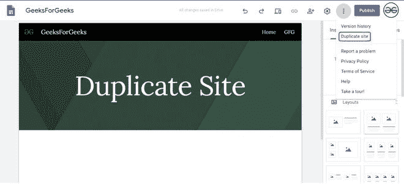
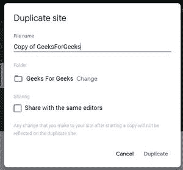
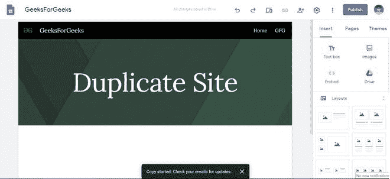

# 如何在新谷歌网站中复制一个网站？

> 原文:[https://www . geeksforgeeks . org/如何在新的谷歌网站上复制网站/](https://www.geeksforgeeks.org/how-to-copy-a-site-in-new-google-sites/)

有时候你正在做一个项目，你必须制作一些相似的网站，所以最好的方法就是简单地复制这些网站。谷歌网站有复制网站和复制父网站的功能。要复制站点，请执行以下步骤:

打开要复制的网站，并进行必要的更改(如果有)。使用“更多”选项选择“复制站点”选项。

点击复制站点选项，将会打开一个对话框，填写要求的信息，然后点击复制按钮。

一旦复制开始，您将看到两个选项之一:

*   如果网站少于 50 页，即对于小型网站，链接将出现在网站编辑器页面的底部。
*   如果网站超过 50 页，它会告诉你检查你的邮件帐户。

