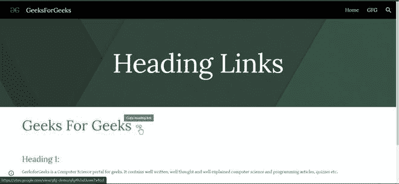
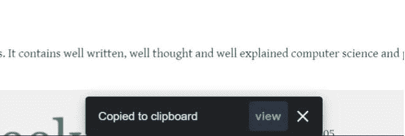
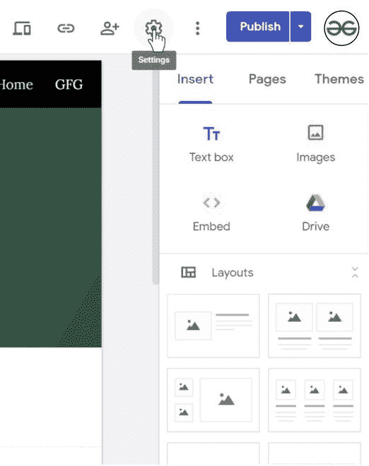
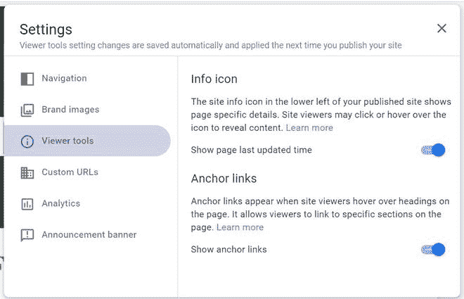
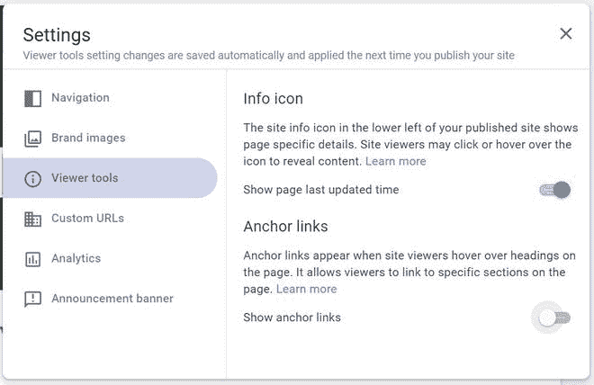

# 如何在新的谷歌网站中复制和隐藏标题链接？

> 原文:[https://www . geeksforgeeks . org/如何复制和隐藏新谷歌网站中的标题链接/](https://www.geeksforgeeks.org/how-to-copy-and-hide-heading-links-in-new-google-sites/)

**复制标题链接:**要复制标题列表，请执行以下步骤:

*   转到您发布的网站，向下滚动到网站上出现的标题。
*   当您将鼠标悬停在标题或标题或子标题上时，您会注意到一个图标出现。

*   点击它复制该标题或标题的链接。

**隐藏标题链接:**隐藏链接比复制容易。要隐藏标题链接，请执行以下步骤:

*   转到设置。

*   然后转到查看器工具选项。

*   禁用默认情况下启用的“显示锚点链接”按钮。

*   然后重新发布网站以查看更改。

> **注意:**不能复制标题的链接或页面标题中的标题。