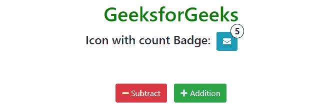
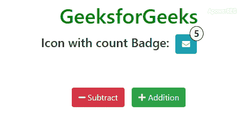

# 如何统计图标上的通知次数？

> 原文:[https://www . geesforgeks . org/如何计数图标上的通知数量/](https://www.geeksforgeeks.org/how-to-count-number-of-notification-on-an-icon/)



Bootstrap 为我们提供了徽章，用于在图标上显示计数，该图标可用于显示未读通知/消息等。我们需要获取图标徽章上的计数值，并相应地更新该值。在本文中，我们将创建一个通知图标，它可以像未读通知一样保存计数。我们将把它分成两个不同的部分，在第一部分，我们将创建图标的结构，在第二部分，我们将设计图标并使图标响应。
**方法:**我们将继续执行以下步骤，以确保无论 DOM 结构如何，我们总能获得图标的通知号/徽章数。

*   将图标和徽章包装在同一元素下。
*   使用 jQuery [**find()**](https://www.geeksforgeeks.org/jquery-find-with-examples/) 函数提取计数。
*   从提取的值中增加/减少徽章的计数。
*   更新该值。

**创建结构:**下面是我们将用作模板的示例代码。最后，我们将根据下面的问题陈述应用 jQuery。

*   **字体超赞图标的 CDN 链接:**

*   **HTML 代码:**

## 超文本标记语言

```htmlhtml
<!-- Final Solution -->
<!DOCTYPE html>
<html lang="en">

<head>
    <meta charset="utf-8">
    <meta name="viewport"
          content="width=device-width, initial-scale=1">
    <link rel="stylesheet" href=
"https://maxcdn.bootstrapcdn.com/bootstrap/4.4.1/css/bootstrap.min.css">
    <script src=
"https://ajax.googleapis.com/ajax/libs/jquery/3.4.1/jquery.min.js">
    </script>
    <script src=
"https://cdnjs.cloudflare.com/ajax/libs/popper.js/1.16.0/umd/popper.min.js">
    </script>
    <script src=
"https://maxcdn.bootstrapcdn.com/bootstrap/4.4.1/js/bootstrap.min.js">
    </script>
    <script src=
"https://cdnjs.cloudflare.com/ajax/libs/font-awesome/5.12.0/js/all.min.js">
    </script>
</head>

<body>
    <div class="container-fluid">
        <br>
        <br>
        <center>
            <h1>GeeksforGeeks</h1>
            <h4>Icon with count Badge:

               <!-- Wrapping the icon and badge -->
               <span id="group">
                 <button type="button" class="btn btn-info">
                  <i class="fa fa-envelope"></i>
                 </button>
                 <span class="badge badge-light">5</span>
               </span>
            </h4>
            <br>
            <br>
            <button class="btn btn-danger">
                <i class="fas fa-minus"></i>
              Subtract
            </button>
            <button class="btn btn-success">
                <i class="fas fa-plus"></i>
              Addition
            </button>
        </center>
    </div>
</body>

</html>
```

**设计结构:**在本节中，我们将设计结构，并使图标具有响应性。

*   **CSS 代码:**T2]

## 半铸钢ˌ钢性铸铁(Cast Semi-Steel)

```htmlhtml
<style>
    h1 {
        color:green;
       }
   .badge {
        position: relative;
        top: -20px;
        left: -25px;
        border: 1px solid black;
        border-radius: 50%;
       }
    button {
        margin:5px;
       }
</style>
```

*   **JavaScript 代码:**该方法的实现完全依赖于开发人员，DOM 结构依赖于所需的用例。开发人员没有必要将徽章与图标分组在同一元素中。

## java 描述语言

```htmlhtml
<script>

    // Use find() function to extract the badge
    // count from '#group' container.
    $(document).ready(function() {
        $(".btn").click(function() {
            var val = parseInt($('#group').find('.badge').text());

            // Check for the button clicked
            if ($(this).hasClass('btn-danger')) {
                $('#group').find('.badge').text(val - 1);
            } else if ($(this).hasClass('btn-success')) {
                $('#group').find('.badge').text(val + 1);
            }
        });
    });
</script>
```

**注意:**稍后我们将通过链接对其进行分组，以在徽章上应用 jQuery，而不管开发人员对其的实现如何。
**结合 HTML、CSS 和 JavaScript 代码:**这是最后的代码，是上面两部分的结合，创建结构和设计结构。

## 超文本标记语言

```htmlhtml
<!-- Final Solution -->
<!DOCTYPE html>
<html lang="en">

<head>
    <meta charset="utf-8">
    <meta name="viewport"
          content="width=device-width, initial-scale=1">
    <link rel="stylesheet" href=
"https://maxcdn.bootstrapcdn.com/bootstrap/4.4.1/css/bootstrap.min.css">
    <script src=
"https://ajax.googleapis.com/ajax/libs/jquery/3.4.1/jquery.min.js">
    </script>
    <script src=
"https://cdnjs.cloudflare.com/ajax/libs/popper.js/1.16.0/umd/popper.min.js">
    </script>
    <script src=
"https://maxcdn.bootstrapcdn.com/bootstrap/4.4.1/js/bootstrap.min.js">
    </script>
    <script src=
"https://cdnjs.cloudflare.com/ajax/libs/font-awesome/5.12.0/js/all.min.js">
    </script>
    <style>
        h1 {
            color:green;
        }
        .badge {
            position: relative;
            top: -20px;
            left: -25px;
            border: 1px solid black;
            border-radius: 50%;
        }
        button {
            margin:5px;
        }
    </style>
</head>

<body>
    <div class="container-fluid">
        <br>
        <br>
        <center>
            <h1>GeeksforGeeks</h1>
            <h4>Icon with count Badge:

               <!-- Wrapping the icon and badge -->
               <span id="group">
                 <button type="button" class="btn btn-info">
                  <i class="fa fa-envelope"></i>
                 </button>
                 <span class="badge badge-light">5</span>
               </span>
            </h4>
            <br>
            <br>
            <button class="btn btn-danger">
                <i class="fas fa-minus"></i>
              Subtract
            </button>
            <button class="btn btn-success">
                <i class="fas fa-plus"></i>
              Addition
            </button>
        </center>
    </div>
</body>
<script>

    // Use find() function to extract the badge
    // count from '#group' container.
    $(document).ready(function() {
        $(".btn").click(function() {
            var val = parseInt($('#group').find('.badge').text());

            // Check for the button clicked
            if ($(this).hasClass('btn-danger')) {
                $('#group').find('.badge').text(val - 1);
            } else if ($(this).hasClass('btn-success')) {
                $('#group').find('.badge').text(val + 1);
            }
        });
    });
</script>

</html>               
```

**输出** :



jQuery 是一个开源的 JavaScript 库，它简化了 HTML/CSS 文档之间的交互，它以其“少写多做”的理念而闻名。
跟随本 [jQuery 教程](https://www.geeksforgeeks.org/jquery-tutorials/)和 [jQuery 示例](https://www.geeksforgeeks.org/jquery-examples/)可以从头开始学习 jQuery。