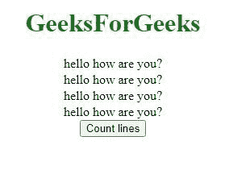
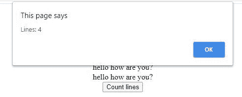

# 如何统计 DOM 元素内部的文本行？

> 原文:[https://www . geeksforgeeks . org/如何计数文本行 dom 内部元素/](https://www.geeksforgeeks.org/how-to-count-text-lines-inside-of-dom-element/)

为了计算 DOM 元素中的文本行数，我们将使用以下方法。

1.  获取 DOM 元素内部内容的总高度。
2.  获取一行的高度。
3.  通过将内容的总高度除以一行的高度，可以得到元素内部的总行数。

**例:**

## 超文本标记语言

```html
<!DOCTYPE html>
<html>

<head>
    <title>Count lines </title>
</head>

<body>
    <h1 style="color: green;">
        GeeksForGeeks
    </h1>

    <div id="content" style="width: 100%; 
                line-height: 20px">
        hello how are you?<br>
        hello how are you?<br>
        hello how are you? <br>
        hello how are you?<br>
    </div>

    <button onclick="countLines()">
        Count lines
    </button>

    <script>

        // Function to count total
        // number of lines
        function countLines() {

            // Get element with 'content' as id                            
            var el = 
                document.getElementById('content');

            // Get total height of the content    
            var divHeight = el.offsetHeight

            // object.style.lineHeight, returns 
            // the lineHeight property
            // height of one line 
            var lineHeight = 
                parseInt(el.style.lineHeight);

            var lines = divHeight / lineHeight;
            alert("Lines: " + lines);
        }
    </script>
</body>

</html>
```

*   **点击按钮前:**

    
*   **After Clicking on the button:**

    