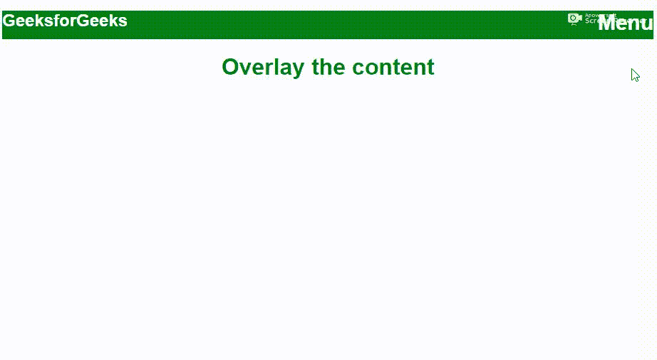
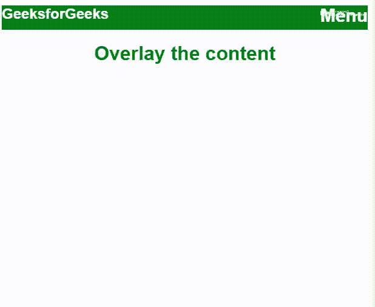

# 在较小的屏幕上按下汉堡菜单，如何覆盖整个屏幕？

> 原文:[https://www . geeksforgeeks . org/如何在较小的屏幕上按下汉堡菜单时覆盖整个屏幕/](https://www.geeksforgeeks.org/how-to-cover-the-whole-screen-when-the-hamburger-menu-is-pressed-on-smaller-screens/)

Bootstrap 提供了一个类来覆盖内容和不同的样式属性，使其看起来更有吸引力。用*填充视口或整个屏幕。导航条*改变高度。

```html
.navbar-nav{
min-height: 100vh;
}
```

**示例:**

```html
<!DOCTYPE html>
<html>

<head>
    <meta name="viewport" 
          content="width=device-width, initial-scale=1">
    <style>
        body {
            font-family: 'Lato', sans-serif;
        }

        .overlay {
            height: 100%;
            width: 0;
            position: fixed;
            background-color: rgb(255, 255, 255);
            background-color: rgba(0, 96, 128, 0.9);
            overflow-x: hidden;
            transition: 0.5s;
        }

        .overlay-content {
            position: relative;
            top: 25%;
            width: 100%;
            text-align: center;
            margin-top: 30px;
        }

        .overlay a {
            padding: 8px;
            text-decoration: none;
            font-size: 36px;
            color: #000000;
            display: block;
            transition: 0.3s;
        }

        .overlay a:hover,
        .overlay a:focus {
            color: #f1f1f1;
        }

        .overlay .closebtn {
            position: absolute;
            top: 20px;
            right: 45px;
            font-size: 60px;
        }

        @media screen and (max-height: 450px) {
            .overlay a {
                font-size: 20px
            }
            .overlay .closebtn {
                font-size: 40px;
                top: 15px;
                right: 35px;
            }
        }
    </style>
</head>

<body>

    <div id="myNav" class="overlay">
        <a href="javascript:void(0)" 
           class="closebtn"
           onclick="closeNav()">×</a>

        <div class="overlay-content">
            <a href="#">Login</a>
            <a href="#">SignUp</a>
            <a href="#">AboutUs</a>
            <a href="#">ContactUs</a>
        </div>
    </div>

    <h2 style="background-color:green; 
               color:white;
               height:40px ">GeeksforGeeks
<span style="font-size:30px;
             cursor:pointer; 
             float:right; "
      onclick="openNav()">Menu</span></h2>

    <h1 style="text-align:center; 
               color:green">Overlay the content</h1>
    <script>
        function openNav() {
            document.getElementById(
              "myNav").style.width = "100%";
        }

        function closeNav() {
            document.getElementById(
              "myNav").style.width = "0%";
        }
    </script>

</body>

</html>
```

**输出:**
**桌面视图:**


**手机视图:**
