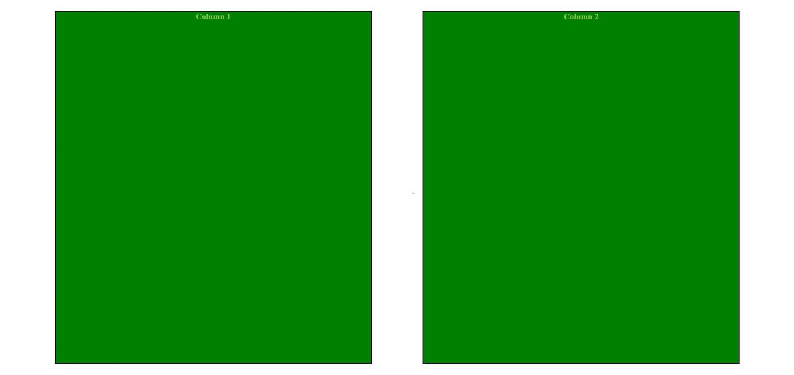

# 如何在保持列背景颜色全尺寸的同时创建 2 列布局？

> 原文:[https://www . geesforgeks . org/如何创建-2 列-布局-保留-列-背景-颜色-全尺寸/](https://www.geeksforgeeks.org/how-to-create-2-column-layout-while-keeping-column-background-colors-full-size/)

在本文中，我们将学习如何制作两列布局，同时保持列背景颜色的全尺寸。

**方法:**我们可以通过使用 CSS 中的 flexbox 技术，并通过相对于*视口设置列的*高度*来制作两列布局，背景颜色占据全尺寸。*

**HTML 代码:**下面的代码演示了上述方法。

## 超文本标记语言

```htmlhtml
<!DOCTYPE html>
<html lang="en">

<head>
    <!-- Required meta tags -->
    <meta charset="UTF-8">
    <meta name="viewport" 
          content="width=device-width, initial-scale=1.0">
    <meta http-equiv="X-UA-Compatible" content="ie-edge">
    <style>
        .container
        {
            display:flex;
            justify-content:space-evenly;
        }
        .column
        {
            margin-top: 15px;
            margin-bottom: 15px;
            height: 100vh;
            width: 40%;
            background-color: green;
            border: 2px solid black;
            text-align: center;
            font-weight:bold;
            color: yellowgreen;
        }
    </style>
 </head>

<body>
    <div class="container">
        <div class="column">Column 1</div> 
        <div class="column">Column 2</div> 
    </div>
</body>
</html>
```

**输出:**

