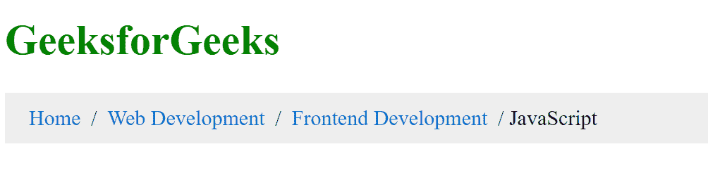
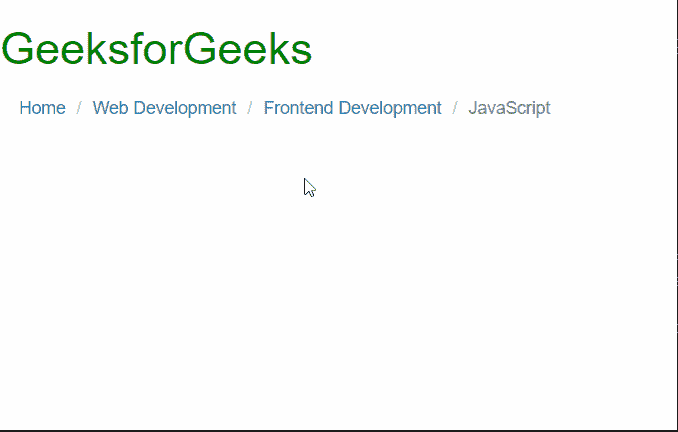

# 如何创建面包屑导航？

> 原文:[https://www . geeksforgeeks . org/如何创建面包屑导航/](https://www.geeksforgeeks.org/how-to-create-a-breadcrumb-navigation/)

在本文中，我们将学习如何创建面包屑导航。面包屑是辅助导航工具，帮助用户轻松浏览网站。面包屑为你提供了一个方向，并向你展示了你在网站层次结构中的确切位置。

**方法 1:** 我们将按照以下步骤仅使用 CSS 创建面包屑。该方法允许精确定制面包屑的外观。

**步骤 1:** 创建导航链接的 HTML 列表。

```htmlhtml
<ul class="breadcrumb-navigation">
    <li><a href="home">Home</a></li>
    <li><a href="webdev">Web Development</a></li>
    <li><a href="frontenddev">Frontend Development</a></li>
    <li>JavaScript</li>
</ul>
```

**第二步:**设置 CSS *显示:内联*以便在同一行显示列表。

```htmlhtml
.breadcrumb-navigation > li {
  display: inline;
}
```

**步骤 3:** 在每个列表元素后添加一个分隔符。

```htmlhtml
.breadcrumb-navigation li + li:before {
  padding: 4px;
  content: "/";
}
```

**示例:**

## 超文本标记语言

```htmlhtml
<!DOCTYPE html>
<html>

<head>
    <style>
        .breadcrumb-navigation {
            padding: 10px 18px;
            background-color: rgb(238, 238, 238);
        }

        .breadcrumb-navigation>li {
            display: inline;
        }

        .breadcrumb-navigation>li>a {
            color: #026ece;
            text-decoration: none;
        }

        .breadcrumb-navigation>li>a:hover {
            color: #6fc302;
            text-decoration: underline;
        }

        .breadcrumb-navigation li+li:before {
            padding: 4px;
            content: "/";
        }
    </style>
</head>

<body>
    <h1 style="color: green">GeeksforGeeks</h1>
    <ul class="breadcrumb-navigation">
        <li>
            <a href="home">
                Home
            </a>
        </li>
        <li>
            <a href="webdev">
                Web Development
            </a>
        </li>
        <li>
            <a href="frontenddev">
                Frontend Development
            </a>
        </li>
        <li>JavaScript</li>
    </ul>
</body>

</html>
```

**输出:**



**方法 2:** 我们将按照以下步骤使用引导库创建面包屑。这允许人们快速创建好看的面包屑。

**步骤 1:** 我们只需将 *aria-label=“面包屑”*添加到导航元素中。

```htmlhtml
<nav aria-label="breadcrumb">
```

**步骤 2:** 接下来我们在列表元素中添加*类=“面包屑-项目”*。

```htmlhtml
<li class="breadcrumb-item"><a href="#">
    Home
</a></li>
```

**步骤 3:** 在当前列表元素中添加*类=“面包屑-项目活动”*。

```htmlhtml
<li class="breadcrumb-item active" aria-current="page">
    JavaScript
</li>
```

**示例:**

## 超文本标记语言

```htmlhtml
<!DOCTYPE html>
<html>

<head>
    <link rel="stylesheet" href=
"https://maxcdn.bootstrapcdn.com/bootstrap/3.4.1/css/bootstrap.min.css" />
</head>

<body>
    <h1 style="color: green">
        GeeksforGeeks
    </h1>
    <nav aria-label="breadcrumb">
        <ol class="breadcrumb">
            <li class="breadcrumb-item">
                <a href="home">Home</a>
            </li>
            <li class="breadcrumb-item">
                <a href="webdev">Web Development</a>
            </li>
            <li class="breadcrumb-item">
                <a href="frontenddev">
                    Frontend Development
                </a>
            </li>
            <li class="breadcrumb-item active" 
                aria-current="page">
                JavaScript
            </li>
        </ol>
    </nav>
</body>

</html>
```

**输出:**

