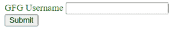
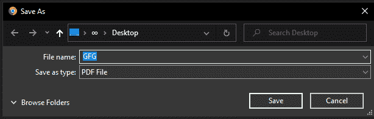

# 如何创建同时提交表单和下载 pdf 的按钮？

> 原文:[https://www . geesforgeks . org/如何创建一个同时提交表单和下载 pdf 的按钮/](https://www.geeksforgeeks.org/how-to-create-a-button-that-submits-a-form-and-downloads-a-pdf-simultaneously/)

没有同时下载和提交表单的直接方法，但是如果我们控制表单提交，并且在单击提交表单按钮时，我们首先触发下载 PDF，然后提交表单，我们就可以执行此任务。因此，我们可以遵循的方法如下所述:

**方法 1:在表单外创建提交表单按钮:**

*   首先，用隐藏的提交按钮创建一个表单。
*   为表单提交按钮提供 id，以便使用 JS 访问它。
*   在表单外创建一个按钮，并给它一个唯一的 id 来访问它。
*   使用 createElement 属性创建一个锚标记，并为其分配 href 和下载属性。
*   之后，我们只需使用 on click 属性，在单击下载按钮时调用提交按钮单击事件。

## 超文本标记语言

```htmlhtml
<!DOCTYPE html>
<html lang="en">
<head>
    <style>
        form {
            color: green;
        }
    </style>
</head>

<body>
    <!-- GFG is the name of the file to be downloaded-->
    <!-- In order to run the code, the location of the 
        file "GFG.pdf" needs to be changed to your local
        directory, both the HTML and downloadable file 
        needs to be present in the same directory -->
    <form method="post">
        <label for="username">GFG Username</label>
        <input type="text" name="username" />
        <input type="submit" id="submit-form" 
            value="submit" hidden />
    </form>

    <button id="download-pdf">Submit</button>

    <script>
        const downloadPdf = document
            .querySelector("#download-pdf");

        const submitForm = document
            .querySelector("#submit-form");

        downloadPdf.addEventListener("click", () => {

            // Creating the element anchor that
            // will download pdf
            let element = document.createElement("a");
            element.href = "./GFG.pdf";
            element.download = "GFG.pdf";

            // Adding the element to body
            document.documentElement.appendChild(element);

            // Above code is equivalent to
            // <a href="path of file" download="file name"> 

            // onClick property, to trigger download
            element.click();

            // Removing the element from body
            document.documentElement.removeChild(element);

             // onClick property, to trigger submit form
            submitForm.click();
        });
    </script>
</body>

</html>
```

**输出:**



**提交时:**



**方法二:提交时禁用提交:**比较简单的方法可以是点击提交-表单按钮禁用提交，调用先下载 PDF 再提交表单的函数手动提交。

*   首先，创建属性 onsubmit 设置为“return:false；的表单，这实际上阻止了表单在单击提交按钮时提交。
*   使用 createElement 属性创建一个锚标记，并为其分配 href 和下载属性。
*   之后，我们简单地调用表单上的 submit 事件来提交它，从我们创建的元素触发下载。

## 超文本标记语言

```htmlhtml
<!DOCTYPE html>
<html>

<head>
    <style>
        form {
            color: green;
        }
    </style>
</head>

<body>
    <!-- GFG is the name of the file to be downloaded-->
    <!-- In order to run the code, the location of the 
        file "GFG.pdf" needs to be changed to your local
        directory, both the HTML and downloadable file  
        needs to be present in the same directory -->
    <form id="my-form" onsubmit="return: false;">
        <label for="username">GFG username</label>
        <input type="text" name="username" />
        <input type="submit" id="submit-form" 
            value="Submit" />
    </form>

    <script>
        const myForm = document
            .querySelector("#my-form");

        const submitForm = document
            .querySelector("#submit-form");

        submitForm.addEventListener("click", () => {

            // Creating element to download pdf
            var element = document.createElement('a');

            // Setting the path to the pdf file
            element.href = 'GFG.pdf';

            // Name to display as download
            element.download = 'GFG.pdf';

            // Adding element to the body
            document.documentElement.appendChild(element);

            // Above code is quivalent to
            // <a href="path to file" download="download name"/>

            // Trigger the file download
            element.click();

            // Remove the element from the body
            document.documentElement.remove(element);

            // Submit event, to submit the form
            myForm.submit();
        });
    </script>
</body>

</html>
```

**输出:**


**提交时:**

