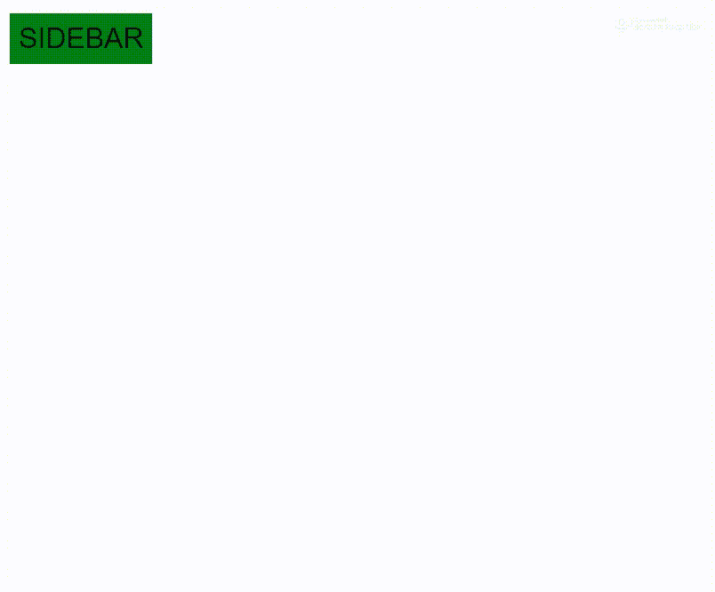

# 如何创建折叠侧边栏？

> 原文:[https://www . geesforgeks . org/如何创建折叠边栏/](https://www.geeksforgeeks.org/how-to-create-a-collapsed-sidebar/)

引导侧边栏是一个用于垂直导航的组件。它可以根据您的需求使用 CSS 定制各种样式，并可以使用 JavaScript 进行响应。

### **创建简单侧栏:**

*。侧边栏*类用于创建简单的 Bootstrap 侧边栏。要制作一个折叠的侧边栏，你还需要一点 JavaScript 知识，因为它将被用来打开和关闭侧边栏，这将使你的侧边栏响应迅速。

**示例:**

```html
<html>

<head>
    <style>
        /*Position and style for the sidebar*/

        .sidebar {
            height: 100%;
            width: 0;
            position: fixed;
            /*Stays in place */
            background-color: green;
            /*green*/
            overflow-x: hidden;
            /*for Disabling horizontal scroll */
        }
        /* Position and style for the sidebar links */

        .sidebar a {
            padding: 10px 10px 10px;
            font-size: 25px;
            color: #111;
            display: block;
            transition: 0.3s;
        }
        /* the links change color when mouse hovers upon them*/

        .sidebar a:hover {
            color: #FFFFFF;
        }
        /* Position and style the for cross button */

        .sidebar .closebtn {
            position: absolute;
            top: 0;
            right: 25px;
        }
        /* Style for the sidebar button */

        .openbtn {
            font-size: 32px;
            background-color: #008000;
            color: #111;
            padding: 10px 10px 10px;
            border: none;
        }
        /* the sidebar button changes 
      color when mouse hovers upon it */
.openbtn:hover {
  color: #FFFFFF;
}

      /* pushes the page content to the right
      when you open the side navigation */

        #main {
            transition: margin-left .5s;
            /* If you want a transition effect */
            padding: 10px;
        }
    </style>
</head>

<body>
    <div id="sidebar" class="sidebar">
        <a href="javascript:void(0)" 
           class="closebtn" 
           onclick="closeNav()">
          ×
      </a>
        <!--the cross button-->
        <a href="#">India</a>
        <a href="#">Nepal</a>
        <a href="#">Srilanka</a>
        <a href="#">Myanmar</a>
    </div>

    <div id="main">
        <button class="openbtn" 
                onclick="openNav()">
          SIDEBAR
      </button>
        <!-- for the sidebar button-->
    </div>
</body>
<script>
    /* Sets the width of the sidebar 
    to 250 and the left margin of the 
    page content to 250 */
    function openNav() {
        document.getElementById(
          "sidebar").style.width = "250px";
        document.getElementById(
          "main").style.marginLeft = "250px";
    }

    /* Set the width of the sidebar 
    to 0 and the left margin of the 
    page content to 0 */
    function closeNav() {
        document.getElementById(
          "sidebar").style.width = "0";
        document.getElementById(
          "main").style.marginLeft = "0";
    }
</script>

</html>
```

**输出:**


通过运行这三个代码，您可以制作一个简单的折叠边栏。您可以进一步添加更多的 CSS 功能，使其根据您的需求变得更好。