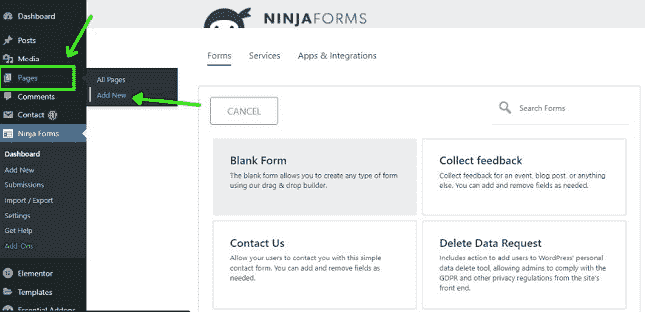
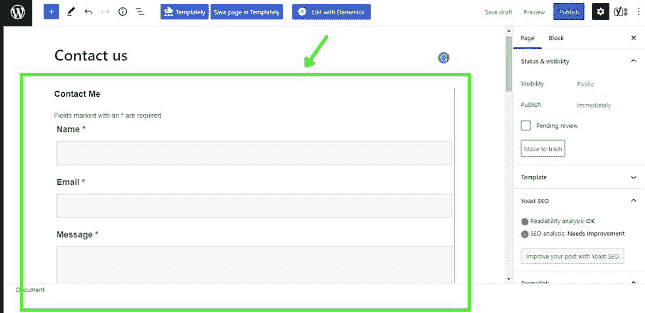

# 如何在 WordPress 中创建联系人表单？

> 原文:[https://www . geeksforgeeks . org/如何在 wordpress 中创建联系人表单/](https://www.geeksforgeeks.org/how-to-create-a-contact-form-in-wordpress/)

假设我们有一个 [WordPress](https://www.geeksforgeeks.org/introduction-wordpress/) 网站，我们想添加一个功能，他们可以从这里联系到他们的查询。我们可以通过在网站上使用 WordPress 插件添加一个联系人表单来做到这一点。因此，当你的访客需要帮助或有事情要分享时，这会给他们一种联系你的方式。

让我们看看如何创建联系人表单。

**分 3 步创建联系人表单:**

**步骤 1:** 在 WordPress 中安装一个插件，帮助创建表单。所以要安装插件，去你的 WordPress 面板。

*   点击仪表板的插件选项。
*   然后点击**添加新的**插件。
    T3】
*   在搜索框中搜索**忍者形态**。你可以选择任何联系人插件。
    T3】
*   点击安装，然后激活搜索到的插件。
*   最后，插件已经安装完毕。
*   新选项将作为**忍者形态**出现在你的仪表盘上。
    T3】

**第二步:**使用**忍者形态**插件创建形态。

*   所以要创建表单，点击仪表盘上的**忍者表单**选项。
    T3】
*   你会在忍者形态中看到默认形态。
*   点击默认表单的设置选项，删除默认联系人表单。
*   点击**添加新的**按钮，创建一个新的表单。
*   从以下给定选项中选择**联系我们**选项:空白表格、联系我们、报价请求、事件注册。
    T3】
*   当你点击它时，你的表单将被创建。
*   将创建一个简单的联系人表单，其中包含姓名、电子邮件、消息和提交按钮等字段。

在**忍者形态**插件选项中选择空白形态选项，可以根据需要添加更多字段。

**第三步:**要将此表单添加到我们的网站，您应该首先在您的网站上创建联系人页面，然后将联系人表单添加到此页面。

*   点击页面，然后**新增。**
    
*   输入页面标题“**联系我们**”。
*   要添加表单，点击标题下方的**添加表单**选项。
    T3】
*   弹出窗口出现，选择你在**忍者形态**中创建的形态。
*   然后点击“插入”，表单就会插入到你的页面中。
    
*   点击**发布**按钮。
    T3】
*   最后，查看您的**联系我们**页面。您的表单可以使用了。

这就是如何在 WordPress 中创建联系人表单。