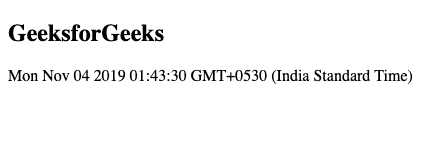
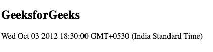

# 如何在不使用字符串表示的情况下创建具有设定时区的日期？

> 原文:[https://www . geeksforgeeks . org/如何在不使用字符串表示的情况下创建带有设置时区的日期/](https://www.geeksforgeeks.org/how-to-create-a-date-with-a-set-timezone-without-using-a-string-representation/)

对于创建具有设置时区的日期而不使用字符串表示，使用**日期对象**方法。更多关于这个方法可以从[这里](https://www.geeksforgeeks.org/javascript-date-objects/)了解。它是 Javascript 中的一个内置函数，用于处理日期和时间。

**语法:**

```html
new Date(year, month, date, hour, minute, second, millisecond)
```

**方法 1:**
使用此方法，您可以创建一个具有设置时区的日期。您所要做的就是通过键入 *new Date()* 来使用这个内置函数，然后将该值存储在一个新变量中。然后使用 document . getelementbyid(" demo innerhtml ")显示这个变量的内容。

**例 1:**

```html
<html>

<body>

    <h2>GeeksforGeeks</h2>

    <p id="demo"></p>

    <script>
        var d = new Date(2019, 10, 4, 1, 43, 30, 0);
        document.getElementById("demo").innerHTML = d;
    </script>

</body>

</html>
```

**输出:**


**方法 2:**
使用 Date()方法，创建一个新的日期，并将其存储在变量中。然后使用 getTimezoneOffset()方法，我们能够增加或减少时区偏移量。

**例 2:**

```html
<html>

<body>

    <h2>GeeksforGeeks</h2>

    <p id="demo"></p>

    <script>
        var d = new Date(2012, 9, 4);
        d.setTime(d.getTime() + d.getTimezoneOffset() * 60 * 1000);
        document.write(d);
    </script>

</body>

</html>
```

**输出:**
