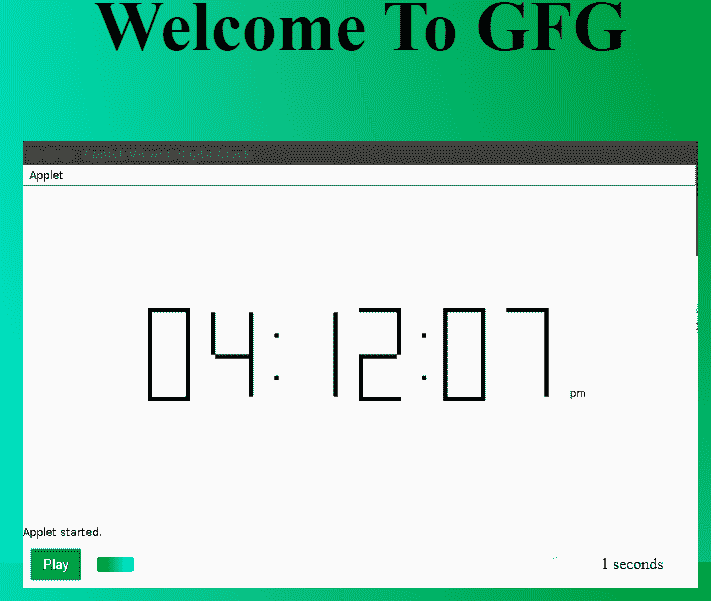

# 如何创建渐变视频进度条？

> 原文:[https://www . geesforgeks . org/如何创建渐变-视频-进度条/](https://www.geeksforgeeks.org/how-to-create-a-gradient-video-progress-bar/)

视频中的动态进度条本身就很有视觉吸引力。在这里，我们将创建一个进度条，使用简单的 HTML、CSS 和一些 JavaScript 来渐变它的颜色。这里的渐变指的是从一种颜色到另一种颜色的平滑变化。这里我们将渐变颜色从绿色改为青色。

**使用的预建函数:**
主要是我们只需要 setInterval()方法。

**语法:**

```html
setInterval(function_reference, time interval)
```

*   让我们从创建 HTML 代码开始:

    **示例:** HTML 代码

    ```html
    <!DOCTYPE html>
    <html>
    <head>
    <title>Gradient Progress Bar</title>
    </head>
    <body>
    <h2>Welcome To GFG</h2>
    <figure>
      <video id="video" 
             src="GFG.mp4">
        </video>
      <figcaption>
        <button id="play" aria-label="Play" role="button">
            Play
         </button>
        <progress id="progress" max="100" value="0">
                Progress
        </progress>
        </figcaption>
    </figure>
    </body>
    </html>
    ```

    这里的主线是:

    ```html
    <progress id="progress" max="100" value="0">Progress</progress>

    ```

    这里 **max** 属性告诉我们这里视频的最大值会是 100，**值**属性告诉我们从 0 开始。

    我们之所以选择这个，是因为从 100 个视频完全播放，0 个视频尚未开始播放的百分比来看，这很容易理解。

*   接下来，我们添加我们选择的 CSS:

    **示例:** CSS 代码

    ```html
    progress[value] {
      appearance: none; 
      border: none;     
      color: green;   
    }

    progress[value]::-webkit-progress-value {
      background-image: linear-gradient(
        to right,
        #00ff00, #014f01
      );
      transition: width 1s linear;
    }
    ```

    现在，开始进度条的 JavaScript 编码。我们将一步一步地做这件事，以便你能很容易地理解。

*   **从视频中获取进度值:**

    让我们分步骤进行:

    *   获取视频的当前时间。
    *   获取视频的总时长。
    *   使用百分比的基本数学公式计算进度值:**(当前时间/持续时间=进度值)**
    *   **Math.round()** 函数会将结果更新为最接近的整数。

    **示例:**进度值的 Javascript 代码。

    ```html
    const progress = document.getElementById("progress");
    function progressLoop() {
      setInterval(function () {
        progress.value = 
    Math.round((video.currentTime / video.duration) * 100);
      });
    }

    progressLoop();
    ```

基本任务完成后，你将有一个梯度进度条使用上述步骤。

此外，我们还将添加以下列出的一些额外功能:

*   显示当前时间。
*   添加播放按钮。

*   **显示当前时间:**

    这是相当容易做到的！我们可以在视频播放时计算秒数，并在进度条旁边的计时器中显示出来。

    **示例:**

    在 HTML 文件中添加计时器标签:

    ```html
    <figure>
      <video controls id="video" 
             src="GFG.mp4">
       </video>
      <figcaption>
        <label id="timer" for="progress" role="timer"></label>
        <progress id="progress" max="100" value="0">
             Progress
        </progress>
        </figcaption>
    </figure>
    ```

*   现在我们只需要给它分配一个变量，并使用 **innerHTML** 打印其中的当前值:

    **示例:**

    ```html
    const progress = document.getElementById("progress");
    const timer = document.getElementById( "timer" );

    function progressLoop() {
      setInterval(function () {
        progress.value = 
    Math.round((video.currentTime / video.duration) * 100);
        timer.innerHTML = 
    Math.round(video.currentTime) + " seconds";
      });
    }

    progressLoop();
    ```

    你会得到一个计时器显示经过的时间。

*   **添加播放按钮:**

    视频标签有一个控制属性，当它被调用时会附带播放、进度、音量、跳过视频功能。让我们删除该属性，并创建一个播放/暂停按钮:

    **示例:**

    在 HTML 中添加一个按钮:

    ```html
    <figure>
      <video id="video" src="GFG.mp4">
      </video>
      <figcaption>
        <label id="timer" for="progress" role="timer"></label>
        <button id="play" aria-label="Play" role="button">
            Play
        </button>
        <progress id="progress" max="100" value="0">
             Progress
        </progress>
        </figcaption>
    </figure>
    ```

*   现在用一个 JavaScript 函数连接它，在播放和暂停之间切换视频:

    **示例:**

    ```html
    button = document.getElementById( "play" );

    function playPause() { 
      if ( video.paused ) {
        video.play();
        button.innerHTML = "Pause";
      }
      else  {
        video.pause(); 
        button.innerHTML = "Play";
      }
    }

    button.addEventListener( "click", playPause );
    video.addEventListener("play", progressLoop);
    ```

    现在，您将看到预建的控制面板已被移除，按钮已被替换。

    最后，只需在背景、视频框和按钮上添加所需的 CSS，您就会有一个渐变视频进度条。

**完整代码:**

```html
<!DOCTYPE html>
<html>
  <head>
    <title>Gradient Video Progress Bar</title>
    <style>
      body {
        background-image: 
        radial-gradient(circle at top right, green, cyan);
        display: grid;
        height: 100vh;
        place-items: center;
        width: 100%;
      }

      figure {
        width: 50%;
      }

      video {
        display: block;
        width: 100%;
      }

      figcaption {
        align-items: center;
        background: #eaeaea;
        display: grid;
        grid-gap: 1rem;
        grid-template-columns: 50px auto min(115px);
        padding: 0.5rem;
      }

      button {
        border: 0;
        background: green;
        display: inline;
        color: white;
        order: 1;
        padding: 0.5rem;
        transition: opacity 0.25s ease-out;
        width: 100%;
      }
      button:hover {
        cursor: pointer;
        opacity: 0.8;
      }

      label {
        order: 2;
        text-align: center;
      }

      /* Fallback stuff */
      progress[value] {
        appearance: none;
        border: none;
        border-radius: 3px;
        box-shadow: 0 2px 3px rgba(0, 0, 0, 0.25) inset;
        color: dodgerblue;
        display: inline;
        height: 15px;
        order: 1;
        position: relative;
        width: 100%;
      }

      /* WebKit styles */
      progress[value]::-webkit-progress-bar {
        background-color: white;
        border-radius: 3px;
        box-shadow: 0 2px 3px rgba(0, 0, 0, 0.25) inset;
      }

      progress[value]::-webkit-progress-value {
        background-image: 
        linear-gradient(to right, green, cyan);
        border-radius: 3px;
        position: relative;
        transition: width 1s linear;
      }
    </style>
  </head>
  <body>
    <h2 style="color: black; font-size: 70px;">
    Welcome To GFG
  </h2>
    <figure>
      <video id="video"
        src=
"https://media.geeksforgeeks.org/wp-content/uploads/20191016154640/geeks6.mp4">
    </video>

      <figcaption>
        <label id="timer"
          for="progress"
          role="timer">
      </label>
        <button id="play"
            aria-label="Play"
            role="button">
        Play
      </button>
        <progress id="progress"
            max="100"
            value="0">
        Progress
      </progress>
      </figcaption>
    </figure>
    <script>
      const progress = document.getElementById("progress");
      const timer = document.getElementById("timer");
      button = document.getElementById("play");

      function progressLoop() {
        setInterval(function () {
          progress.value = 
          Math.round((video.currentTime / video.duration) * 100);

          timer.innerHTML = 
          Math.round(video.currentTime) + " seconds";
        });
      }

      function playPause() {
        if (video.paused) {
          video.play();
          button.innerHTML = "Pause";
        } else {
          video.pause();
          button.innerHTML = "Play";
        }
      }

      button.addEventListener("click", playPause);
      video.addEventListener("play", progressLoop);
    </script>
  </body>
</html>         
```

**输出:**
