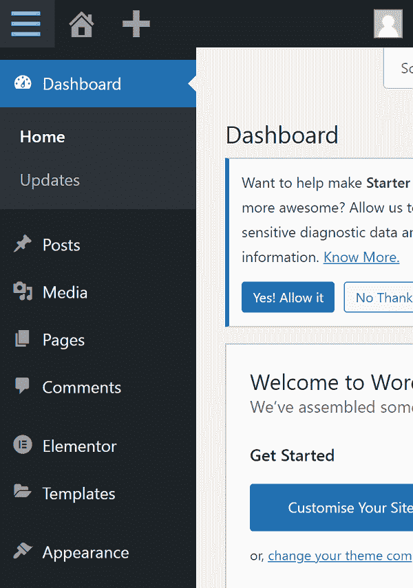
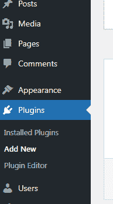
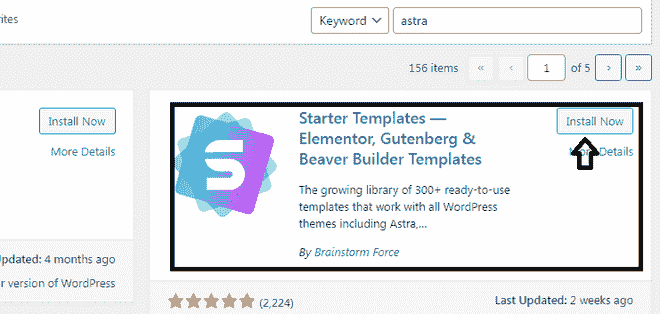
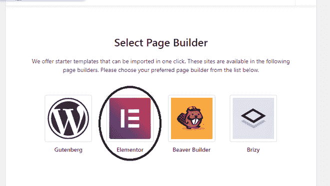
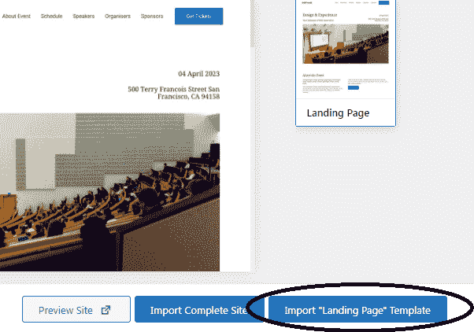
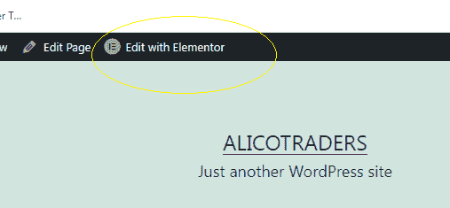
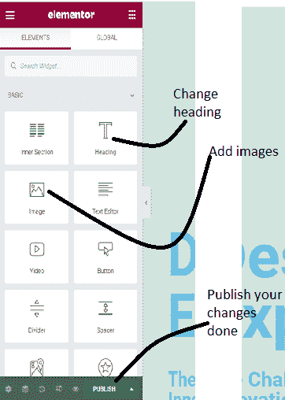
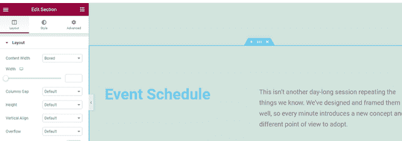
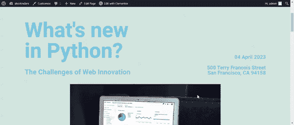

# 如何在 WordPress 中创建登陆页面？

> 原文:[https://www . geesforgeks . org/如何在 wordpress 中创建登录页面/](https://www.geeksforgeeks.org/how-to-create-a-landing-page-in-wordpress/)

**登陆页面:**登陆页面是为特定受众制作的带有特定目标的目的页面，可以用“一页一目的”来形容。登陆页面必须有一个“行动号召”，并有一个明确的目标。成功的登录页面具有更高的转化率、更高的参与度和更高质量的销售线索。

根据您的具体目标，有两种类型的登录页面。它们如下:

**销售线索生成登录页:**此登录页的目标是为您的业务收集销售线索。

**点进登陆页面:**这种类型的登陆页面在电商、课程、Saas 公司比较常见。

[**登陆页面与主页的区别:**](https://www.geeksforgeeks.org/difference-between-landing-page-and-home-page/) 登陆页面不同于主页。主页通常包含关于您的网站的所有信息，包括导航栏和菜单、指向网站其他页面的链接以及许多行动号召按钮，而登录页面没有导航栏和指向其他页面的链接，因为它有特定的用途。登陆页面是用户点击广告或帖子后登陆的页面，从而产生销售线索和转化。

**使用 WordPress 创建登陆页面:**在本文中，我们将学习如何使用 **Elementor** 创建一个简单的登陆页面。一个**元素**是一个页面生成器(视觉编辑器)，用来开发漂亮的页面和网站。它具有拖放功能，可以轻松创建页面。

**第一步:获取你的 WordPress 网站。**

第一步是购买你的域名和[托管](https://www.geeksforgeeks.org/types-of-web-hosting/)。从托管平台的控制面板安装 WordPress。登录你的 WordPress 帐户，打开你的仪表板。

**第二步:添加新插件**

在你的网站上安装 **StarterTemplates** 插件。这个插件提供了许多漂亮的预建网站模板作为单独的页面模板，使用页面构建器，如 Elementor，Beaver Builder，Brizy 和 WordPress 默认编辑器 Gutenberg。

首先，你需要进入**插件**并选择**添加新的**。搜索插件“ **StarterTemplates** ”。接下来，你必须安装插件。安装后，别忘了激活它。

<figure class="table">

|  |

</figure>

<figure class="table">

|  |

</figure>

转到插件，从开始模板插件中选择查看库，并选择页面生成器，如**元素或**。你也可以选择其他的页面构建者。

**第三步:选择你的登陆页面模板**

在下一个屏幕上，您将可以选择登陆页面主题和网站主题。您也可以从头开始构建登录页面。这个插件有很多漂亮的模板。其中一些是免费使用的，一些需要购买。你可以根据自己的要求选择主题。我们选择了如下图所示的设计与体验主题。

接下来，您将获得导入完整站点和导入**登录页面**模板两个选项。最后，选择如下图所示的导入登录页模板，因为我们正在创建一个登录页。

转到页面，选择我们刚刚加载的**“登录页面”**模板。在编辑模式下打开，选择**用元素编辑**。

**第四步:自定义添加内容**

根据您的要求开始定制页面。 **Elementor** 自带拖放功能，可以非常方便地自定义任何模板。完成所有更改后，点击**发布**保存更改。请详细查看可用选项。

您可以根据您的内容编辑页面，并添加适当的图像。如果页面上不需要某个块，也可以将其移除。你可以添加自己的风格，如颜色和字体等。要更改样式，请单击“样式”选项卡。选择您想要编辑的块，您将获得以下选项。

**输出:**最终登陆页面如下。

