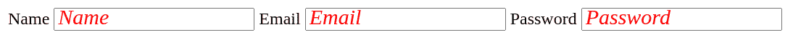

# 如何在 SASS 中为占位符创建 mixin？

> 原文:[https://www . geeksforgeeks . org/如何为 sass 中的占位符创建 mixin/](https://www.geeksforgeeks.org/how-to-create-a-mixin-for-placeholder-in-sass/)

**Mixin** 是 SASS 最好的特性之一，像函数一样工作。你可以为重复的 CSS 属性创建混合，然后在你的 CSS 类中使用 *@include* 包含这些混合。

**进场:**

1.  我们创建一个 mixin，我们使用 *@content* ，让我们在 mixin 里面注入整个 CSS 代码块，这个块代替了 mixin 里面的 *@content* 。
2.  我们使用*&(SASS &符号)*，它总是被父 CSS 选择器替换，嵌套级别降低 1。
3.  通过在“输入”中使用 mixin 来配置“输入”占位符，mixin 现在就可以使用了。我们使用 **@include** 来包含 mixin，后面是我们想要在 mixin 中传递的内容。因此，我们传递具有为占位符定义的“字体系列”、“字体大小”和“颜色”属性的 CSS 代码块。
4.  在我们**的处理过程中”。scss"** 文件， *@include* 替换为 mixin 代码， *@content* 替换为传递过来的 css 代码块， *&* 替换为父选择器，每次都是*输入*通过代码替换得到想要的 CSS 文件。

**SASS 文件:**下面的代码片段演示了扩展名为“”的 SASS 文件。SCS”。

```htmlhtml
@mixin placeholder
{
    &::-webkit-input-placeholder {@content}
    &:-moz-placeholder           {@content}
    &::-moz-placeholder          {@content}
    &:-ms-input-placeholder      {@content}  
}

input {
    @include placeholder {
      font-family: robota;
      font-size: 20px;
      color: red;
      font-style: italic;
    }
}

```

将上面的 SASS 代码放在“style.scss”文件中，并使用下面的命令从 SASS 文件创建“style.css”文件。只有在系统中安装了 SASS 时，该命令才会起作用。可以从 SASS 官网下载。

```htmlhtml
sass style.scss style.css
```

这将在您的工作目录中创建“style.css”文件。工作目录将保存“index.html”、“style . SCS”和“style.css”文件。

**CSS 代码:**下面的代码是上面的 SASS 文件的结果，执行时转换为“style.css”文件。

```htmlhtml
input::-webkit-input-placeholder {
  font-family: robota;
  font-size: 20px;
  color: red;
  font-style: italic;
}
input:-moz-placeholder {
  font-family: robota;
  font-size: 20px;
  color: red;
  font-style: italic;
}
input::-moz-placeholder {
  font-family: robota;
  font-size: 20px;
  color: red;
  font-style: italic;

}
input:-ms-input-placeholder {
  font-family: robota;
  font-size: 20px;
  color: red;
  font-style: italic;

}

```

**HTML 代码:**下面的代码演示了“index.html”文件。

```htmlhtml
<!DOCTYPE html>
    <head>       
        <meta name="viewport" content="width=device-width,
         initial-scale=1">
        <link rel="stylesheet" href="style.css" type="text/css">
    </head>
    <body>
        <style></style>
        <label for="1">Name</label>
        <input type="text" placeholder="Name" id="1"/>
        <label for="2">Email</label>
        <input type="text" placeholder="Email" id="2"/>
        <label for="3">Password</label>
        <input type="text" placeholder="Password" />
    </body>
</html>
```

**输出:**

