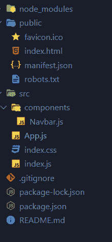
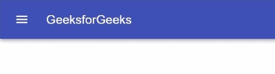

# 如何用材质-界面创建导航栏？

> 原文:[https://www . geeksforgeeks . org/如何创建带有材料的导航栏-ui/](https://www.geeksforgeeks.org/how-to-create-a-navigation-bar-with-material-ui/)

Material UI 是谷歌为 React 组件设计的前端 UI 框架。它是使用 Less 构建的，Less 是 CSS 向后兼容的语言扩展。我们已经使用应用程序栏组件在 ReactJS 中创建了一个带有材质用户界面的导航栏

**创建反应应用程序并安装模块:**

*   **步骤 1:** 使用以下命令创建一个 React 应用程序。

    ```
    npx create-react-app foldername
    ```

*   **步骤 2:** 创建项目文件夹即文件夹名称后，使用以下命令移动到该文件夹。

    ```
    cd foldername
    ```

*   **步骤 3:** 创建 React.js 应用程序后，使用以下命令安装**材质-用户界面**模块。

    ```
    npm install @material-ui/core
    npm install @material-ui/icons
    ```

**项目结构:**如下图。



**示例:**创建一个Navbar.js 文件，我们将使用如下所示的材质 UI 创建我们自己的 Navbar 组件。

**示例:**

## Navbar，js

```
// Importing files from Material-UI
import React from 'react';
import { makeStyles } from '@material-ui/core/styles';
import AppBar from '@material-ui/core/AppBar';
import Toolbar from '@material-ui/core/Toolbar';
import Typography from '@material-ui/core/Typography';
import IconButton from '@material-ui/core/IconButton';
import MenuIcon from '@material-ui/icons/Menu';

// Using Inline Styling
const useStyles = makeStyles((theme) => ({
  root: {
    flexGrow: 1,
  },
  menuButton: {
    marginRight: theme.spacing(2),
  },
}));

// Exporting Default Navbar to the App.js File
export default function Navbar() {
  const classes = useStyles();

  return (
    <div className={classes.root}>
      <AppBar position="static">
        <Toolbar variant="dense">
          <IconButton edge="start" 
            className={classes.menuButton} 
            color="inherit" aria-label="menu">
              <MenuIcon />
          </IconButton>
          <Typography variant="h6" color="inherit">
            Geeks for Geeks
          </Typography>
        </Toolbar>
      </AppBar>
    </div>
  );
}
```

创建 Navbar 组件后，我们将把它导入到我们的 App.js 文件中，如下所示。

## App.js

```
// Importing the navbar component inside
// the main app file
import Navbar from "./components/Navbar";

const App = () =>{
  return (
    <>
      <Navbar/>         
    </>
  );
}

export default App;
```

**运行应用程序的步骤:**从项目的根目录使用以下命令运行应用程序。

```
npm start
```

**输出:**现在打开浏览器，转到 **http://localhost:3000/** ，会看到如下输出。



Navbar 演示

**参考:**T2】https://material-ui.com/components/app-bar/