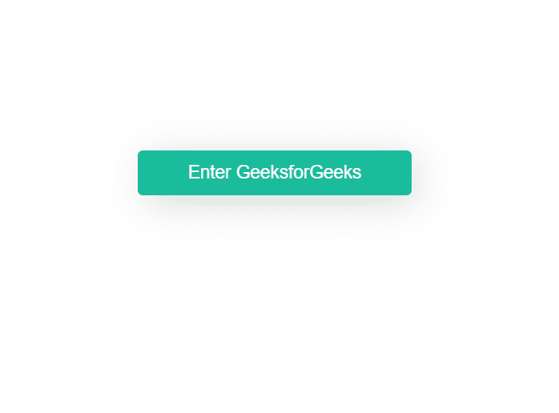
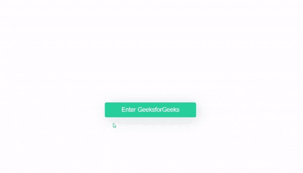

# 如何在点击按钮时产生涟漪效应？

> 原文:[https://www . geeksforgeeks . org/如何创建点击按钮的连锁反应/](https://www.geeksforgeeks.org/how-to-create-a-ripple-effect-on-click-the-button/)

涟漪效应是**现代设计潮流**的一部分。你已经在很多网站上看到了，特别是谷歌的材料设计语言。它给出一个按钮**按压效果**。我们可以通过在按钮上添加一个子元素并制作动画来产生涟漪效果。我们也可以使用 Javascript 根据光标在按钮上的位置来定位它。

1.  **Basic styling:** Add basic styling to the button with a `position:relative` attribute to position the inner span tag and `overflow:hidden` to prevent span going outside of button.

    ```html
    <!DOCTYPE html>
    <html>

    <head>
        <title>
            Button Ripple Effect - GFG
        </title>

        <style>

            /* Adding styles to button */
            .btn {
                padding: 12px 50px;
                border: none;
                border-radius: 5px;
                background-color: #1abc9c;
                color: #fff;
                font-size: 18px;
                outline: none;
                cursor: pointer;

                /* We need this to position
                    span inside button */
                position: relative;
                overflow: hidden;
                box-shadow: 6px 7px 40px -4px 
                         rgba(0, 0, 0, 0.2);
            }
        </style>
    </head>

    <body>
        <button class="btn">
            Enter GeeksforGeeks
        </button>
    </body>

    </html>
    ```

    **输出:**
    

2.  **为跨度元素添加样式:**现在为跨度元素添加样式，该样式将在单击按钮时显示。

    ```html
    <style>
        .btn span {
            position: absolute;
            border-radius: 50%;
            /* To make it round */
            background-color: rgba(0, 0, 0, 0.3);

            width: 100px;
            height: 100px;
            margin-top: -50px;
            /* for positioning */
            margin-left: -50px;

            animation: ripple 1s;
            opacity: 0;
        }

        /* Add animation */
        @keyframes ripple {
            from {
                opacity: 1;
                transform: scale(0);
            }

            to {
                opacity: 0;
                transform: scale(10);
            }
        }
    </style>
    ```

3.  **添加 JavaScript:** 现在我们将根据鼠标点击的位置添加按钮点击的 span 元素。在按钮上点击我们要做的事情如下:

    ```html
    <script>
        const btn = document.querySelector(".btn");

        // Listen for click event
        btn.onclick = function (e) {

            // Create span element
            let ripple = document.createElement("span");

            // Add ripple class to span
            ripple.classList.add("ripple");

            // Add span to the button 
            this.appendChild(ripple);

            // Get position of X
            let x = e.clientX - e.target.offsetLeft;

            // Get position of Y 
            let y = e.clientY - e.target.offsetTop;

            // Position the span element
            ripple.style.left = `${x}px`;
            ripple.style.top = `${y}px`;

            // Remove span after 0.3s
            setTimeout(() => {
                ripple.remove();
            }, 300);

        };
    </script>
    ```

    1.  创建`span`元素并添加**波纹**类。
    2.  使用`event`变量获取光标的点击位置。
    3.  设置跨度元素的位置。
    4.  移除 span 元素以避免在按钮中滥发 span 元素。

最终输出如下所示:
