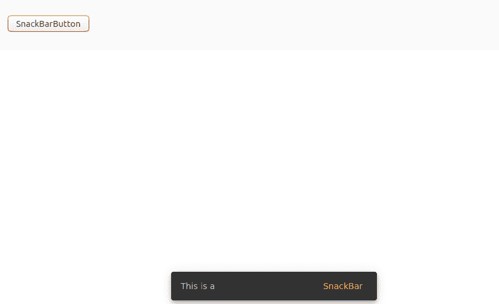

# 如何创建 SnackBar 服务？

> 原文:[https://www . geeksforgeeks . org/如何创建 snackbar-service/](https://www.geeksforgeeks.org/how-to-create-a-snackbar-service/)

**任务栏**是一个角度指令，用于在移动设备上显示通知栏。
这些类型的 UI 组件一般使用几次。
所以为了避免代码重复，可以简单地创建一个服务，在不同的组件中使用 SnackBar。

**进场:**

*   要创建服务，您必须使用以下命令:

    ```html
    ng g s snackBar
    ```

    *   现在从 **@angular/core** 导入 **MatSnackBar** 并定义函数 **openSnackBar** (可以一直使用不同的名称)。

    ```html
    import { Injectable } from '@angular/core';
    import {MatSnackBar} from '@angular/material/snack-bar';

    @Injectable({
      providedIn: 'root'
    })
    export class SnackBarService {

    //create an instance of MatSnackBar

      constructor(private snackBar:MatSnackBar) { }

    /* It takes three parameters 
        1.the message string 
        2.the action 
        3.the duration, alignment, etc. */

      openSnackBar(message: string, action: string) {
        this.snackBar.open(message, action, {
           duration: 2000,
        });
      }
    }
    ```

    *   导入 **snackBarService** 并将其注入到组件的构造函数中，在其中您要使用 Snackbar。这将创建一个服务实例，比如**服务**。
    现在，在 **snackBService** 的帮助下，在任何需要的地方调用 openSnackBar 函数。

    ```html
    import { Component, OnInit } from '@angular/core';
    import {SnackBarService} from '../snack.service';

    @Component({
      selector: 'app-profile',
      templateUrl: './snackBar.html',
      styleUrls: ['./snackBar.css']
    })
    export class SnackBar {

      // create an instance of SnackBarService 

      constructor(private snackBService:SnackBarService) { }

      //defining method for display of SnackBar

      trigger(message:string, action:string)
      {
       this.snackBService.openSnackBar(message, action);
      }

    }
    ```

    *   By repeating these steps we can use the snackBar inside any component.
    **Example:**

    ```html
    <button  (click)="trigger('This is a ', 'SnackBar')">
        SnackBarButton
    </button>
    ```

    **输出:**
    