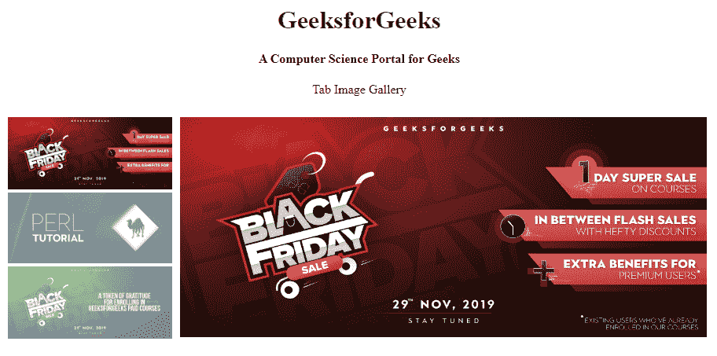
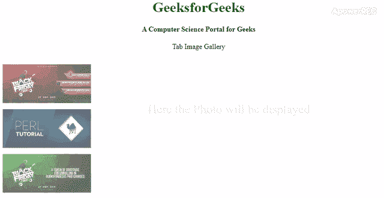

# 如何创建标签图片库？

> 原文:[https://www . geeksforgeeks . org/如何创建选项卡图像库/](https://www.geeksforgeeks.org/how-to-create-a-tab-image-gallery/)



要创建选项卡图像库，您需要使用 HTML、CSS 和 JavaScript。HTML 会让身体的结构好看，CSS 会让它看起来好看。这种标签图片库在网站上看起来很有吸引力。通过使用 JavaScript，您可以轻松地更改图库中显示的图片。
**创建结构:**在本节中，我们将为标签图片库创建一个基本的网站结构。

*   **HTML 代码制作结构:**

## 超文本标记语言

```html
<!DOCTYPE html>
<html>

<head>
    <meta name="viewport"
        content="width=device-width, initial-scale=1">
    <title>
        How To Create a Tab Image Gallery
    </title>
</head>

<body>
    <div style="text-align:center">
        <h1>GeeksforGeeks</h1>

        <h4>A Computer Science Portal for Geeks</h4>

<p>Tab Image Gallery</p>

    </div>

    <!-- gallery pic -->
    <div class="row">
        <div id="geeks">
            Here the Photo will be displayed
        </div>

        <div class="column">
            
            
            
        </div>

        <div class="column">
            <span onclick=
                "this.parentElement.style.display='none'">
            </span>

            
        </div>
    </div>
</body>

</html>
```

**设计结构:**上一节我们已经创建了基础网站的结构。在本节中，我们将设计选项卡图像库的结构，然后使用 JavaScript 更改选项卡图像库中的图片效果。

*   **CSS 代码要好看的结构:**

## 半铸钢ˌ钢性铸铁(Cast Semi-Steel)

```html
<style>
    h1 {
        color: green;
    }

    /* column pic */
    .column {
        float: left;
        width: 25%;
        padding: 10px;
    }

    /* Style the images of gallery */
    .column img {
        opacity: 0.6;
        cursor: zoom-in;
        padding: 5px;
    }

    .column img:hover {
        opacity: 1;
        transform: scale(1.1);
        transition: 0.5s;
    }

    .column img:active {
        opacity: 1;
    }

    * {
        box-sizing: border-box;
    }

    /* Expanding image text */
    #geeks {
        position: absolute;
        left: 200px;
        padding-top: 100px;
        font-size: 28px;
        color: #EFECE9;
    }

    #geeks:hover {
        color: #ADE3BD;
        cursor: wait;
    }
</style>
```

*   **图库中动画的 JavaScript 代码:**

## java 描述语言

```html
<script>
    function gfg(imgs) {
        var expandImg = document.getElementById("expand");
        var imgText = document.getElementById("geeks");
        expandImg.src = imgs.src;
        imgText.innerHTML = imgs.alt;
        expandImg.parentElement.style.display = "block";
    }
</script>
```

**组合 HTML、CSS 和 JavaScript 代码:**这个例子是上面几节的组合。

## 超文本标记语言

```html
<!DOCTYPE html>
<html>

<head>
    <meta name="viewport"
        content="width=device-width, initial-scale=1">
    <title>
        How To Create a Tab Image Gallery
    </title>
    <style>
        h1 {
            color: green;
        }

        /* column pic */
        .column {
            float: left;
            width: 25%;
            padding: 10px;
        }

        /* Style the images of gallery */
        .column img {
            opacity: 0.6;
            cursor: zoom-in;
            padding: 5px;
        }

        .column img:hover {
            opacity: 1;
            transform: scale(1.1);
            transition: 0.5s;
        }

        .column img:active {
            opacity: 1;
        }

        * {
            box-sizing: border-box;
        }

        /* Expanding image text */
        #geeks {
            position: absolute;
            left: 200px;
            padding-top: 100px;
            font-size: 28px;
            color: #EFECE9;
        }

        #geeks:hover {
            color: #ADE3BD;
            cursor: wait;
        }
    </style>
</head>

<body>

    <div style="text-align:center">
        <h1>GeeksforGeeks</h1>
        <h4>A Computer Science Portal for Geeks</h4>

<p>Tab Image Gallery</p>

    </div>

    <!-- gallery pic -->
    <div class="row">
        <div id="geeks">Here the Photo will be displayed</div>

        <div class="column">
            
            
            
        </div>

        <div class="column">
            <span onclick="this.parentElement.style.display='none'"></span>
            
        </div>
    </div>
    <script>
        function gfg(imgs) {
            var expandImg = document.getElementById("expand");
            var imgText = document.getElementById("geeks");
            expandImg.src = imgs.src;
            imgText.innerHTML = imgs.alt;
            expandImg.parentElement.style.display = "block";
        }
    </script>
</body>

</html>
```

**输出:**

