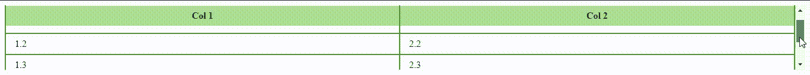
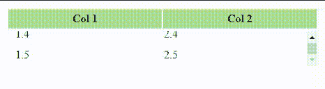

# 如何创建表头固定、表体可滚动的表？

> 原文:[https://www . geeksforgeeks . org/如何创建标题固定、正文可滚动的表格/](https://www.geeksforgeeks.org/how-to-create-a-table-with-fixed-header-and-scrollable-body/)

本文的目的是创建一个具有固定标题和可滚动正文的表。我们可以用这两种方法中的任何一种来创建这样的表。

1.  通过将**位置**属性设置为“粘性”，并将“0”指定为第<个>元素的**顶部**属性的值。
2.  通过将**显示**设置为<和>以及<车身>元素的“阻挡”，我们可以将**高度**和**溢出**属性应用于<车身>。

**注:**

*   *位置*属性表示元素的定位类型。
*   *display* 属性说明元素应该如何显示。

**示例:**下面是说明具有*位置*属性的表的形成的代码。

## 超文本标记语言

```
<!DOCTYPE html>
<html>

<head>
  <style>
    .fixTableHead {
      overflow-y: auto;
      height: 110px;
    }
    .fixTableHead thead th {
      position: sticky;
      top: 0;
    }
    table {
      border-collapse: collapse;        
      width: 100%;
    }
    th,
    td {
      padding: 8px 15px;
      border: 2px solid #529432;
    }
    th {
      background: #ABDD93;
    }
  </style>
</head>

<body>
  <div class="fixTableHead">
    <table>
      <thead>
        <tr>
          <th>Col 1</th>
          <th>Col 2</th>
        </tr>
      </thead>

      <tbody>
        <tr>
          <td>1.1</td>
          <td>2.1</td>
        </tr>
        <tr>
          <td>1.2</td>
          <td>2.2</td>
        </tr>
        <tr>
          <td>1.3</td>
          <td>2.3</td>
        </tr>
        <tr>
          <td>1.4</td>
          <td>2.4</td>
        </tr>
        <tr>
          <td>1.5</td>
          <td>2.5</td>
        </tr>
      </tbody>

    </table>
  </div>
</body>

</html>
```

**输出:**



**例 2:** 下面是用*显示*属性说明表格形成的代码。

## 超文本标记语言

```
<!DOCTYPE html>
<html>

<head>
  <style>
    .tableFixHead {
      width: 500px;
      table-layout: fixed;
      border-collapse: collapse;
    }
      .tableFixHead tbody {
      display: block;
      width: 100%;
      overflow: auto;
      height: 50px;
    }
    .tableFixHead thead tr {
      display: block;
    }
    .tableFixHead th,
    .tableFixHead  td {
      padding: 5px 10px;
      width: 200px;
    }
    th {
      background: #ABDD93;
    }
  </style>
</head>

<body>
  <div class="tableFixHead">
    <table>
      <thead>
        <tr>
          <th>Col 1</th>
          <th>Col 2</th>
        </tr>
      </thead>
      <tbody>
        <tr>
          <td>1.1</td>
          <td>2.1</td>
        </tr>
        <tr>
          <td>1.2</td>
          <td>2.2</td>
        </tr>
        <tr>
          <td>1.3</td>
          <td>2.3</td>
        </tr>
        <tr>
          <td>1.4</td>
          <td>2.4</td>
        </tr>
        <tr>
          <td>1.5</td>
          <td>2.5</td>
        </tr>
      </tbody>
    </table>
  </div>
</body>

</html>
```

**输出:**

