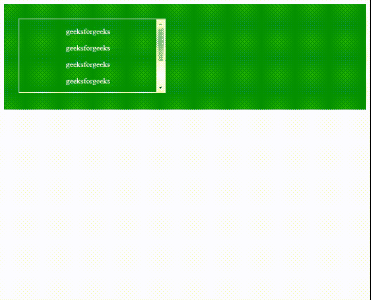

# 如何创建透明的 iframe？

> 原文:[https://www . geeksforgeeks . org/如何创建透明 iframe/](https://www.geeksforgeeks.org/how-to-create-a-transparent-iframe/)

**[< iframe >标签](https://www.geeksforgeeks.org/html-iframes/)** 是一个内嵌框架。它用于在当前的网页中嵌入另一个网页。

**语法:**

```htmlhtml
<iframe src = "URL"></iframe>
```

透明的 **iframe** 可以通过将其背景设置为透明来制作。

```htmlhtml
body {
    background-color : transparent;
}

```

并且，“iframe”的 **allowtransparency** 属性设置为“true”。

```htmlhtml
<iframe src = "URL" allowtransparency = "true"></iframe>
```

**示例:**

*   **HTML 代码:**

    ```htmlhtml
    <!DOCTYPE html>
    <html>

    <body>
        <div style="background: green; 
                padding: 30px;">

            <iframe src="iframe.html" 
                allowtransparency="true">
                Alternate content
            </iframe>
        </div>
    </body>

    </html>
    ```

*   **iframe.html**

    ```htmlhtml
    <!DOCTYPE html>
    <html>

    <body style=
        "background-color: transparent; 
        text-align: center; 
        color: #ffffff;">

        <p>geeksforgeeks</p>
        <p>geeksforgeeks</p>
        <p>geeksforgeeks</p>
        <p>geeksforgeeks</p>
        <p>geeksforgeeks</p>
        <p>geeksforgeeks</p>
        <p>geeksforgeeks</p>
    </body>

    </html>
    ```

    **输出:**
    