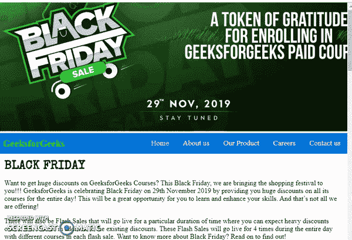

# 如何创建一个词缀或粘性导航条？

> 原文:[https://www . geeksforgeeks . org/如何创建一个词缀或粘性 navbar/](https://www.geeksforgeeks.org/how-to-create-an-affix-or-sticky-navbar/)


要创建词缀或粘性导航栏，您需要使用 HTML、CSS 和 JavaScript。HTML 会让身体的结构好看，CSS 会让它看起来好看。这种粘性 navbar 在网站上看起来很有吸引力。通过使用 JavaScript，当用户向下滚动时，您可以轻松地使导航栏变得有粘性。
**创建结构:**在这一部分，我们将为粘性导航栏创建一个基本的网站结构，当用户向下滚动页面时，它将显示效果。

*   **HTML 代码制作结构:**

## 超文本标记语言

```htmlhtml
<!DOCTYPE html>
<html>

<head>
    <title>How To Create a Affix Navbar</title>

    <meta name="viewport"
        content="width=device-width, initial-scale=1">

        <!-- Google fonts -->
    <link href=
"https://fonts.googleapis.com/css?family=Special+Elite&display=swap"
        rel="stylesheet">
</head>

<body>
    <div class="header">
        
    </div>

    <div id="navlist">
        <b>GeeksforGeeks</b>
        <a href="javascript:void(0)">Contact us</a>
        <a href="javascript:void(0)">Careers</a>
        <a href="javascript:void(0)">Our Product</a>
        <a href="javascript:void(0)">About us</a>
        <a href="javascript:void(0)">Home</a>
    </div>

    <div class="scrollable"
            style="padding:15px 15px 4500px;">

        <b>BLACK FRIDAY</b>

<p>
            Want to get huge discounts on GeeksforGeeks
            Courses? This Black Friday, we are bringing
            the shopping festival to you!!! GeeksforGeeks
            is celebrating Black Friday on 29th November
            2019 by providing you huge discounts on all
            its courses for the entire day! This will be
            a great opportunity for you to learn and
            enhance your skills. And that’s not all we
            are offering!
        </p>

<p>
            There will also be Flash Sales that will go
            live for a particular duration of time where
            you can expect heavy discounts over a few
            courses in addition to the existing discounts.
            These Flash Sales will go live for 4 times
            during the entire day with different courses
            in each flash sale. Want to know more about
            Black Friday? Read on to find out!
        </p>

<p>
            Black Friday is the Friday immediately after
            Thanksgiving in the United States, which is
            on 29th November this time. This Black Friday
            Sale is intended to provide you with the best
            courses along with great deals where the
            investment of your time and money will surely
            pay off. So Grab this opportunity, Grab the
            deals and celebrate this Black Friday in the
            most amazing way possible!!!
        </p>

        <center>
            <h3>Black Friday Sale Highlights</h3>
        </center>

<p>
            This Black Friday, GeeksforGeeks is here with
            some Red Hot new deals on online and offline
            courses. Unbelievable offers will also be back
            in Flash Sales but you need to be quick to get
            them. Here’s everything you need to know about
            the Black Friday sale by GeeksforGeeks:
        </p>

        <h4>All Day Super Sale On All Courses:</h4>

<p>
            There will be a Super Sale on all the available
            courses for the whole day of Black Friday. So
            you can buy your favorite courses at premium
            prices and learn a lot!
        </p>

        <h4>4 Flash Sales On Selected Courses:</h4>

<p>
            There will be In Between Flash Sales on different
            courses for 1 hour each on Black Friday. These
            sales will reduce the prices of already discounted
            courses even further. Stay tuned to find out the
            times for different courses on the Flash Sale!
            There are Limited seats so the discount will be
            available on First Come First Serve basis.
        </p>

        <h4>Social Media Contest:</h4>

<p>
            There will also be a Social Media Contest about
            “Guessing the Price of a Course” on the Black
            Friday Sale. Try your Luck!! Hefty discounts will
            be live on the following courses for the complete
            day. Grab them and pave the way to your dream
            product-based company!
        <hr>

        <i>
            All the details you will get by clicking this
            <a href=
"https://www.geeksforgeeks.org/black-friday-sale-programmers-have-carts-geeksforgeeks-has-deals/">
            link</a>
        </i>
    </div>
</body>

</html>
```

**设计结构:**上一节我们已经创建了基础网站的结构。在本节中，我们将设计导航栏的结构，并使用 JavaScript 在导航栏上实现向下滚动效果。

*   **CSS 代码要好看的结构:**

## 钢性铸铁

```htmlhtml
<style>
    body {
        margin: 0;
    }

    .header {
        text-align: center;
        width: 100%;
    }

    #navlist {
        overflow: hidden;
        background-color: #0074D9;
    }

    /* navlist designing */
    #navlist a {
        float: right;
        display: block;
        color: #f2f2f2;
        text-align: center;
        padding: 14px 16px;
        text-decoration: none;
        font-size: 17px;
    }

    /* navlist link hover effect */
    #navlist a:hover {
        background-color: #ddd;
        color: black;
    }

    #navlist b{
        margin-top: 4px;
        padding: 8px 12px;
        color:lime;
        float: left;
        font-size: 22px;
    }

    /* scroll portion design */
    .scrollable b {
        font-family: 'Special Elite', cursive;
        font-size: 28px;
    }

    .content {
        padding: 16px;
    }

    .sticky {
        position: fixed;
        top: 0;
        width: 100%;
    }
</style>
```

*   **粘性导航栏的 JavaScript 代码:**

## java 描述语言

```htmlhtml
<script>
    window.onscroll = function() {myFunction()};

    var navlist = document.getElementById("navlist");
    var sticky = navlist.offsetTop;

    /* Function to stick the nav bar */
    function myFunction() {
        if (window.pageYOffset >= sticky) {
            navlist.classList.add("sticky")
        }
        else {
            navlist.classList.remove("sticky");
        }
    }
</script>
```

*   **结合 HTML、CSS 和 JavaScript 代码:**这个例子结合了上面的部分，制作了一个粘性 navbar 网站。

## 超文本标记语言

```htmlhtml
<!DOCTYPE html>
<html>

<head>
    <title>How To Create a Affix Navbar</title>

    <meta name="viewport"
        content="width=device-width, initial-scale=1">

        <!-- Google fonts -->
    <link href=
"https://fonts.googleapis.com/css?family=Special+Elite&display=swap"
        rel="stylesheet">

    <style>
        body {
            margin: 0;
        }

        .header {
            text-align: center;
            width: 100%;
        }

        #navlist {
            overflow: hidden;
            background-color: #0074D9;
        }

        /* navlist designing */
        #navlist a {
            float: right;
            display: block;
            color: #f2f2f2;
            text-align: center;
            padding: 14px 16px;
            text-decoration: none;
            font-size: 17px;
        }

        /* navlist link hover effect */
        #navlist a:hover {
            background-color: #ddd;
            color: black;
        }

        #navlist b{
            margin-top: 4px;
            padding: 8px 12px;
            color:lime;
            float: left;
            font-size: 22px;
        }

        /* scroll portion design */
        .scrollable b {
            font-family: 'Special Elite', cursive;
            font-size: 28px;
        }

        .content {
            padding: 16px;
        }

        .sticky {
            position: fixed;
            top: 0;
            width: 100%;
        }
    </style>
</head>

<body>
    <div class="header">
        
    </div>

    <div id="navlist">
        <b>GeeksforGeeks</b>
        <a href="javascript:void(0)">Contact us</a>
        <a href="javascript:void(0)">Careers</a>
        <a href="javascript:void(0)">Our Product</a>
        <a href="javascript:void(0)">About us</a>
        <a href="javascript:void(0)">Home</a>
    </div>

    <div class="scrollable"
            style="padding:15px 15px 4500px;">

        <b>BLACK FRIDAY</b>

<p>
            Want to get huge discounts on GeeksforGeeks
            Courses? This Black Friday, we are bringing
            the shopping festival to you!!! GeeksforGeeks
            is celebrating Black Friday on 29th November
            2019 by providing you huge discounts on all
            its courses for the entire day! This will be
            a great opportunity for you to learn and
            enhance your skills. And that’s not all we
            are offering!
        </p>

<p>
            There will also be Flash Sales that will go
            live for a particular duration of time where
            you can expect heavy discounts over a few
            courses in addition to the existing discounts.
            These Flash Sales will go live for 4 times
            during the entire day with different courses
            in each flash sale. Want to know more about
            Black Friday? Read on to find out!
        </p>

<p>
            Black Friday is the Friday immediately after
            Thanksgiving in the United States, which is
            on 29th November this time. This Black Friday
            Sale is intended to provide you with the best
            courses along with great deals where the
            investment of your time and money will surely
            pay off. So Grab this opportunity, Grab the
            deals and celebrate this Black Friday in the
            most amazing way possible!!!
        </p>

        <center>
            <h3>Black Friday Sale Highlights</h3>
        </center>

<p>
            This Black Friday, GeeksforGeeks is here with
            some Red Hot new deals on online and offline
            courses. Unbelievable offers will also be back
            in Flash Sales but you need to be quick to get
            them. Here’s everything you need to know about
            the Black Friday sale by GeeksforGeeks:
        </p>

        <h4>All Day Super Sale On All Courses:</h4>

<p>
            There will be a Super Sale on all the available
            courses for the whole day of Black Friday. So
            you can buy your favorite courses at premium
            prices and learn a lot!
        </p>

        <h4>4 Flash Sales On Selected Courses:</h4>

<p>
            There will be In Between Flash Sales on different
            courses for 1 hour each on Black Friday. These
            sales will reduce the prices of already discounted
            courses even further. Stay tuned to find out the
            times for different courses on the Flash Sale!
            There are Limited seats so the discount will be
            available on First Come First Serve basis.
        </p>

        <h4>Social Media Contest:</h4>

<p>
            There will also be a Social Media Contest about
            “Guessing the Price of a Course” on the Black
            Friday Sale. Try your Luck!! Hefty discounts will
            be live on the following courses for the complete
            day. Grab them and pave the way to your dream
            product-based company!
        <hr>

        <i>
            All the details you will get by clicking this
            <a href=
"https://www.geeksforgeeks.org/black-friday-sale-programmers-have-carts-geeksforgeeks-has-deals/">
            link</a>
        </i>
    </div>

    <script>
        window.onscroll = function() {myFunction()};

        var navlist = document.getElementById("navlist");
        var sticky = navlist.offsetTop;

        /* Function to stick the nav bar */
        function myFunction() {
            if (window.pageYOffset >= sticky) {
                navlist.classList.add("sticky")
            }
            else {
                navlist.classList.remove("sticky");
            }
        }
    </script>
</body>

</html>
```

**输出:**

