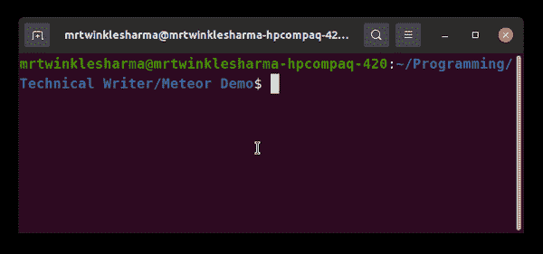
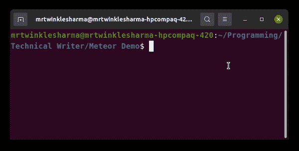
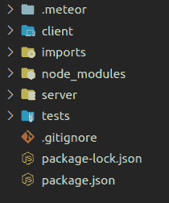
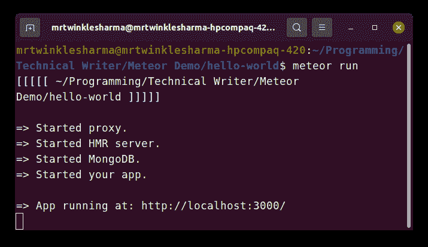
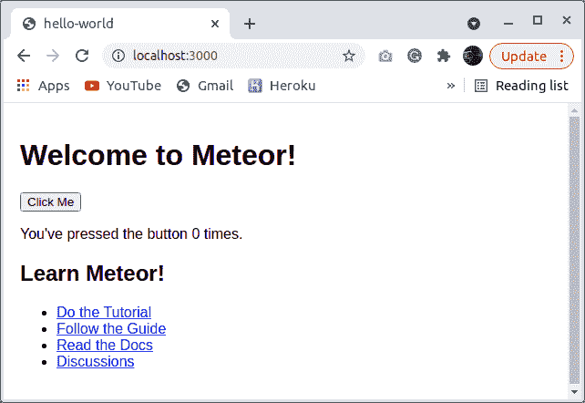

# 如何使用 Meteor 创建 App？

> 原文:[https://www . geesforgeks . org/如何使用流星创建应用/](https://www.geeksforgeeks.org/how-to-create-an-app-using-meteor/)

这是一个用于开发 web 和移动应用程序的全栈 javascript 平台。流星使用一组技术以及 Node.js 和 JavaScript 来实现我们的目标。它期望最少的开发工作，并提供最好的性能。在这篇文章中，我们将看到如何启动一个关于流星的项目。

下面是一个逐步实现。

**第一步:安装**

*   **Linux 和 OS:**cURL 命令用于通过指定服务器的位置来与服务器进行交互，这里我们正在从 meteor 提供的资源接收安装 meteor 的代码，而 sh 命令正在安装它。

```html
*curl https://install.meteor.com/ | sh*
```

*   **Windows:** 在 Windows 中，我们将需要节点包管理器来安装 meteor。

```html
*npm install -g meteor* 
```



**第二步:**用流星创建一个项目就是这么简单，只需要在你的终端中写下*流星创建*命令以及一些配置即可。

```html
meteor create app-name --option
```

*   ***配置:***
    **app-name–**这将是我们的应用名称。
    **选项–**流星支持的 JavaScript 库/框架的名称，即 Vue、Svelte、React、Blaze 和 Angular。此外，流星提供了几个更多的选择。

例如，我们在这里创建了一个基于反应的应用程序，它有*“流星创造你好世界–反应*”



**项目结构:**成功初始化后，这将是我们的文件夹结构。



**步骤 3:** 运行应用程序。写下面的命令来运行你的流星应用程序，运行后流星保持文件的所有变化同步。

```html
meteor run 
```

类似这样的东西会在你的终端上显示出来。



**输出:**当我们打开***http://localhost:3000***在浏览器中查看我们的应用时，会出现类似下面给出的截图。这是流星应用程序的默认前端视图。



有了这个，我们的流星项目就准备好了，我们可以开始编写我们的数据库模型、服务器逻辑以及其中的前端设计。

**示例 1:** 在本例中，我们将替换流星的默认前端内容。在**导入/用户界面**目录中有一个 **App.jsx** 文件，我们可以在里面编写我们的反应代码。

**档案名称:App.jsx**

## java 描述语言

```html
import React from 'react';

export const App = () => (
  <div>
    <h1>Hello, GFG Learner!</h1>
   </div>
);
```

**输出:**


**示例 2:** 这是如何从数据库中获取数据，并在 Meteor 的帮助下在前端进行渲染的示例。首先，我们要创建 mongo 集合，这里我们已经创建了一个名为 *gfglinks* 的集合，并将其导出，以便可以在其他文件中使用。

**文件名:links.js**

## java 描述语言

```html
import { Mongo } from 'meteor/mongo';

export const LinksCollection = new Mongo.Collection('gfglinks');
```

**解释:**在集合被创建之后，我们可以将数据插入其中。在后端，我们将一些数据插入到集合中。当服务器启动时，Meteor.startup 执行一些给定的功能。注意我们正在导入从 *links.js* 文件中导出的 LinksCollection。insert 方法将给定数据插入数据库。

**文件名:main.js**

## java 描述语言

```html
import { Meteor } from 'meteor/meteor';
import { LinksCollection } from '/imports/api/links';

function insertLink({ title, url }) {
  LinksCollection.insert({title, url});
}

Meteor.startup(() => {
    insertLink({
      title: 'Competitive Programming Guide',
      url: 
'https://www.geeksforgeeks.org/competitive-programming-a-complete-guide/?ref=shm'
    });

    insertLink({
      title: 'Data Structures Tutorial',
      url: 
'https://www.geeksforgeeks.org/data-structures/?ref=shm'
    });

    insertLink({
      title: 'Algorithmic Tutorial',
      url: 
'https://www.geeksforgeeks.org/fundamentals-of-algorithms/?ref=shm'
    });
});
```

**说明:**当数据在我们的数据库中时，我们可以把它取到前端。在这里，我们将呈现在最后一步中插入到数据库中的所有数据。*使用跟踪器*是流星中的一个钩子，它负责组件的所有反应。LinkCollection 是我们从 link.js 文件中导出的一个，find 方法查找其中的所有数据。

稍后我们简单地在地图功能的帮助下渲染一些 *li* 标签。

**档案名称:App.jsx**

## java 描述语言

```html
import React from 'react';
import { useTracker } from 'meteor/react-meteor-data';
import { LinksCollection } from '../api/links';

const App = () => {
  const links = useTracker(() => {
    return LinksCollection.find().fetch();
  });

  return (
    <div>
      <h1>Hello, GeeksforGeeks Learner</h1>H
      <h2>Explore the Articles provided by GFG</h2>
      <ul>{links.map(
        link => <li key={link._id}>
          {link.title} <a href={link.url} 
            target="_blank"> Click Here!
           </a>
        </li>
      )}</ul>
    </div>
  );
};
export default App;
```

**输出:**在所有这些过程之后，我们的应用程序准备运行，随着*流星运行*类似下面给出的 GIF 的东西将会显示出来。

