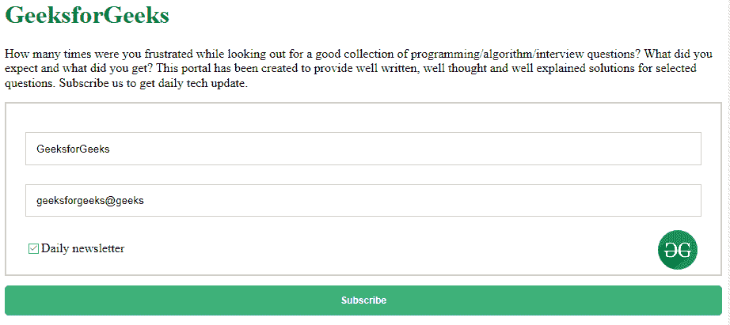
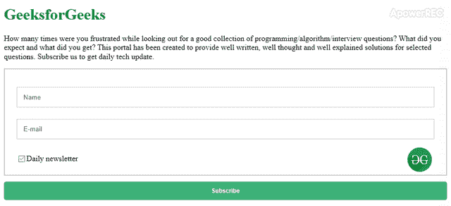

# 如何创建电子邮件简讯？

> 原文:[https://www . geesforgeks . org/如何创建电子邮件简讯/](https://www.geeksforgeeks.org/how-to-create-an-email-newsletter/)



要创建电子邮件简讯，你需要使用 HTML 和 CSS。HTML 将使简讯正文的结构和 CSS 将使其风格看起来不错。电子邮件简讯用于通知对您的内容非常感兴趣的读者或发烧友。如果用户订阅了时事通讯，那么该用户将获得关于每日更新的通知信息。这些东西有助于用户保持更新。他们将通过电子邮件收到更新的信息或新发布的内容。

**创建结构:**在本节中，我们将为电子邮件简讯创建一个基本的表单结构。

*   **HTML 代码:**用于设计简讯表单的结构。

## 超文本标记语言

```htmlhtml
<!DOCTYPE html>
<html>

<head>
    <title>Email Newsletter</title>
</head>

<body>
    <form action="">

        <!-- Title and the content -->
        <h1>GeeksforGeeks</h1>

<p>
            How many times were you frustrated while looking
            out for a good collection of programming/algorithm
            /interview questions? What did you expect and what
            did you get? This portal has been created to provide
            well written, well thought and well explained
            solutions for selected questions. Subscribe us to
            get daily tech update.
        </p>

        <!-- Fill up form for the user -->
        <div class="container">
            <input type="text" placeholder="Name"
                    name="name" required>

            <input type="text" placeholder="E-mail"
                    name="email" required>

            

            <br><br>

            <label>
                <input type="checkbox" checked="checked"
                        name="check">Daily newsletter
            </label>
        </div>

        <!-- Button to subscribe -->
        <div class="btn">
            <button type="submit" placeholder="Subscribe"
                    value="Subscribe">Subscribe</button>

            <p id=test> </p>

        </div>
    </form>
</body>

</html>
```

**设计结构:**上一节我们已经创建了基本形态的结构。在这一节中，我们将使用 CSS 样式设计电子邮件简讯的结构。

*   **CSS 代码:**这个 CSS 代码和 HTML 代码结构一起使用，做成一个邮件简讯表单。

## 半铸钢ˌ钢性铸铁(Cast Semi-Steel)

```htmlhtml
<style>
    h1 {
        color: green;
    }

    /* Container padding & border */
    .container {
        padding: 24px;
        border: 2px solid #ccc;
    }

    /* Container image styling */
    .container img {
        border-radius: 50%;
        width: 50px;
        float: right;
        margin: 5px;
    }

    /* input filed type text styling */
    input[type=text] {
        width: 100%;
        padding: 12px;
        margin: 12px 0;
        border: 1px solid #ccc;
        box-sizing: border-box;
    }

    /* input filed type checkbox floating */
    input[type=checkbox] {
        float: left;
    }

    /* button styling */
    .btn button {
        background-color: #0E9D57;
        opacity: 0.8;
        color: white;
        font-size: 12px;
        width: 100%;
        padding: 12px;
        margin: 12px 0;
        border: none;
        border-radius: 5px;
        font-weight: bold;
    }

    /* hover affect on button */
    .btn button:hover {
        opacity: 1;
    }
</style>
```

**结合 HTML 和 CSS 代码:**这个例子结合了上面两个部分(HTML 和 CSS 代码)来制作一个 Email 简讯。

## 超文本标记语言

```htmlhtml
<!DOCTYPE html>
<html>

<head>
    <title>Email Newsletter</title>

    <style>
        h1 {
            color: green;
        }

        /* Container padding & border */
        .container {
            padding: 24px;
            border: 2px solid #ccc;
        }

        /* Container image styling */
        .container img {
            border-radius: 50%;
            width: 50px;
            float: right;
            margin: 5px;
        }

        /* input filed type text styling */
        input[type=text] {
            width: 100%;
            padding: 12px;
            margin: 12px 0;
            border: 1px solid #ccc;
            box-sizing: border-box;
        }

        /* input filed type checkbox floating */
        input[type=checkbox] {
            float: left;
        }

        /* button styling */
        .btn button {
            background-color: #0E9D57;
            opacity: 0.8;
            color: white;
            font-size: 12px;
            width: 100%;
            padding: 12px;
            margin: 12px 0;
            border: none;
            border-radius: 5px;
            font-weight: bold;
        }

        /* hover affect on button */
        .btn button:hover {
            opacity: 1;
        }
    </style>
</head>

<body>
    <form action="">

        <!-- Title and the content -->
        <h1>GeeksforGeeks</h1>

<p>
            How many times were you frustrated while looking
            out for a good collection of programming/algorithm
            /interview questions? What did you expect and what
            did you get? This portal has been created to
            provide well written, well thought and well
            explained solutions for selected questions.
            Subscribe us to get daily tech update.
        </p>

        <!-- Fill up form for the user -->
        <div class="container">
            <input type="text" placeholder="Name"
                    name="name" required>

            <input type="text" placeholder="E-mail"
                    name="email" required>

            

            <br><br>

            <label>
                <input type="checkbox" checked="checked"
                        name="check">Daily newsletter
            </label>
        </div>

        <!-- Button to subscribe -->
        <div class="btn">
            <button type="submit" placeholder="Subscribe"
                    value="Subscribe">Subscribe</button>
            <p id=test> </p>

        </div>
    </form>
</body>

</html>
```

**输出:**



**支持的浏览器:**

*   谷歌 Chrome
*   微软边缘
*   火狐浏览器
*   歌剧
*   旅行队