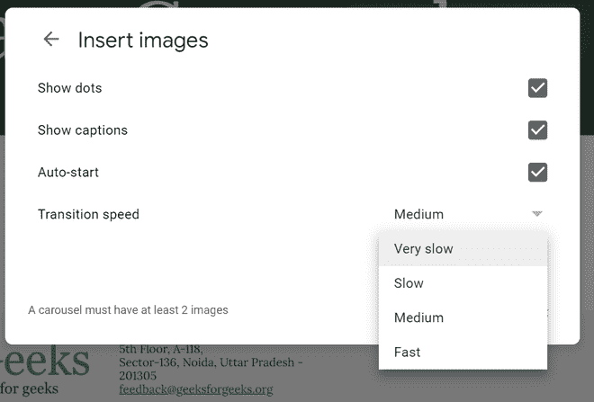
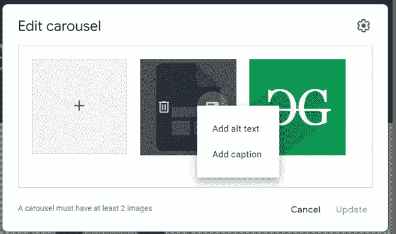
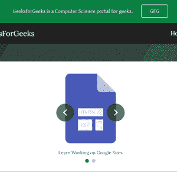

# 如何在新谷歌网站中创建图像转盘？

> 原文:[https://www . geeksforgeeks . org/如何在新的谷歌网站上创建图像转盘/](https://www.geeksforgeeks.org/how-to-create-an-image-carousel-in-new-google-sites/)

除了添加图像，还有其他属性，如是否显示点、自动启动或手动等。这也可以设置。此外，在每个图像上有 2 到 3 秒的停顿，并且它也可以被改变。

**属性:**选择属性小鸡，对话框左上角的**设置**选项弹出。窗口看起来像:

2.然后，我们可以看到**添加文本**选项包含**添加标题**选项。

3.现在只需将标题添加到图像中。

之后，图像转盘将被添加到您的站点页面。屏幕将如下所示:

