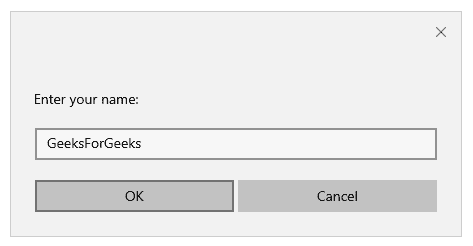
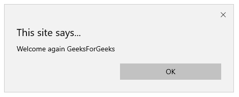

# 如何从 cookie 中创造和读取价值？

> 原文:[https://www . geesforgeks . org/如何从 cookie 中创建和读取价值/](https://www.geeksforgeeks.org/how-to-create-and-read-value-from-cookie/)

网络服务器托管网站。客户机-服务器向 web 服务器请求数据，web 服务器获取所需的页面，并通过发送请求的页面来响应客户机。网络服务器使用超文本传输协议与客户机-服务器通信。HTTP 是一种无状态协议，这意味着一旦事务结束并且连接关闭，服务器就不需要保留用户信息。网络浏览器是使用 HTTP 与网络服务器通信的客户机-服务器的一个例子。HTTP 防止客户端与网络服务器长时间的接触，一旦请求得到服务，连接就会自动关闭。但通常需要存储用户信息以备将来参考。cookies 最常见的用途之一是用于身份验证。Cookies 的目的是即使在连接丢失时也能保留用户信息。Cookies 是存储在计算机文本文件中的数据。

**cookie 由五个可变字段组成:**

*   **过期:**指定 cookie 何时过期。如果留空，当连接丢失时，cookie 会立即过期。
*   **域名:**指定网站的域名。
*   **名称=值:**cookie 以名称-值对的形式存储。
*   **路径:**指定设置 cookie 的网页或目录。
*   **安全:**指定 cookie 是否可以被任何服务器检索(安全或非安全)。

然而，cookies 只能存储少量数据，如**用户标识**或**会话标识**。清除 cookies 将注销用户登录的每个网站。HTTP 可以通过使用 cookies 来实现状态化。有状态 web 应用程序存储来自先前请求的信息，并可以使用它来服务未来的请求。

**工作原理:**当客户端或 web 浏览器与 web 服务器建立连接时，web 服务器会以 cookie 的形式向浏览器发送一些数据。浏览器可以接受或拒绝 cookie。如果浏览器接受它，cookie 会存储在客户端设备的硬盘中。服务器上的 CGI 脚本可以读写存储在客户端的 cookie 值，因此当客户端再次访问同一网站时，它会从浏览器中检索 cookie 数据。JavaScript 可以用来使用 Document 对象的 cookie 属性来操作 cookie。JavaScript 可以读取、创建、修改和删除当前网页的 cookies。下面的代码演示了如何使用 JavaScript 从 cookie 中创建和读取值。

**使用 JavaScript 创建 cookie:**该函数使用字段名、字段值和到期日期创建 cookie。该路径留空，以便应用于当前网页。但是，我们可以指定任何其他网页或目录名。

**程序:**

```htmlhtml
function createCookie(fieldname, fieldvalue, expiry) {
    var date = new Date();
    date.setTime(date.getTime()+ (expiry*24*60*60*1000));
    var expires = "expires=" + date.toGMTString();
    document.cookie = fieldname + "=" + fieldvalue + 
                      ";" + expires + ";path=/";
}
```

**使用 JavaScript 读取 cookie:**该函数检索浏览器中存储的 cookie 数据。cookie 字符串在从服务器发送到浏览器时会自动编码。因此，在检索实际数据之前，需要对其进行解码。接下来，解码后的字符串被拆分成一个数组，以获得所有的 cookie 名称-值对。在数组中循环查找字段名和相应的字段值。如果找到 cookie，则返回值，否则函数返回空字符串。

**程序:**

```htmlhtml
function readCookie(cname) {
    var name = cname + "=";
    var decoded_cookie = decodeURIComponent(document.cookie);
    var carr = decoded_cookie.split(';');
    for(var i=0; i<carr.length;i++){
    var c = carr[i];
    while(c.charAt(0)==' '){
        c=c.substring(1);
    }
    if(c.indexOf(name) == 0) {
        return c.substring(name.length, c.length);
    }
     }
     return "";
}
```

**使用 JavaScript 创建和读取 cookie:**加载网页后，将调用 **runApp()** 函数，该函数将检查浏览器中是否存在 cookie，并检索该 cookie，否则将为其创建新的 cookie。

**程序:**

```htmlhtml
<!DOCTYPE html>
<html>
<head>
    <title>
        Create and read cookies
        using JavaScript
    </title>

    <script type="text/javascript">
        function createCookie(fieldname, fieldvalue, expiry) {
            var date = new Date();
            date.setTime(date.getTime()+ (expiry*24*60*60*1000));
            var expires = "expires=" + date.toGMTString();
            document.cookie = fieldname + "=" + fieldvalue
                            + ";" + expires + ";path=/";
        }

        function readCookie(cname) {
            var name = cname + "=";
            var decoded_cookie = 
                decodeURIComponent(document.cookie);
            var carr = decoded_cookie.split(';');
            for(var i=0; i<carr.length;i++){
                var c = carr[i];
                while(c.charAt(0)==' '){
                    c=c.substring(1);
                }
                if(c.indexOf(name) == 0) {
                    return c.substring(name.length, c.length);
                }
            }
            return "";
        }

        function runApp() {
            var user = readCookie("username");
            if(user != ""){
                alert("Hello "+user);
            }else{
                user=prompt("Enter your name: ", "");
                if(user!= "" && user!=null){
                    createCookie("username", user, 30);
                }
            }
        }

    </script>
</head>
<body onload="runApp()"></body>
</html>
```

**输出:**

*   创建 Cookie:
    
*   阅读 Cookie:
    