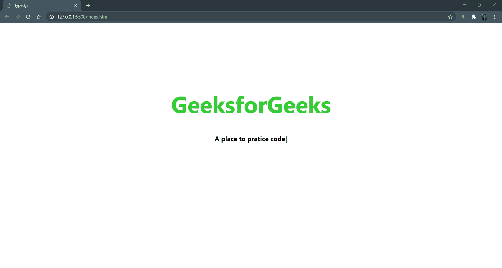

# 如何使用 typed.js 创建动画打字效果？

> 原文:[https://www . geesforgeks . org/如何创建-动画-打字-效果-使用-打字-js/](https://www.geeksforgeeks.org/how-to-create-animated-typing-effect-using-typed-js/)

**Typed.js** 是一个 JavaScript 库，用于以您设置的速度键入一组字符串，退格输入内容，并以您设置的另一个字符串开始键入。



让我们从创建一个项目文件夹开始，并根据您的意愿命名它。创建两个文件并命名为*“index . html”*和*“style . CSS”*

1.  在*“index . html”*中写下以下代码

    ## 超文本标记语言

    ```htmlhtml
    <!DOCTYPE html>
    <html lang="en">

    <head>
        <title>Typed.js</title>
        <!-- Import style.css from root directory -->
        <link rel="stylesheet" href="./style.css" />
    </head>

    <body>
        <div class="heading">
            <h1>GeeksforGeeks</h1>
            <h3>
                <span class="text-slider-items">
                    A computer Science portal for geeks,
                    A place to pratice code
                </span>

                <strong class="text-slider"></strong>
                <!-- classes "text-slider" 
                and "text-slider-items"
                for typed.js script -->
            </h3>
        </div>
    </body>

    </html>
    ```

2.  将以下 CSS 代码写入您的*“style . CSS”*文件。

    ```htmlhtml
    <style>
        body {
            background-color: white;
            font-family: Roboto, Oxygen, Ubuntu, Cantarell,
                'Open Sans', 'Helvetica Neue', sans-serif;

        }

        .text-slider-items {
            display: none;
        }

        .heading {
            margin-top: 200px;
            text-align: center;
        }

        .heading h1 {
            color: limegreen;
            font-size: 70px;
        }

        .heading h3 {
            color: black;
            font-size: 20px;
        }
    </style>
    ```

3.  现在你要从下面的链接下载*“typed . js”*脚本文件夹，解压后保存在你的项目目录中。

    **下载链接:**[https://mattboldt.com/demos/typed-js/](https://mattboldt.com/demos/typed-js/)

    此外，您必须包含 jQuery 库才能使用 jQuery 函数。有两种方法，要么下载并添加“jquery.js”文件，要么添加其 CDN 文件链接。在这里，您将使用 CDN 链接添加 jQuery。

    **CDN 链接:**[https://developers . Google . com/speed/libraries/dev guide # jquery](https://developers.google.com/speed/libraries/devguide#jquery)

4.  我们必须从“typed.js”文件夹导入并添加“typed.js”文件。在“body”标签前添加所有的 JavaScript 文件。另外，将下面的脚本添加到您的“index.html”文件中。

    ## 超文本标记语言

    ```htmlhtml
    <script src="./typed.js-master/lib/typed.min.js">
    </script>
    <script src="https://ajax.googleapis.com/ajax/libs/
       jquery/3.5.1/jquery.min.js">
    </script>
    <script>
        if ($(".text-slider").length == 1) {
            var typed_strings = $(".text-slider-items").text();
            var typed = new Typed(".text-slider", {
                strings: typed_strings.split(", "),
                typeSpeed: 50,
                loop: true,
                backDelay: 900,
                backSpeed: 30,
            });
        }
    </script>
    ```

    应该是这样的。

    ## 超文本标记语言

    ```htmlhtml
    <!DOCTYPE html>
    <html lang="en">

    <head>
        <title>Typed.js</title>

        <!-- Import style.css from root directory -->
        <link rel="stylesheet" href="./style.css" />
    </head>

    <body>
        <div class="heading">
            <h1>GeeksforGeeks</h1>
            <h3>
                <span class="text-slider-items">
                    A computer Science portal for 
                    geeks, A place to pratice code
                </span>
                <strong class="text-slider"></strong>

            </h3>
        </div>
        <!-- Import typed.min.js file from typed.js folder -->
        <script src=
            "./typed.js-master/lib/typed.min.js">
        </script>

        <!-- Add jquery cdn -->
        <script src=
    "https://ajax.googleapis.com/ajax/libs/jquery/3.5.1/jquery.min.js">
        </script>

        <!-- Add this script for successful 
            implementation of typed.js  -->
        <script>
            if ($(".text-slider").length == 1) {

                var typed_strings = 
                    $(".text-slider-items").text();

                var typed = new Typed(".text-slider", {
                    strings: typed_strings.split(", "),
                    typeSpeed: 50,
                    loop: true,
                    backDelay: 900,
                    backSpeed: 30,
                });
            }
        </script>
    </body>

    </html>
    ```

    启动“index.html”文件并注意输出。

**输出:**
