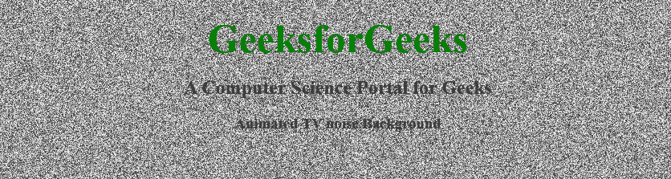

# 如何在画布中创建类似电视噪音的背景？

> 原文:[https://www . geeksforgeeks . org/如何创建类似背景的画布中的电视噪音/](https://www.geeksforgeeks.org/how-to-create-background-like-tv-noise-in-a-canvas/)



电视噪声是电视机或其他此类设备的接收天线没有获得传输信号时显示的随机黑白点像素模式。为了创建这个场景作为背景，我们需要 HTML、CSS 和 JavaScript。HTML 用于创建画布区域，或者您可以将整个背景用作一个区域。CSS 将适用于设计背景，JavaScript 将创建电视噪音动画。我们将逐步完成这项工作。下面的步骤一一提到和描述。
**HTML 和 CSS 版块:**

*   **HTML 代码:**在网页中创建一个 HTML5 画布。

## 超文本标记语言

```htmlhtml
<!DOCTYPE html>
<html lang="en">

<head>
    <meta charset="utf-8">
    <title>TV noise Background</title>
</head>

<body>
    <canvas id="canvas"></canvas>
    <h1>GeeksforGeeks</h1>
    <h2>A Computer Science Portal for Geeks</h2>
    <h3>Animated TV noise Background</h3>
</body>

</html>
```

*   **CSS 代码:**编辑画布元素的 CSS 使其全屏。

## 超文本标记语言

```htmlhtml
<style>
    #canvas {
        z-index: -100;
        position: absolute;
        top: 0;
        left: 0;
        opacity: 0.8;
        background-color: #fff;
    }
    h1 {
        color: green;
        font-size: 50px;
        margin-bottom: 0;
    }
    body {
        text-align: center;
    }
</style>
```