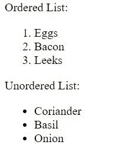
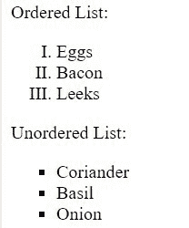
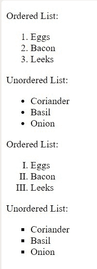

# 如何使用

创建项目符号*   elements ?

    > 原文:[https://www . geeksforgeeks . org/如何使用 li 元素创建项目符号/](https://www.geeksforgeeks.org/how-to-create-bullets-using-li-elements/)

    我们知道，无论是有序列表还是无序列表，它们都带有编号。

    可能是:

    *   子弹
    *   广场
    *   小数
    *   小说等。

    我们可以使用许多选项，但问题是这取决于什么属性？

    在 CSS 中，对于像

    *列表样式类型。*

    **方法:***列表样式类型*属性确定项目符号、正方形或十进制等是否带有 li 元素。要改变或理解它如何影响 HTML，就要使用 CSS 来定位选择器< ul >或< ol >。

    **语法:** CSS 瞄准< li >元素:

    ```htmlhtml
    ol {
        list-style-type: decimal
    }
    ul {
        list-style-type: disc
    }    

    ```

    让我们用例子来理解:

    1.  有序列表的默认列表样式类型是**十进制**，无序列表是**圆盘。**从上面的代码可以明显看出。
        *   **例:**

            ```htmlhtml
            <!DOCTYPE html>
            <html>
            <head>
              <meta charset="utf-8">
              <meta name="viewport" content=
                      "width=device-width">
              <title>Lists</title>
            </head>
            <body>
              <p>Ordered List:</p>
              <ol>
                  <li>Eggs</li>
                  <li>Bacon</li>
                  <li>Leeks</li>
              </ol>
              <p>Unordered List:</p>
              <ul>
                  <li>Coriander</li>
                  <li>Basil</li>
                  <li>Onion</li>
              </ul>
            </body>
            </html>
            ```

        *   **Output:**
            

            默认样式下，

            从这里我们可以理解子弹是如何到达

        *   Elements, but we can also change them into other things.

    2.  现在我们知道了列表元素中项目符号的来源，我们可以相应地更改它。让我们将其设置为有序列表中的罗马数字和无序列表中的正方形。
        *   **例:**

            ```htmlhtml
            <!DOCTYPE html>
            <html>
            <head>
              <meta charset="utf-8">
              <meta name="viewport" content=
                    "width=device-width">
              <title>Lists</title>

              <style>
                ol{
                  list-style-type: upper-roman
                }
                ul{
                  list-style-type: square
                }
            </style>
            </head>

            <body>
              <p>Ordered List:</p>
              <ol>
                  <li>Eggs</li>
                  <li>Bacon</li>
                  <li>Leeks</li>
              </ol>
              <p>Unordered List:</p>
              <ul>
                  <li>Coriander</li>
                  <li>Basil</li>
                  <li>Onion</li>
              </ul>
            </body>
            </html>
            ```

        *   **Output:**
            

            在这里我们可以清楚地看到项目符号/圆盘被替换为方形，小数被替换为罗马数字。

    **完整代码:**

    ```htmlhtml
    <!DOCTYPE html>
    <html>
    <head>
      <meta charset="utf-8">
      <meta name="viewport" content
             ="width=device-width">
      <title>Lists</title>
    </head>

    <body>
      <p>Ordered List:</p>
      <ol>
          <li>Eggs</li>
          <li>Bacon</li>
          <li>Leeks</li>
      </ol>
      <p>Unordered List:</p>
      <ul>
          <li>Coriander</li>
          <li>Basil</li>
          <li>Onion</li>
      </ul>
      <p>Ordered List:</p>
      <ol style="list-style-type:
                upper-roman;">
        <li>Eggs</li>
        <li>Bacon</li>
        <li>Leeks</li>
      </ol>
      <p>Unordered List:</p>
      <ul style="list-style-type:
                      square;">
        <li>Coriander</li>
        <li>Basil</li>
        <li>Onion</li>
      </ul>
    </body>
    </html>                    
    ```

    **输出:**

    

    同时使用默认和自定义内嵌 CSS

    同样，我们可以将列表样式类型更改为许多类型:

    1.  上α
    2.  下α
    3.  没有人
    4.  circle

        还有更多…