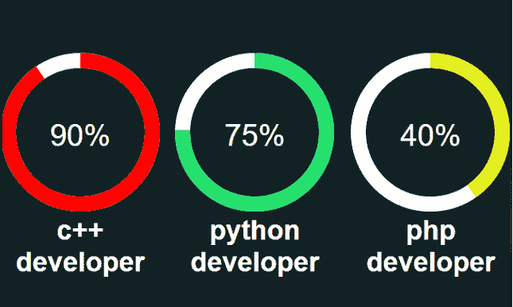

# 如何用 SVG 创建圆形进度条？

> 原文:[https://www . geesforgeks . org/如何创建-循环-进度条-使用-svg/](https://www.geeksforgeeks.org/how-to-create-circular-progress-bar-using-svg/)

在本文中，我们将学习如何使用 SVG 创建一个循环进度条。

让我们从 HTML 部分开始。在 SVG 圆中，cx 和 cy 属性定义了圆的 x 和 y 坐标。如果 cx 和 cy 不在圆心，则设置为(0，0)。r 属性定义了圆的半径。 [Span](https://www.geeksforgeeks.org/span-tag-html/) 是一个内联字符容器，用于标记文本的一部分。它可以很容易地用 CSS 来设计风格。Span 很像一个 HTML i div 元素，但是 *div* 是一个块级元素。 *div* 块在视觉上隔离了页面上文档的一部分，并且可能包含其他块级组件。

## 超文本标记语言

```html
<!DOCTYPE html>
<html lang="en">

<head>
    <meta charset="UTF-8">
    <meta http-equiv="X-UA-Compatible" content="IE=edge">
    <meta name="viewport" content=
        "width=device-width, initial-scale=1.0">
    <link rel="stylesheet" href="style.css" />
    <title>Circle progress bar</title>
</head>

<body>

    <div class="circle_box">
        <div>
            <svg>
                <circle cx="100" cy="100" r="95" />
                <circle cx="100" cy="100" r="95" />
            </svg>
            <span>90%</span>
        </div>
        <strong>c++ developer</strong>
    </div>
    <div class="circle_box">
        <div>
            <svg>
                <circle cx="100" cy="100" r="95" />
                <circle cx="100" cy="100" r="95" />
            </svg>
            <span>75%</span>
        </div>
        <strong>python developer</strong>
    </div>
    <div class="circle_box">
        <div>
            <svg>
                <circle cx="100" cy="100" r="95" />
                <circle cx="100" cy="100" r="95" />
            </svg>
            <span>40%</span>
        </div>
        <strong>php developer</strong>
    </div>
</body>

</html>
```

CSS [*尺寸框*](https://www.geeksforgeeks.org/css-box-sizing-property/) 允许我们在元素的总*宽度*和*高度*中包含*填充*和*边框*。CSS t [变换](https://www.geeksforgeeks.org/css-transform-property/)属性给元素一个 2D 或三维变换。该属性允许旋转、移动等。[溢出](https://www.geeksforgeeks.org/css-overflow/)属性有助于剪辑内容。 [*描边宽度*](https://www.geeksforgeeks.org/css-stroke-width-property/) 用于设置 SVG 形状上边框的宽度。

第 n 个子元素匹配其父元素的第 n 个子元素。n 可以是数字、关键字或公式。[笔划-划线-偏移](https://www.geeksforgeeks.org/css-stroke-dashoffset-property/)定义了沿 SVG 路径的位置，笔划的划线将从该位置开始。[笔画-虚线数组](https://www.geeksforgeeks.org/css-stroke-dasharray-property/)属性用于在 SVG 形状的笔画中创建虚线。当指定 CSS 属性值时，CSS [calc()](https://www.geeksforgeeks.org/css-calc-function/) 函数执行计算。 **calc()** 函数允许将带有加法(+)、减法(-)、乘法(*)、除法(/)的数学表达式用作分量值。

## style.css

```html
*,*:after,*:before{
    -webkit-box-sizing: border-box;
    -moz-box-sizing: border-box;
    -ms-box-sizing: border-box;
    box-sizing: border-box;
}
body{
    font-family: arial;
    font-size: 16px;
    margin: 0;
    background: #122325;
    display: flex;
    align-items: center;
    justify-content: space-around;
    height: 100vh;
}

svg{
    width: 200px;
    height: 200px;    
    transform: rotate(-90deg);
    overflow: initial;
} 

circle{
    stroke-width:20px;
    fill:none;    
}
circle:nth-child(1){ stroke: #fff }
circle:nth-child(2){
    stroke: #f00; 
    position: relative;
    z-index: 1;    
}
.circle_box:nth-child(1) circle:nth-child(2){
    stroke-dashoffset:calc(100 * 6);
    stroke-dasharray:calc(100 * 6);
    stroke-dashoffset:calc((100 * 6) - ((100 * 6) * 90) / 100); 
    stroke-position: inside;
}
.circle_box:nth-child(2) circle:nth-child(2){
    stroke-dashoffset:calc(100 * 6);
    stroke-dasharray:calc(100 * 6);
    stroke-dashoffset:calc((100 * 6) - ((100 * 6) * 75) / 100);
    stroke: rgb(37, 224, 109);  
}
.circle_box:nth-child(3) circle:nth-child(2){
    stroke-dashoffset:calc(100 * 6);
    stroke-dasharray:calc(100 * 6);
    stroke-dashoffset:calc((100 * 6) - ((100 * 6) * 40) / 100);
    stroke: rgb(227, 241, 25);  
}
.circle_box{
    font-size: 36px;
    color: #fff;
    text-align: center;
}
.circle_box div{
    position: relative;
}
.circle_box span{
    position: absolute;
    left: 50%;
    top:50%;
    transform: translate(-50%,-50%);
    color: #fff;
    font-size: 40px;
}
```

**输出:**现在，正如你在输出中看到的，我们创建了一个漂亮的进度图，它将吸引读者用编程语言阅读一个人的进度。

