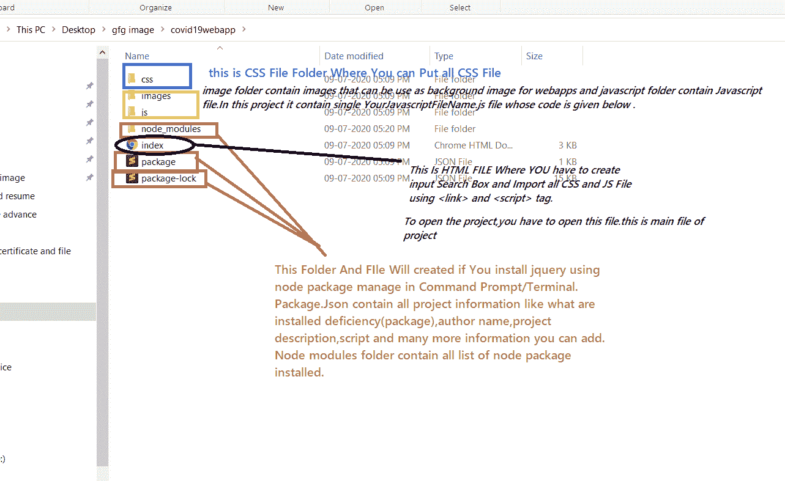
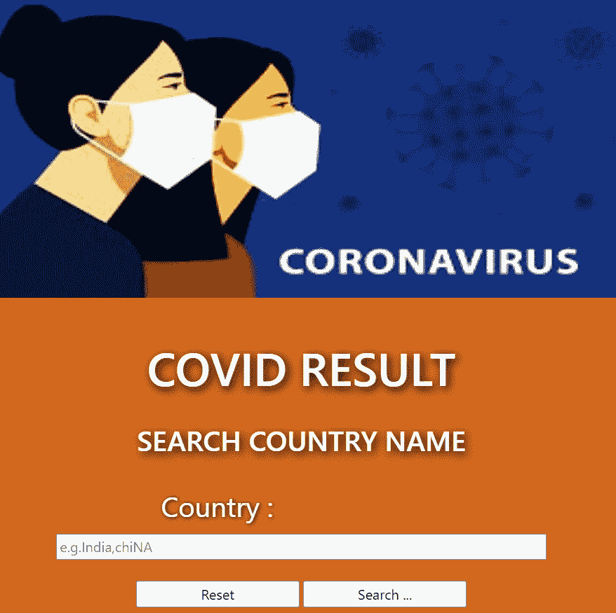
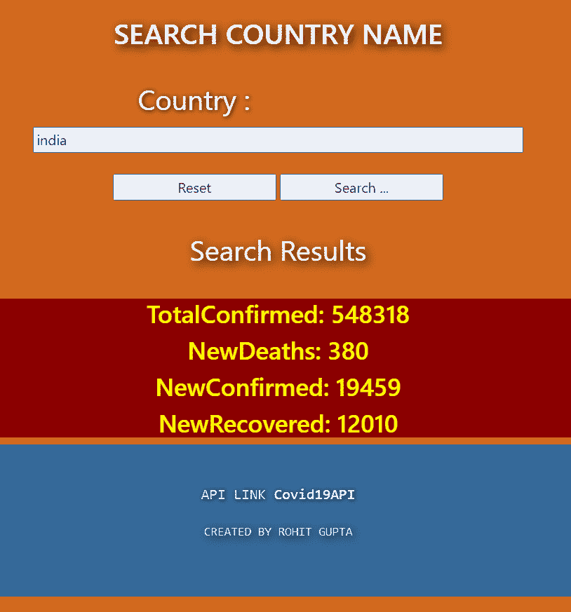

# 如何使用 REST API 创建 Covid19 国别状态项目？

> 原文:[https://www . geesforgeks . org/how-create-co vid 19-country-wise-status-project-use-rest-API/](https://www.geeksforgeeks.org/how-to-create-covid19-country-wise-status-project-using-rest-api/)

今天，世界上所有国家都在与冠状病毒作斗争。冠状病毒病例每天都在迅速上升。对所有人来说，每天跟踪 COVID 病例是很重要的，并且应该努力保证自己的安全。我们制作了小型网络应用程序，可以告诉你病例总数、新病例数、新死亡数、康复数等。给用户。你只需输入国家名称并点击搜索。

该应用程序还免受客户端脚本的影响，并使用免费的 Covid19 应用编程接口。以下是 API 链接:
[https://covid19api.com/](https://covid19api.com/)

**运行程序的步骤:**我们在本文中展示了 JavaScript 和 HTML 文件。所有的代码，包括 HTML，CSS，js 都在我的 Github 档案里。以下是完整的项目链接:
T3】https://github.com/rohitdhonicsk/covid19webapp

1.  Git 克隆*https://github.com/rohitdhonicsk/covid19webapp*，将 GitHub 项目文件复制到你的电脑上。
2.  现在打开 Index.html 文件。
3.  键入国家/地区名称，然后单击搜索。

**所需项目文件和模块:**

1.  你应该有三个主文件 index.html(在 index.html 文件的代码下面)，CSS(只有你想设计的时候才需要，你可以从我的 GitHub 资源库[项目文件](https://github.com/rohitdhonicsk/covid19webapp)下载 CSS)。第三个最重要的文件是 JavaScript 文件(我们在下面给出了完整的代码)，它是获取 COVID 数据和响应用户搜索所需要的。
2.  You require jQuery which is JavaScript Library. You can put CDN Script on your HTML Code from [Jquery Official Website](https://jquery.com/) OR using Command below:

    **注意:**确保机器中安装了 node 和 NPM，否则去 NODE 官网下载安装。

    首先，您必须在项目目录中键入下面的命令。它将创建一个 package.json 文件。

    ```html
    npm init
    ```

    现在输入以下命令安装 **jQuery** 。

    ```html
    npm install jquery
    ```

**项目目录:**


**项目会是这样的:**
**首页:**


**COVID19 统计搜索印度国家:**


**构建应用程序的步骤:**

1.  第一步是转到 API，将 API 的链接复制到邮递员应用，可视化数据的 JSON 格式。我们用的是 API 的汇总数据。
2.  在 HTML 文件中创建一个表单，输入字段是国家名称。
3.  为应该在 JavaScript 上使用的标题、表单、输入和标签分配标识。下面是演示 HTML 文件，其中类和 id 用于样式和动作调用。

    ```html
    <h1 class='section-heading'>COVID RESULT</h1>
    <h2 class='section-subheading'>SEARCH COUNTRY NAME</h2>

    <div class="section-description">

      <p class="section-subheading">
      <form id="query-form">
        <div>
          <label for="ingredients">Country :</label>
            <input class="textfield" id="ingredients" 
              type="text" name="ingredients"
              placeholder="e.g.India, chiNA" 
              onChange="sanitizeInputs()" />
        </div>

        <div class="button">
          <br />
          <input class="button" type="button" 
            value="Reset" id="resetButton" 
            onClick="this.form.reset();resetResults()" />
          <input class="button" type="submit" 
            value="Search ..." id="searchButton" />
        </div>
      </form>
      </p>

      <div class="section-subheading" 
        id="search-results-heading"></div>
      <div class="results-div" id="results"></div>
    </div>
    ```

4.  现在包含你的 CSS 文件(可选)。
5.  请记住在 HTML 代码中包含以下两件事:
    *   jQuery CDN 链接
    *   你的 JS 文件
6.  现在，在你的 JS 文件中添加以下代码:

    ```html
    // This Code calls function name performSearch()
    // on clicking submit button of form 

    $(document).ready(function() {

      // Add an event listener (performSearch) 
      // to the form
      $("#query-form").submit(function(event) 
        { performSearch(event); });
    });
    ```

7.  现在使用下面的代码创建 performSearch()函数:

    ```html
    function performSearch(event) {

      // Variable to hold request
      var request;

      // Prevent default posting of form 
      // put here to work in case of errors
      event.preventDefault();

      // Abort any pending request
      if (request) {
          request.abort();
      }

      // Setup some local variables
      var $form = $(this);

      // Disable the inputs and buttons 
      // for the duration of the request.
      setFormDisabledProps(true);

      // It will show heading searching during the request
      $("#search-results-heading").text("Searching ...");
      $("#results").text("");

      // Send the request to API for data
      request = $.ajax({
          url:"https://api.covid19api.com/summary",
          type: "GET",
          // data: { i:, q: $("#contains").val()}
      });

    // Taking country name from input box that we created
    pat=$("#ingredients").val(); 

      // Callback handler for success
      request.done(function (response, textStatus, jqXHR) {

        // Calling formal search after getting data from api
        formatSearchResults(response);
      });

      // Callback handler for failure
      request.fail(function (jqXHR, textStatus, errorThrown) {
       $("#search-results-heading").
         text("Unable to fetch Covid Data, Try again")
       $("#results").text("");
      });

      // Callback handler that will be called in any case
      request.always(function () {

          // Reenable the inputs
          setFormDisabledProps(false);
      });
    }
    ```

8.  创建 formatSearchResults 函数，为用户提供所需的搜索结果。

    ```html
    var pat, flag = 0;
    function formatSearchResults(jsonResults) {

        // Storing Json Data in jsonobject variable
        var jsonObject = jsonResults;

        $("#search-results-heading").text("Search Results");
        var formatedText = "";

        jsonObject.Countries.forEach(function (item, index) {

            // Matching user search data with api data 
            if (item.Country.toLowerCase() == pat.toLowerCase()) {
                var thumbnail = item.NewConfirmed;

                // Printing the result
                formatedText += 
    "<div class='dish-ingredients-div'><h3>TotalConfirmed: " +
                    item.TotalConfirmed + "<h3></div>";

                formatedText += 
    "<div class='dish-ingredients-div'><h3>NewDeaths: " +
                    item.NewDeaths + "<h3></div>";

                formatedText += 
    "<div class='dish-ingredients-div'><h3>NewConfirmed: " +
                    item.NewConfirmed + "<h3></div>";

                formatedText += 
    "<div class='dish-ingredients-div'><h3>NewRecovered: " +
                    item.NewRecovered + "<h3></div>";

                flag = 1;
                return;
            }
        });

        // If result not found
        $("#results").html(formatedText);

        if (!flag) {
            $("#search-results-heading")
                .text("Dont Fun With it.Please Enter"
                + " Correct Country Name e.g-India");
            $("#results").text("");
        }
    }
    ```

9.  最后一步是保护数据免受客户端脚本和重置功能的影响。

    ```html
    function resetResults() {
      $("#search-results-heading").text("");
      $("#results").text("");
      flag=0;
    }

    // This function checks the user input fields
    // for any unacceptable characters and removes
    // them if found
    function sanitizeInputs() {
      var str = $("#ingredients").val();
      str = str.replace(/[^a-zA-Z 0-9, ]/gim, "");
      str = str.trim();
      $("#ingredients").val(str);
    }
    ```

**完整的 Javascript 代码:**

```html
// This Code call function name performSearch()
// on clicking submit button of form 
$(document).ready(function () {

    // Add an event listener (performSearch)
    // to the form
    $("#query-form").submit(function (event) 
        { performSearch(event); });
});

var pat, flag = 0;
function formatSearchResults(jsonResults) {

    // Storing Json Data in jsonobject variable
    var jsonObject = jsonResults;

    $("#search-results-heading").text("Search Results");
    var formatedText = "";

    jsonObject.Countries.forEach(function (item, index) {

        // Matching user search data with api data 
        if (item.Country.toLowerCase() == pat.toLowerCase()) {
            var thumbnail = item.NewConfirmed;
            // Printing the result
            formatedText += 
"<div class='dish-ingredients-div'><h3>TotalConfirmed: " +
                item.TotalConfirmed + "<h3></div>";

            formatedText += 
"<div class='dish-ingredients-div'><h3>NewDeaths: " +
                item.NewDeaths + "<h3></div>";

            formatedText += 
"<div class='dish-ingredients-div'><h3>NewConfirmed: " +
                item.NewConfirmed + "<h3></div>";

            formatedText += 
"<div class='dish-ingredients-div'><h3>NewRecovered: " +
                item.NewRecovered + "<h3></div>";

            flag = 1;
            return;
        }
    });

    $("#results").html(formatedText);

    // If result not found
    if (!flag) {
        $("#search-results-heading")
            .text("Dont Fun With it.Please Enter"
                + " Correct Country Name e.g-India");
        $("#results").text("");
    }
}

function performSearch(event) {

    // Variable to hold request
    var request;

    // Prevent default posting of form - 
    // put here to work in case of errors
    event.preventDefault();

    // Abort any pending request
    if (request) {
        request.abort();
    }

    // Setup some local variables
    var $form = $(this);

    // Disable the inputs and buttons 
    // for the duration of the request.
    setFormDisabledProps(true);

    // It will show heading searching
    // during the request
    $("#search-results-heading")
            .text("Searching ...");
    $("#results").text("");

    // Send the request to API for data
    request = $.ajax({
        url: "https://api.covid19api.com/summary",
        type: "GET",
        // data: { i:, q: $("#contains").val() }
    });

    // Taking country name from input
    // box that we created
    pat = $("#ingredients").val();

    // Callback handler for success
    request.done(function (response, 
        textStatus, jqXHR) {
        formatSearchResults(response);
    });

    // Callback handler for failure
    request.fail(function (jqXHR, 
            textStatus, errorThrown) {

        // Calling formal search after 
        // getting data from api
        $("#search-results-heading").text(
"Sorry We Unable to fetch Covid Data.Try again.");
        $("#results").text("");
    });

    // Callback handler that will be
    // called in any case
    request.always(function () {

        // Reenable the inputs
        setFormDisabledProps(false);
    });
}

// This function clears the search results
// and the heading "Search Results"
function resetResults() {
    $("#search-results-heading").text("");
    $("#results").text("");
    flag = 0;
}

// This function checks the user input
// fields for any unacceptable characters
// and removes them if found
function sanitizeInputs() {
    var str = $("#ingredients").val();
    str = str.replace(/[^a-zA-Z 0-9, ]/gim, "");
    str = str.trim();
    $("#ingredients").val(str);
}
```