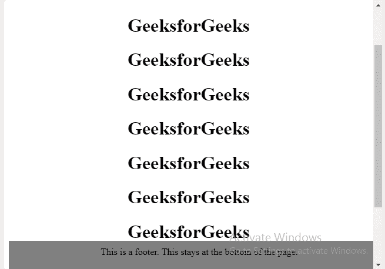

# 如何创建页脚以停留在网页底部？

> 原文:[https://www . geesforgeks . org/如何创建页脚-停留在网页底部/](https://www.geeksforgeeks.org/how-to-create-footer-to-stay-at-the-bottom-of-a-web-page/)

要在网页底部创建页脚，我们可以将其固定在网页底部，这样，如果您向下滚动该网页，您仍然可以从页面的任何位置查看页脚。
要将页脚固定在网页底部，可以使用**位置:固定**。

**语法:**

```
#footer {
   position:absolute;
   bottom:0;
   width:100%;
   height:60px;   /* Height of the footer */
   background:#6cf;
}

```

**示例:**

```
<html>

<head>
    <style>
        #footer {
            position: fixed;
            padding: 10px 10px 0px 10px;
            bottom: 0;
            width: 100%;
            /* Height of the footer*/ 
            height: 40px;
            background: grey;
        }
    </style>

    <head>

        <body>
            <center>
                <div id="container">
                    <h1>GeeksforGeeks</h1>
                    <h1>GeeksforGeeks</h1>
                    <h1>GeeksforGeeks</h1>
                    <h1>GeeksforGeeks</h1>
                    <h1>GeeksforGeeks</h1>
                    <h1>GeeksforGeeks</h1>
                    <h1>GeeksforGeeks</h1>
                    <h1>GeeksforGeeks</h1>
                    <h1>GeeksforGeeks</h1>
                    <h1>GeeksforGeeks</h1>
                    <h1>GeeksforGeeks</h1>
                    <h1>GeeksforGeeks</h1>
                    <div id="footer">This is a footer.
                      This stays at the bottom of the page.
                  </div>
                </div>
            </center>
        </body>
        <html>
```

**输出:**


CSS 是网页的基础，通过设计网站和网络应用程序用于网页开发。你可以通过以下 [CSS 教程](https://www.geeksforgeeks.org/css-tutorials/)和 [CSS 示例](https://www.geeksforgeeks.org/css-examples/)从头开始学习 CSS。